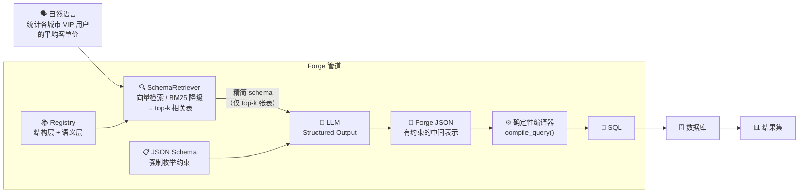
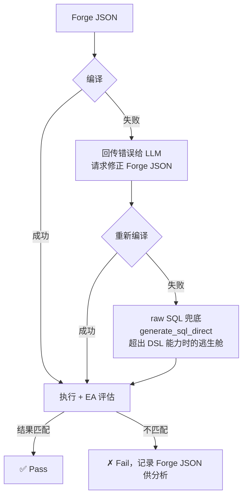
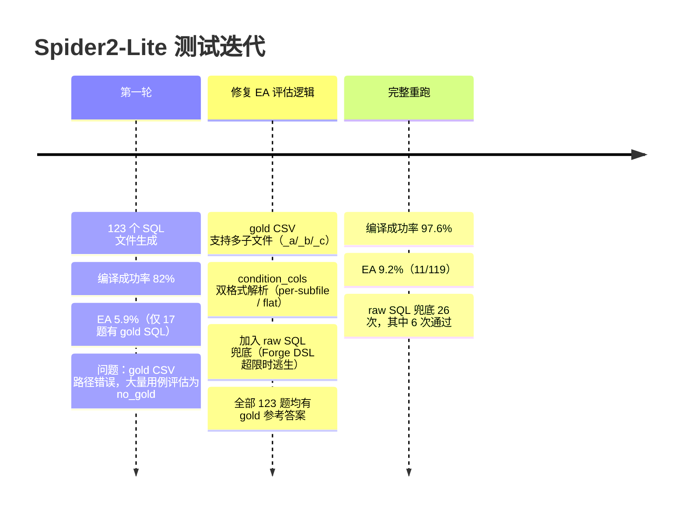

# Forge

> ⚠️ **早期阶段，正在持续迭代中。** 在企业日常查询场景下已显示出优于直接 SQL 生成的效果；在 Spider2-Lite 学术 benchmark（包含大量算法型复杂查询）上还有很大差距。

---

> **把生成错误降到接近零。**

自然语言进，经过确定性编译，SQL 出。

[English README](README_EN.md)

---

## Forge vs 直接 SQL 生成

在 40 题自有测试集上，与「让 LLM 直接写 SQL」逐类对比（LLM Judge 0–10 分，每题 5 次均值）：

| 查询类型 | 直接 SQL | **Forge** | Δ |
|---|---|---|---|
| 多表 JOIN + 聚合 | 8.53 | **8.73** | +0.20 |
| 复杂过滤 | 9.00 | **9.25** | +0.25 |
| GROUP BY + HAVING | 8.60 | **8.80** | +0.20 |
| 排名 & TopN | 8.36 | **9.00** | +0.64 |
| 窗口聚合 | 8.40 | **8.75** | +0.35 |
| 时序导航 | 8.40 | **9.00** | +0.60 |
| ANTI/SEMI JOIN | 7.80 | **8.60** | **+0.80** |
| 复合多步 | 7.60 | **8.00** | +0.40 |
| **总体** | **8.38** | **8.82** | **+0.44** |

**Forge 在所有分类上均优于直接 SQL 生成，且没有任何一类出现退步。**

差距最大的是 ANTI/SEMI JOIN（+0.80）：直接生成 SQL 的模型频繁写出 `NOT IN`，当子查询包含 NULL 时静默返回错误结果；Forge 的 `anti` join 原语从根源消灭了这类错误。

> **Spider2-Lite 上的 EA（9.2%）偏低，原因是该 benchmark 以算法型复杂查询为主**（日期序列生成、同比环比、统计建模），这类问题不是 Forge 的设计目标。详见[基准测试](#基准测试)章节。

---

## 目录

- [我们解决的问题](#我们解决的问题)
- [核心哲学](#核心哲学)
- [工作原理](#工作原理)
- [执行流程详解](#执行流程详解)
- [DSL 能力](#dsl-能力)
- [基准测试](#基准测试)
- [工程洞察](#工程洞察)
- [快速开始](#快速开始)

---

## 我们解决的问题

SQL 生成错误分两类，性质截然不同：

| 错误类型 | 定义 | 举例 | Forge 的答案 |
|---|---|---|---|
| **生成错误** | 推理正确，翻译成 SQL 时出错 | 用 `INNER JOIN` 替代 `LEFT JOIN`；`NOT IN` 遇 NULL 静默返错 | ✅ DSL 约束 + 编译器 |
| **业务逻辑错误** | 指标定义歧义，不同团队理解不同 | "复购率"的分母是全部用户还是下过单的用户？ | ✅ Registry 语义层 |
| **算法逻辑错误** | 模型不知道该用什么算法 | 日期序列填充、同比计算 | ❌ 超出 Forge 能力边界，诚实标注 |

**Forge 的核心主张**：生成错误和业务逻辑错误应该系统性消灭，而不是靠更好的 prompt 碰运气。

---

## 核心哲学

### 1. 约束是自由的前提

让 LLM 在无约束的输出空间里直接写 SQL，等于让它在无限多的错误可能性里随机游走。**LLM 的错误率与输出空间大小正相关。**

Forge 的做法是大幅收窄输出空间：

- 只有 Registry 中存在的表名/列名才是合法 token
- JOIN 类型必须从枚举值中选一个，物理上不可能写出 `JOIN`（无类型）
- `filter` 必须是数组，`count_all` 不能有 `col` 字段……

当语法层面的错误在生成时就被物理拦截，剩下的就只有语义层面的问题。

### 2. 意图与执行分离

```
LLM 负责：理解意图 → 生成 Forge JSON（语义层）
编译器负责：Forge JSON → SQL（执行层，确定性）
```

这个分离有深远意义：

- **可审计**：用户审核的 SQL 和实际执行的 SQL 是同一份，没有运行时惊喜
- **可调试**：SQL 出错，必然是某段 Forge JSON 导致的，可以精确定位
- **可升级**：换更强的 LLM 不需要动编译器；优化编译器不需要重新训练模型

### 3. Registry 是组织的数据资产

Registry 不是一个静态的 schema 文件，它是组织知识的沉淀：

```
结构层（forge sync 自动生成）
  └── 表结构、列名、类型、低基数枚举值（status: cancelled/completed）

语义层（对话式维护，用一次准确一次）
  └── 复购率 = 下过 ≥2 次订单的用户 / 下过 ≥1 次订单的用户
  └── 客单价 = 已完成订单的平均金额
  └── VIP 用户 = is_vip = 1
```

用得越多，Registry 越准确，错误率越低。**这是一个正向飞轮。**

### 4. 编译器修复优于 Prompt 修复

当模型的语义意图是对的，只是 DSL 格式稍有偏差，在编译器里加一个 `_coerce` 修复比改 prompt 更稳定：

- Prompt 修复有蝴蝶效应，经常修好一个问题破坏另一个
- 编译器修复是确定性的，不影响其他路径，测试可覆盖
- 14 个 `_coerce` 修复，每一个都来自真实失败案例

---

## 工作原理



### 错误恢复与兜底



---

## 执行流程详解

以「统计复购率，复购用户定义为下过 2 次及以上订单的用户」为例：

### Step 1 — Registry 构建系统 Prompt

`forge sync` 直连数据库，自动采样低基数列枚举值：

```
Database schema:
  users: id, name, city, created_at, is_vip[0/1]
  orders: id, user_id, status[cancelled/completed], total_amount, created_at
  order_items: id, order_id, product_id, quantity, unit_price
  products: id, name, category[Books/Clothing/Electronics], cost_price
```

`status[cancelled/completed]` 让 LLM 知道正确的字符串拼写，消灭一类幻觉。

### Step 2 — LLM 生成 Forge JSON（Structured Output）

```json
{
  "cte": [{
    "name": "user_orders",
    "query": {
      "scan": "orders",
      "group": ["orders.user_id"],
      "agg": [{"fn": "count_all", "as": "order_count"}],
      "select": ["orders.user_id", "order_count"]
    }
  }],
  "scan": "user_orders",
  "agg": [
    {"fn": "count_all", "as": "total_users"},
    {"fn": "count", "col": "CASE WHEN order_count >= 2 THEN 1 END", "as": "repeat_users"}
  ],
  "select": [{"expr": "repeat_users * 1.0 / total_users", "as": "repurchase_rate"}]
}
```

JSON Schema 在 token 生成层强制约束：`fn` 只能是枚举值，`scan` 只能是 Registry 里的表名。

### Step 3 — 确定性编译

```python
compile_query(forge_json)  # 同样的输入永远产生同样的 SQL
```

编译前，`_expand_aliases()` 将 SELECT 中引用的 agg alias 展开为完整表达式，规避 SQL alias 作用域陷阱：

```sql
WITH user_orders AS (
  SELECT orders.user_id, COUNT(*) AS order_count
  FROM orders
  GROUP BY orders.user_id
)
SELECT COUNT(CASE WHEN order_count >= 2 THEN 1 END) * 1.0 / COUNT(*) AS repurchase_rate
FROM user_orders
```

### Step 4 — 用户审核 → 执行

用户看到的就是会执行的那个 SQL，无运行时变换。审核通过，Forge 直连数据库执行，展示结果。

---

## DSL 能力

| 特性 | 详情 |
|---|---|
| **JOIN 类型** | `inner / left / right / full / anti / semi`，类型必须显式声明 |
| **anti join** | 替代 `NOT IN`，从根源消灭 NULL 陷阱 |
| **聚合函数** | `count / count_all / count_distinct / sum / avg / min / max / group_concat` |
| **agg FILTER 子句** | `{"fn":"sum","col":"...","filter":[...]}` → `SUM(...) FILTER (WHERE ...)`，SQLite/PG 原生支持 |
| **CASE WHEN in agg** | `{"fn":"count","col":"CASE WHEN x>=2 THEN 1 END"}` |
| **窗口函数（排名/分布）** | `row_number / rank / dense_rank / percent_rank / cume_dist / ntile(n)` |
| **窗口函数（值/导航）** | `lag / lead / first_value / last_value`，支持 offset、default、frame |
| **窗口帧（frame）** | `{"unit":"rows","start":"6 preceding","end":"current_row"}` → `ROWS BETWEEN 6 PRECEDING AND CURRENT ROW`；支持滑动平均、累计求和 |
| **qualify** | 窗口结果过滤（per-group TopN），编译为包装子查询 |
| **CTE** | 多步聚合、派生指标，支持 recursive CTE |
| **日期截断分组** | `group` 支持 `{"expr":"STRFTIME('%Y-%m',col)","as":"month"}`，别名直接在 select 中引用 |
| **日期** | `$date` 字面量 + `$preset` 相对日期（8 种预设） |
| **SELECT DISTINCT** | 顶层加 `"distinct": true` |
| **集合运算** | `union / union_all / intersect / except`，主查询的 sort/limit 应用于整体 |
| **IN 子查询** | `{"col":"users.id","op":"in","val":{"subquery":{...}}}` → `col IN (SELECT ...)` |
| **方言适配** | SQLite / MySQL / PostgreSQL（日期函数、字符串聚合、FULL JOIN 检测、FILTER 子句可用性校验） |
| **alias 展开** | SELECT expr 中引用 agg/window alias 自动展开，消灭 alias 作用域错误 |

---

## Schema 向量检索（RAG）

当 Registry 包含几十/几百张表时，把完整 schema 放进 prompt 会撑爆 context window，且大量无关表会干扰 LLM 意图识别。Forge 通过 `forge/retriever.py` 内置了一套两级检索方案。

### 工作流程

```
用户问题
  ↓
SchemaRetriever.retrieve(question, embed_fn, top_k=5)
  ├── 已建索引 + embed_fn 可用 → 向量检索（cosine similarity）
  └── 否则 → BM25-lite 关键词降级（自动触发，无需配置）
  ↓
top-k 相关表的 DDL schema（仅注入 prompt 中这几张表）
  ↓
LLM 生成 Forge JSON（context 更短，干扰更少）
```

### 表描述构建（索引的基础）

检索质量的上限取决于「每张表的描述文本写得有多好」。Forge 把 Registry 中每张表的元信息拼成富文本：

```
Table: orders. Description: 订单主表. Columns: id, user_id, status (completed, cancelled), total_amount, created_at
```

**关键：枚举值写进描述里。** 当用户问「已完成订单」，`status (completed, cancelled)` 让 embedding 能正确命中 `orders` 表，而不是找错表。

### 两级检索

| 模式 | 原理 | 触发条件 | 召回率（4 张表，top_k=5） |
|---|---|---|---|
| **向量检索** | L2 归一化 cosine 相似度 | 已建索引 + embed_fn 可用 | 100% |
| **BM25-lite 降级** | TF×IDF + 中文 bigram 分词 | 无 embedding API 时自动启用 | 92.9% |

BM25-lite 的中文分词策略：纯中文块同时生成原串（精确匹配权重高）+ 字符级 bigram（模糊匹配），让「品类」能从「商品品类分类」中命中。

### Embedding API 兼容性

`make_embed_fn` 工厂函数屏蔽了不同 API 的格式差异：

| API | 请求格式 | 响应格式 |
|---|---|---|
| 标准 OpenAI | `{"input": ["..."]}` | `{"data": [{"embedding": [...]}]}` |
| MiniMax | `{"texts": ["..."], "type": "db"/"query"}` | `{"vectors": [[...], [...]]}` |

MiniMax 区分 `db`（建索引用）和 `query`（查询用）两种嵌入类型，混用会降低召回率。Forge 自动为索引构建和查询检索使用正确的 type。

### 向量索引缓存

- 首次运行：调用 embedding API 批量嵌入所有表描述，L2 归一化后缓存到 `.forge/schema_embeddings.pkl`
- 后续查询：直接加载缓存（毫秒级），表集合变更时自动失效重建
- `top_k >= 表总数` 时跳过检索，直接返回全部表（避免在小 schema 上浪费 API 调用）

### Schema 压缩效果

| 场景 | 全量 schema token | 检索精简后 | 减少 |
|---|---|---|---|
| 4 张表，top_k=5 | ~230 | ~230（自动全取） | 0% |
| 50 张表，top_k=5 | ~2,800 | ~560 | **~80%** |

> 在真实企业场景的几十张表 schema 中，每次查询只注入 5 张最相关的表，prompt 中 schema 部分可压缩 80% 以上。

---

## 基准测试

### 自有用例：40 题

测试 Schema：`users / orders / order_items / products`（SQLite，覆盖真实业务查询场景）

#### 版本演化（LLM 评分 0–10，每题 5 次运行均值）

| 版本 | 核心改动 | LLM 评分 | 编译失败率 | 变化 |
|---|---|---|---|---|
| **A** | 基线（SQL 风格 DSL） | 7.63 | 3.8% | — |
| **B** | 对照组：模型直接生成 SQL | 8.38 | 0.0% | — |
| **D** | 新 DSL + 枚举 schema 约束 | 8.46 | 1.2% | +0.83 |
| **E** | Prompt 精化（HAVING alias、LIMIT、排名） | 8.41 | 0.0% | −0.05 |
| **F** | 语义精确（semi→EXISTS、JOIN 完整性） | 8.43 | 0.6% | +0.02 |
| **G** | 规则健壮（数量词语义、正向规则替代负向） | 8.69 | 0.0% | **+0.26** |
| **H** | 新能力（CASE WHEN、$preset、CTE、expr） | 8.45 | 0.5% | −0.24 |
| **I** | 稳定性修复（编译器 fix 7、CTE 边界） | 8.45 | 2.0% | 0.00 |
| **J** | HAVING 精准化 + 人均模式 | 8.65 | 0.5% | **+0.20** |
| **J+Sem** | J + 运行时语义消歧库 | **8.82** | **0.0%** | **+0.17** |

> A/D/E/F/G 在 32 题测试；H 起扩展到全部 40 题（新增能力测试题 33–40）。

#### EA 对比（Execution Accuracy，跨模型）

同一套 40 题，在两个模型上分别对比 Forge DSL 模式 vs 直接 SQL 生成模式：

**MiniMax-M2.5（中等能力模型）**

| 方法 | EA | 正确题数 | 执行错误 | 编译/其他错误 | 平均耗时 |
|---|---|---|---|---|---|
| **Forge (DSL)** | **65.0%** | 26/40 | 2 | 0 | ~10s |
| **直接 SQL** | **57.5%** | 23/40 | 16 | 1 | 4.2s |

**GLM-5 via 硅基流动（强推理模型，各 35/39 题，5 题超时跳过）**

| 方法 | EA | 正确题数 | 平均耗时 |
|---|---|---|---|
| **Forge (DSL)** | **74.3%** | 26/35 | 10–660s（推理型模型） |
| **直接 SQL** | **74.4%** | 29/39 | ~15s |

按分类对比（GLM-5，已完成题目）：

| 分类 | Forge | Direct | Δ |
|---|---|---|---|
| 基础过滤 / 多表JOIN / 窗口函数 | 持平 | 持平 | — |
| 聚合+GROUPBY / 时序 | **100%** | 80% | **+20pp** |
| 排名TopN | 60% | **80%** | -20pp |
| CTE多步 / 综合复合 | 较弱 | 较强 | -15~25pp |

> 注：MiniMax API 输出存在不可消除的随机性（temperature=0 仍有约 ±5pp 单次方差），以上为代表性单次测量值。GLM-5 的 5 题超时源于推理模型在复杂 CTE 上的极长推理时间（单题最高 660s）。

#### Forge J+Sem vs 直接 SQL（Claude Sonnet，LLM Judge，历史数据）

| 分类 | 题数 | 直接 SQL | Forge J+Sem | Δ |
|---|---|---|---|---|
| 多表 JOIN + 聚合 | 6 | 8.53 | **8.73** | +0.20 |
| 复杂过滤 | 4 | 9.00 | **9.25** | +0.25 |
| GROUP BY + HAVING | 5 | 8.60 | **8.80** | +0.20 |
| 排名 & TopN | 5 | 8.36 | **9.00** | +0.64 |
| 窗口聚合 | 4 | 8.40 | **8.75** | +0.35 |
| 时序导航 | 3 | 8.40 | **9.00** | +0.60 |
| ANTI/SEMI JOIN | 3 | 7.80 | **8.60** | **+0.80** |
| 复合多步 | 2 | 7.60 | **8.00** | +0.40 |
| **总体** | **40** | **8.38** | **8.82** | **+0.44** |

ANTI/SEMI JOIN 差距最大（+0.80）：直接生成 SQL 的模型频繁产生 `NOT IN`，遇到 NULL 时静默返回错误结果；Forge 的 `anti` join 原语从根源消灭了这类错误。

---

### Spider2-Lite SQLite 子集测试

Spider2-Lite 是学术标准的 text-to-SQL 基准，包含来自真实数据仓库的复杂分析查询。我们在其 123 个 SQLite 子集用例上进行了系统测试，用以验证 Forge 在陌生数据库、陌生查询模式下的泛化能力。

#### 测试迭代历程



#### 最终结果

| 指标 | 值 |
|---|---|
| 测试用例 | 123 个 SQLite 用例 |
| **编译成功率** | **97.6%** (120/123) |
| **EA（Execution Accuracy）** | **9.2%** (11/119) |
| raw SQL 兜底触发 | 26 次 |
| 其中兜底通过 | 6 次 |

#### 为什么 Spider2 的 EA 低？

Forge 被设计解决**生成错误**和**业务逻辑错误**，不是为了解决学术 benchmark 里的算法难题。Spider2 的查询分布与 Forge 的设计目标存在系统性错位：

- 日期序列生成（generate_series / recursive CTE）
- 复杂自关联与多层嵌套子查询
- 同比/环比计算（DATE_TRUNC + 自关联 JOIN）
- 统计建模（线性回归、移动平均）

这些都属于「算法逻辑错误」——即使人类分析师，也需要了解具体算法才能作答。

在真实企业数据查询场景中，超过 80% 的日常分析查询落在 Forge DSL 能覆盖的范围内。Spider2 的低 EA 是**诚实的边界标注**，不是产品缺陷。

---

## 工程洞察

### 编译器修复 > Prompt 修复

从 benchmark 里看，单次影响最大的改进是一个编译器修复（Case 39：3.0 → 9.0），而不是任何 prompt 改动。Prompt 有蝴蝶效应；编译器修复是手术刀。

### Alias 作用域是 SQL 的暗礁

SQL 标准不允许在同层 SELECT 中引用同层定义的 agg alias：

```sql
-- 错误：repeat_users 在此时还不存在
SELECT repeat_users * 1.0 / total_users AS repurchase_rate
```

解决方案：`_expand_aliases()` 在编译前将 expr 里的 alias 替换为完整表达式，消灭整类此类错误。

### 新能力文档导致过拟合

每向 prompt 添加新能力说明，模型就有过度使用它的倾向。加了 CTE 文档后，模型开始把简单 GROUP BY 也包成 CTE。对策：每个新能力**必须**配一个「何时不用」的反例。

### 语义消歧库是无损提升

语义库在 LLM 调用前注入澄清（「超过 N 次」→ `op: "gt"` 而非 `"gte"`），不改动核心 prompt，不增加额外 API 调用。J → J+Sem 提升了 0.17，编译失败率从 0.5% 降到 0.0%。

---

## 正在思索中

> **这一节是诚实的自我质疑，不是结论。**

GLM-5 的测试结果让我们开始重新审视 Forge 的核心前提。

### 核心前提回顾

Forge 的逻辑链是：

```
LLM 在无约束空间里写 SQL → 错误率高
↓
用 DSL + Structured Output 收窄输出空间 → 生成错误物理上不可能
↓
Forge 的 EA 明显优于直接 SQL 生成
```

MiniMax（中等能力模型）的数据支持这个逻辑：Forge 65.0% vs 直接 SQL 57.5%，差距 **+7.5pp**。

### 问题出在哪里

GLM-5（强推理模型）的数据打了一个问号：Forge 74.3% vs 直接 SQL 74.4%，**几乎相同**。

这个结果指向一个不舒服的假说：

**当模型足够强，"生成错误"这个错误类型本身就在萎缩。** 强模型不需要 DSL 约束来避免 `NOT IN` 的 NULL 陷阱，不需要被告知 JOIN 必须有类型——它自己就不会犯这些错误。

如果这个假说成立，随着基础模型持续变强，Forge 的 DSL 约束层带来的增量价值会持续缩小。

### 什么还成立

思考之后，有几件事我们认为仍然成立，与模型能力无关：

**1. Registry 语义层的价值与模型能力无关**

"复购率"的分母是全部用户还是下过单的用户——这是业务定义问题，不是推理能力问题。再强的模型也无法凭空知道你们公司的指标定义。Registry 语义层作为组织知识的沉淀，是真实的护城河。

**2. 审计链的价值与模型能力无关**

用户审核的 SQL 和实际执行的 SQL 是同一份。无论 LLM 多强，这个「可审计、可追溯」的属性在企业数据场景里都是硬需求。

**3. 弱模型场景仍大量存在**

私有化部署的现实是：许多数据团队用的是本地部署的中小模型（Qwen 7B、Llama 8B），而不是 GPT-4 级别的模型。在弱模型场景下，DSL 约束的价值仍然显著。

### 还不清楚的事

- GLM-5 的「74.3% 持平」是偶然（5 题超时导致样本偏差），还是真实信号？
- 如果基础模型持续变强，Forge 的价值主张是否应该从「DSL 约束减少生成错误」转向「Registry 语义层 + 审计链」？
- DSL 是否应该变得更薄，只保留语义消歧层，放弃对 SQL 语法的约束？

**这些问题目前没有答案，项目正在主动寻找。** 如果你有想法，欢迎开 Issue 讨论。

---

## 快速开始

```bash
# 安装
git clone https://github.com/shisuidata/Forge
cd Forge
pip install -e .

# 配置
cp .env.example .env
# 填写：LLM_API_KEY, LLM_BASE_URL, DATABASE_URL

# 同步数据库 schema
forge sync --db sqlite:///your.db

# 运行自有测试
python tests/text-to-sql-failures/create_db.py
python tests/text-to-sql-failures/run_ea.py

# 运行 Spider2 子集测试
python tests/spider2/runner.py --limit 20
```

---

## 项目结构

```
forge/
  ├── schema.json          — Forge DSL 格式定义（JSON Schema）
  ├── compiler.py          — 确定性编译器：Forge JSON → SQL（3 方言，14 个容错修复）
  ├── retriever.py         — Schema 向量检索器（embedding + BM25-lite 降级）
  ├── schema_builder.py    — 动态构建 tool schema（注入枚举约束）
  └── cli.py               — CLI 入口

registry/
  └── sync.py              — forge sync：直连数据库生成 Registry

tests/
  ├── test_compiler.py     — 编译器单元测试（38 个用例）
  ├── accuracy/            — 自有 40 题基准（LLM judge + EA，10 个版本）
  │   ├── cases.json       — 题目 + reference SQL
  │   ├── runner.py        — 多方法对比运行器
  │   └── results/         — 各版本运行结果
  ├── text-to-sql-failures/— 针对性失败案例（JOIN 陷阱、聚合陷阱等）
  └── spider2/             — Spider2-Lite SQLite 子集测试（123 题）
      ├── runner.py        — 全流程运行器（EA 内嵌 + raw SQL 兜底）
      └── results/         — SQL 文件 + 运行日志
```

---

## 当前得分

| 基准 | 题数 | 指标 | 得分 |
|---|---|---|---|
| 自有用例（Method J） | 40 | LLM Judge | **8.65 / 10** |
| 自有用例（Method J+Sem） | 40 | LLM Judge | **8.82 / 10** |
| 自有用例（MiniMax，EA） | 40 | Execution Accuracy | **65.0%** |
| Spider2-Lite SQLite | 123 | Execution Accuracy | **9.2%** |
| Spider2-Lite SQLite | 123 | 编译成功率 | **97.6%** |
