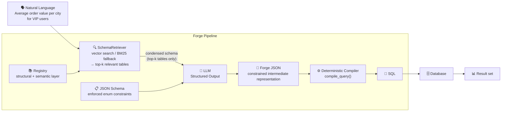
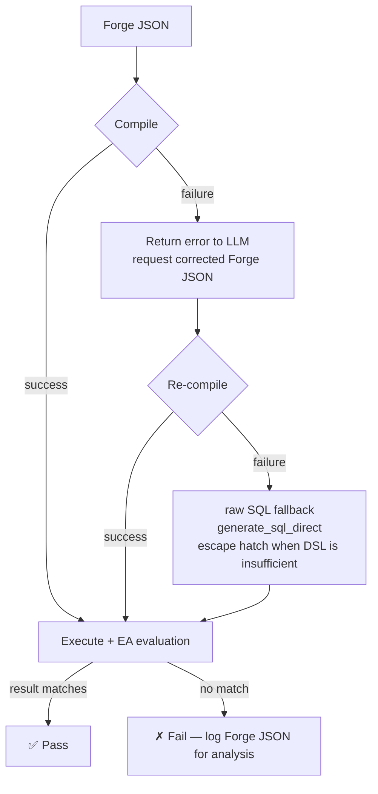

# Forge

[](https://github.com/shisuidata/Forge/actions/workflows/ci.yml)
[](LICENSE)

> **Open-source infrastructure for trustworthy AI-assisted data querying: constrained, reviewable, executable, and auditable.**

Forge sits between an upstream agent and a database. It accepts Direct SQL or constrained Forge JSON candidates, then applies Registry context, deterministic SQL compilation, read-only and scope checks, human review, Evidence, and Audit. It is not a thin Text-to-SQL wrapper, and it does not treat “the model produced SQL” as proof that a query is trustworthy.

[简体中文](README.zh-CN.md) · [Contributing](CONTRIBUTING.md) · [Documentation index](docs/README.md)

## Forge in 30 seconds

| A typical Text-to-SQL path | Forge today |
|---|---|
| A model emits and may execute open-ended SQL | A candidate enters a bounded, rejectable assurance path |
| The prompt owns semantics, syntax, and safety | Registry owns semantics, the compiler owns translation, and runtime gates own execution |
| Failures collapse into a SQL error | Input kind, SQL hash, revisions, failure stage, Evidence, and Audit remain inspectable |
| Correctness depends on one model response | Reproducible benchmarks and regressions guide development; open-world 100% accuracy is not claimed |

**Working core available today:**

- constrained Forge JSON intermediate representation and deterministic SQL compilation;
- a shared candidate, QueryRun review, and execution path for Direct SQL and Forge JSON;
- versioned, non-executing Evaluate API/CLI with persistent suites, manifests, replay, and regression gates;
- versioned Enforce API/CLI that binds Principal, Purpose, Task, Resource Scope, Policy, Assurance, Registry, and hash-bound human approval;
- versioned Explain API/CLI that projects actual SQL/results, persisted Registry semantics, governance, Evidence, lineage, integrity, and explicit limitations from the same QueryRun;
- Registry-backed schema and semantic constraints, relationship checks, and grain checks;
- read-only SQL, table/column scope, approval hashes, timeouts, and result limits;
- automated compatibility checks for SQLite, PostgreSQL, and MySQL;
- replayable accuracy benchmarks, exact-result comparison, and bounded failure diagnostics.

> **Project status: early-stage and actively maintained.** Suitable for evaluation and controlled deployments with human review and read-only credentials; not feature-complete or HA-ready. The latest complete structured GPT-5.6 BIRD run was sealed at **57.4% EA vs 62.8% Direct SQL**. A later compiler replay of the **same candidates** reached **62.6% vs 62.8%**, not a new generation result or demonstrated accuracy advantage. Results are version- and dataset-specific. See [current state](docs/current-project-state.md), [benchmark results](#benchmark-results), and the [report index](docs/README.md).

**Upgrade note (2026-09-07):** shared Assurance is now `query-assurance-v10`. Physical-table authorization follows each SQL scope; a nested same-name CTE cannot hide an unauthorized table. The current flat Registry does not authorize schema/catalog-qualified sources. Old v9 QueryRuns fail approval with `assurance_revision_drift`: prepare and review a new QueryRun rather than upgrading old evidence in place. See the [release verification](docs/release-verification-2026-09-07.json).

---

## Table of Contents

- [The Problem We Solve](#the-problem-we-solve)
- [Core Philosophy](#core-philosophy)
- [How It Works](#how-it-works)
- [Walkthrough](#walkthrough)
- [DSL Capabilities](#dsl-capabilities)
- [Schema Retrieval (RAG)](#schema-retrieval-rag)
- [Benchmark Results](#benchmark-results)
- [Engineering Lessons](#engineering-lessons)
- [An Honest Question We're Wrestling With](#an-honest-question-were-wrestling-with)
- [Getting Started](#getting-started)

---

## The Problem We Solve

AI data querying becomes unreliable when the model owns the whole chain: business definitions, schema selection, SQL generation, execution, and result traceability. Forge separates those responsibilities into a trustworthy query workflow.

| Trust gap | Definition | Example | Forge's answer |
|---|---|---|---|
| **Definition trust** | Metric definition ambiguity across teams | Is "repurchase rate" denominator all users, or only users who placed an order? | ✅ Registry semantic layer |
| **Generation trust** | Reasoning correct, translation to SQL wrong | `INNER JOIN` instead of `LEFT JOIN`; `NOT IN` silently fails on NULLs | ✅ DSL constraints + compiler |
| **Execution trust** | Users cannot see what the AI actually ran | SQL execution bypasses review | ✅ Review flow, read-only role, timeout, row cap |
| **Traceability trust** | Failures do not become reusable knowledge | The same mistake repeats next week | ✅ Audit, feedback, failure triage |
| **Capability trust** | Model does not know which algorithm to use | Date series fill, period-over-period calculation | ❌ Outside Forge's scope, honestly labeled |

**Forge's core claim**: trustworthy AI data querying requires a constrained, reviewable, auditable middle layer. Better prompts alone are not enough.

---

## Core Philosophy

### 1. Constraints make failures inspectable

Provider-enforced strict output can constrain the shape of a Forge JSON candidate. Deterministic compilation and shared Assurance then check supported semantics, read-only SQL, Registry access, and source bindings.

These layers do not eliminate all generation errors: expression fields still require validation, compiler bugs need regression coverage, and syntactically valid queries can answer the wrong question. A constrained object is a candidate—not proof of correctness or permission to execute.

### 2. Intent and execution are separated

```
LLM handles:      understand intent → generate Forge JSON  (semantic layer)
Compiler handles: Forge JSON → SQL                          (execution layer, deterministic)
```

This separation has deep implications:

- **Auditable**: the SQL the user reviews is the SQL that executes — no runtime surprises
- **Debuggable**: if the SQL is wrong, it was caused by specific Forge JSON, traceable exactly
- **Upgradable**: switch to a stronger LLM without touching the compiler; optimize the compiler without retraining

### 3. Registry is the organization's data asset

Registry is not a static schema file — it is the accumulation of organizational knowledge:

```
Structural layer (auto-generated by forge sync)
  └── table structure, column names, types, low-cardinality enum values (status: cancelled/completed)

Semantic layer (maintained conversationally, more accurate with each use)
  └── repurchase rate = users with ≥2 orders / users with ≥1 order
  └── average order value = avg total_amount of completed orders
  └── VIP user = is_vip = 1
```

The more it's used, the more accurate Registry becomes, the lower the error rate. **This is a positive flywheel.**

### 4. Fix deterministic bugs without guessing intent

A compiler fix should preserve the meaning of a valid candidate, not infer missing CTE exports, silently add result columns, or repair a model answer using Gold. Local alias expansion and qualified source bindings are covered by behavioral regressions.

Prompt changes are separate, budgeted experiments. A gain on one probe does not outweigh a correct-answer regression; unknown usage and incomplete scoring remain explicit.

---

## How It Works


```mermaid
flowchart LR
    NL["🗣️ Natural Language<br/>Average order value per city<br/>for VIP users"]

    subgraph forge["Forge Pipeline"]
        direction TB
        REG["📚 Registry<br/>structural + semantic layer"]
        RETRIEVER["🔍 SchemaRetriever<br/>vector search / BM25 fallback<br/>→ top-k relevant tables"]
        SCHEMA["📋 JSON Schema<br/>enforced enum constraints"]
        LLM["🤖 LLM<br/>Structured Output"]
        JSON["📄 Forge JSON<br/>constrained intermediate representation"]
        COMPILER["⚙️ Deterministic Compiler<br/>compile_query()"]
        SQL["📝 SQL"]
    end

    DB["🗄️ Database"]
    RESULT["📊 Result set"]

    NL --> RETRIEVER
    REG --> RETRIEVER
    RETRIEVER -->|"condensed schema<br/>(top-k tables only)"| LLM
    SCHEMA --> LLM
    LLM --> JSON
    JSON --> COMPILER
    COMPILER --> SQL
    SQL --> DB
    DB --> RESULT
```

### Error Recovery and Fallback


```mermaid
flowchart TD
    FJ["Forge JSON"]

    FJ --> C1{Compile}
    C1 -->|success| EXEC[Execute + EA evaluation]
    C1 -->|failure| FB1["Return error to LLM<br/>request corrected Forge JSON"]

    FB1 --> C2{Re-compile}
    C2 -->|success| EXEC
    C2 -->|failure| FB2["raw SQL fallback<br/>generate_sql_direct<br/>escape hatch when DSL is insufficient"]

    FB2 --> EXEC
    EXEC -->|result matches| PASS["✅ Pass"]
    EXEC -->|no match| FAIL["✗ Fail — log Forge JSON for analysis"]
```

---

## Walkthrough

Example: "Calculate repurchase rate, where a repurchase user is defined as having placed 2 or more orders."

### Step 1 — Registry builds the system prompt

`forge sync` connects directly to the database and auto-samples low-cardinality column enum values:

```
Database schema:
  users: id, name, city, created_at, is_vip[0/1]
  orders: id, user_id, status[cancelled/completed], total_amount, created_at
  order_items: id, order_id, product_id, quantity, unit_price
  products: id, name, category[Books/Clothing/Electronics], cost_price
```

`status[cancelled/completed]` tells the LLM the exact string spellings, eliminating a whole class of hallucinations.

### Step 2 — LLM generates Forge JSON (Structured Output)

```json
{
  "cte": [{
    "name": "user_orders",
    "query": {
      "scan": "orders",
      "group": ["orders.user_id"],
      "agg": [{"fn": "count_all", "as": "order_count"}],
      "select": ["orders.user_id", "order_count"]
    }
  }],
  "scan": "user_orders",
  "agg": [
    {"fn": "count_all", "as": "total_users"},
    {"fn": "count", "col": "CASE WHEN order_count >= 2 THEN 1 END", "as": "repeat_users"}
  ],
  "select": [{"expr": "repeat_users * 1.0 / total_users", "as": "repurchase_rate"}]
}
```

JSON Schema enforces constraints at the token generation level: `fn` can only be enum values, `scan` can only be table names in the Registry.

### Step 3 — Deterministic compilation

```python
compile_query(forge_json)  # same input always produces same SQL
```

During compilation, `_expand_aliases()` expands unqualified local aggregate/window column references. SQLGlot AST locations enable a single source-preserving replacement pass; qualified source columns, literals, comments, function/type names and nested SQL scopes are not rewritten. For example:

```sql
WITH user_orders AS (
  SELECT orders.user_id, COUNT(*) AS order_count
  FROM orders
  GROUP BY orders.user_id
)
SELECT COUNT(CASE WHEN order_count >= 2 THEN 1 END) * 1.0 / COUNT(*) AS repurchase_rate
FROM user_orders
```

### Step 4 — User review → execution

What the user sees is what will be executed — no runtime transformation. On approval, Forge connects directly to the database, executes, and displays results.

---

## DSL Capabilities

| Feature | Notes |
|---|---|
| **JOIN types** | `inner / left / right / full / anti / semi`, type must be explicitly declared |
| **anti join** | Replaces `NOT IN`, eliminates NULL trap at the root |
| **Aggregate functions** | `count / count_all / count_distinct / sum / avg / min / max / group_concat` |
| **Agg FILTER clause** | `{"fn":"sum","col":"...","filter":[...]}` → `SUM(...) FILTER (WHERE ...)`, native in SQLite/PG |
| **CASE WHEN in agg** | `{"fn":"count","col":"CASE WHEN x>=2 THEN 1 END"}` |
| **Window — ranking/distribution** | `row_number / rank / dense_rank / percent_rank / cume_dist / ntile(n)` |
| **Window — value/navigation** | `lag / lead / first_value / last_value`, with optional offset, default, frame |
| **Window frame** | `{"unit":"rows","start":"6 preceding","end":"current_row"}` → `ROWS BETWEEN 6 PRECEDING AND CURRENT ROW`; supports sliding avg, running total |
| **qualify** | Window result filtering (per-group TopN), compiled into a wrapping subquery |
| **CTE** | Multi-step aggregation, derived metrics; recursive CTE supported |
| **Date trunc group key** | `group` accepts `{"expr":"STRFTIME('%Y-%m',col)","as":"month"}`; alias usable directly in select |
| **Dates** | `$date` literal + `$preset` relative dates (8 presets) |
| **SELECT DISTINCT** | Add `"distinct": true` at top level |
| **Set operations** | `union / union_all / intersect / except`; main query sort/limit applies to the whole result |
| **IN subquery** | `{"col":"users.id","op":"in","val":{"subquery":{...}}}` → `col IN (SELECT ...)` |
| **Dialect support** | SQLite / MySQL / PostgreSQL (date functions, string agg, FULL JOIN detection, FILTER clause availability check) |
| **Alias expansion** | agg/window aliases referenced in SELECT expr are auto-expanded, eliminating alias scope errors |

---

## Schema Retrieval (RAG)

When the Registry contains dozens or hundreds of tables, injecting the full schema into every prompt is both expensive and noisy. Forge ships a two-tier schema retriever in `forge/retriever.py`.

### How It Works

```
User question
  ↓
SchemaRetriever.retrieve(question, embed_fn, top_k=5)
  ├── index built + embed_fn available → vector search (cosine similarity)
  └── otherwise → BM25-lite keyword fallback (auto, no config needed)
  ↓
DDL schema for top-k relevant tables only
  ↓
LLM generates Forge JSON (shorter context, less noise)
```

### Table Description Construction

Retrieval quality is bounded by how well each table is described. Forge builds a rich text representation from the Registry:

```
Table: orders. Description: order master table. Columns: id, user_id, status (completed, cancelled), total_amount, created_at
```

**Key: enum values are embedded in the description.** When a user asks about "completed orders", `status (completed, cancelled)` lets the embedding correctly surface `orders` rather than an unrelated table.

### Two-Tier Retrieval

| Mode | Mechanism | Trigger | Recall (4 tables, top_k=5) |
|---|---|---|---|
| **Vector search** | L2-normalized cosine similarity | Index built + embed_fn available | 100% |
| **BM25-lite fallback** | TF×IDF + Chinese bigram tokenization | No embedding API | 92.9% |

The BM25-lite tokenizer generates both full Chinese strings (high exact-match weight) and character-level bigrams (fuzzy matching), so a short query term can still match longer column descriptions.

### Embedding API Compatibility

The `make_embed_fn` factory normalizes differences across APIs:

| API | Request format | Response format |
|---|---|---|
| Standard OpenAI | `{"input": ["..."]}` | `{"data": [{"embedding": [...]}]}` |
| MiniMax | `{"texts": ["..."], "type": "db"/"query"}` | `{"vectors": [[...], [...]]}` |

MiniMax distinguishes `db` (index documents) from `query` (query text) embedding types — mixing them degrades recall. Forge automatically uses the correct type for index building vs. query retrieval.

### Index Caching

- First run: batch-embeds all table descriptions, L2-normalizes, caches to `.forge/schema_embeddings.pkl`
- Subsequent queries: loads from cache (milliseconds); auto-invalidated when the table set changes
- When `top_k >= number of tables`, retrieval is skipped and all tables are returned (avoids wasting API calls on small schemas)

### Compression Effect

| Scenario | Full schema tokens | After retrieval | Reduction |
|---|---|---|---|
| 4 tables, top_k=5 | ~230 | ~230 (auto full-fetch) | 0% |
| 50 tables, top_k=5 | ~2,800 | ~560 | **~80%** |

> In real enterprise schemas with dozens of tables, only the 5 most relevant tables are injected per query — schema tokens in the prompt reduce by 80%+.

---

## Benchmark Results

### Public BIRD Mini-Dev: keep generation and replay separate

The repository records three complete 500-case, 1,000-call paired runs. These are historical measurements under their recorded model, Prompt, compiler, and evaluator revisions—not a fresh benchmark of every later commit.

| Evidence | Forge Official EX / EA | Direct SQL Official EX / EA | Interpretation |
|---|---:|---:|---|
| DeepSeek V4 Flash, complete generation | 227/500 (45.4%) | 282/500 (56.4%) | Historical run; not the latest result |
| GPT-5.6, text generation | 266/500 (53.2%) | 311/500 (62.2%) | Complete paired generation |
| GPT-5.6, structured tool generation as originally sealed | 287/500 (57.4%) | 314/500 (62.8%) | Original runtime verdicts retained |
| Same structured candidates, deterministic compiler replay | 313/500 (62.6%) | 314/500 (62.8%) | Offline replay, not new generation |

For the last row, the discordant pairs are Forge-only 22 and Direct-only 23 (two-sided exact p=1.0): **no demonstrated Forge JSON accuracy advantage**. The original structured generation also used 59.57% more Forge tokens and 51.69% more average generation time. A later result-comparator correction gives Contract 284/500 versus 294/500 on the same candidates; Official EX remains unchanged. Contract is a separate metric, not a replacement for Official EX.

The attempted additional DeepSeek run is **incomplete**: only 78 candidates per arm, with 422 missing per arm and quota/balance failures. Its nominal 500 terminal cases are not a fourth valid full run.

### Development experiments through 2026-09-07

The BIRD snapshot has been exposed during development and is now **R**, a regression set. Small **D** probes diagnose failures; **S** fixtures test logical and safety boundaries. Independently audited **H** evidence and external-adoption evidence remain open gates.

| Recent paired experiment | New model calls | Forge EX / Contract, control → treatment | Decision |
|---|---:|---|---|
| Denominator example (REQ-056) | 16 | 2/4 → 3/4 | Rejected: previously correct md-079 regressed |
| CTE interface example (REQ-058) | 16 | 3/4 → 3/4 | Rejected: md-199 improved, md-079 regressed |

REQ-058 also had Direct 3/4 → 2/4 with identical Direct inputs. Its 67,367 total tokens were fully observed; treatment total tokens rose 8.57%, Forge tokens per correct answer rose 13.11%, and four-observation generation P95 rose 41.53%. The latter two cost/latency gates failed. Neither prompt example is enabled by default; date, grain, and value context options remain off. No replacement calls or automatic repair are implied.

**Every published report—including preparation, offline replay, negative results, and incomplete runs—is indexed in the [documentation index](docs/README.md).** Start with the [historical run ledger](docs/benchmark-historical-runs-2026-09-07.json), [CTE experiment](docs/benchmark-luna-cte-interface-2026-09-07.json), and [benchmark protocol](docs/benchmarks.md). The [publication manifest](docs/report-publication-2026-09-07.json) distinguishes public redacted copies from preserved originals. Private runtime databases, provider sessions, and third-party dataset files are not included in a clone; local artifact paths are not public download links.

### Historical suites are not a leaderboard

The earlier 40-case in-house suite and Spider2-Lite SQLite experiments remain in [benchmark history](docs/benchmarks.md). Spider2 reported 11/119 scored answers (9.2%) after 123 generated cases and a different fallback/retry protocol. Different denominators, LLM-judge scores, and completed-only subsets must not be combined with BIRD Official EX or used to claim general accuracy.

---


## Engineering Lessons

### Separate compiler corrections from generation gains

The structured 500-case candidate set improved from 287 to 313 Official EX passes after deterministic compiler fixes. That is an offline result on unchanged candidates—not evidence that a newly generated answer or a Prompt revision improved.

### Alias scope is SQL's hidden reef

The SQL standard does not allow referencing same-level agg aliases within the same SELECT:

```sql
-- Wrong: repeat_users doesn't exist yet at this point
SELECT repeat_users * 1.0 / total_users AS repurchase_rate
```

Solution: expand unqualified local aggregate/window column references, not arbitrary matching text. Qualified source columns and nested SQL scopes keep their meaning; missing CTE outputs are not inferred or added. This resolves supported same-level alias references, not every alias error.

### Prompt changes need paired controls

A synthetic CTE example can pass structural fixtures yet cause a fresh percentage query to return two counts instead of the requested answer. Preserve the full paired denominator, regressions, and costs; successful compilation is not complete-answer success.

Semantic context also needs verified provenance. Date, grain, and value observations remain opt-in and version-bound; a heuristic is not an organization-confirmed business definition.


---

## An Honest Question We're Wrestling With

**Does constrained generation itself justify its cost? Current public evidence does not establish that advantage.** The fixed-candidate BIRD replay is 313/500 versus 314/500, while the Forge branch's original generation cost more tokens and time. Small prompt experiments can repair one answer and break another.

Forge therefore treats Direct SQL and Forge JSON as alternative candidate formats, not a hierarchy of trust. The product boundary is **Evaluate → Enforce → Explain**: reproducible assessment, a shared rejectable execution path, hash-bound approval, and evidence from the same QueryRun. Deterministic checks cannot settle an unknown business definition or prove a correct answer on every future database state.

The remaining questions need independent evidence: does this runtime catch meaningful failures in an external team's workflow, at acceptable cost and user effort? Do independently audited holdout cases support the same conclusions? Internal tests, exposed benchmarks, maintainer demos, and stars do not answer those questions. See [current project state](docs/current-project-state.md) for the open adoption gates.

---


## Getting Started

### Public Golden Path

```bash
git clone https://github.com/shisuidata/Forge
cd Forge
bash scripts/bootstrap-dev.sh
source .venv/bin/activate
forge quickstart
```

That command is the complete public Trust Runtime path: it starts an isolated local Forge server and SQLite datasource, submits a **Direct SQL** candidate to `Evaluate`, stops at `Enforce` review, executes only after you approve the displayed SQL, reads the same QueryRun through `Explain`, and verifies its Dashboard projection. No API key, LLM, embedding service, Pi knowledge, Forge JSON, existing database, or `.env` file is required.

Expected proof: the first `Evaluate` request rejects write SQL with `assurance/readonly_violation`; the read-only request passes exact-result comparison; `Enforce` returns two rows and reports row-limit truncation; `Explain` reports `integrity=verified` with seven Evidence types and explicit limitations; Dashboard contains the same QueryRun ID; and `run_receipt.receipt_hash` provides a stable checksum for the sanitized receipt.

```bash
# Keep the isolated server open and print its Dashboard URL.
forge quickstart --serve

# Non-interactive CI output; safe only because the command creates synthetic local data.
forge quickstart --yes --json

# Preserve the demo database, QueryRuns, log, and summary instead of deleting them.
forge quickstart --yes --workdir .forge/quickstart-proof
```

`--yes` is a demo-only convenience. Real Enforce deployments still require authenticated creator/reviewer separation and matching immutable review hashes.
Ran this independently? Submit the sanitized `run_receipt`, fresh-clone setup time, first failure or confusing step, and your interpretation through the [Quickstart adoption report](https://github.com/shisuidata/Forge/issues/new?template=quickstart-adoption.yml). Forge sends no telemetry. The checksum detects receipt drift and supports deduplication; it is not an identity attestation—the GitHub-authored report provides public provenance.

### Full natural-language development demo (optional)

The broader NLQ demo requires LLM and embedding configuration and is not part of the Trust Runtime Golden Path:

```bash
cp .env.example .env
bash scripts/demo-setup.sh
uvicorn main:app --host 0.0.0.0 --port 8000
```

### Evaluate an existing agent output

`POST /api/v1/evaluate` accepts either Direct SQL or Forge JSON through one versioned envelope. It applies deterministic candidate, Registry, scope, read-only, and result-contract checks. It **does not execute SQL** and never grants execution authority; `allowed_tables` is an evaluation criterion, not an access grant.

Create `evaluation.json`:

```json
{
  "schema_version": 1,
  "question": "Return the value 1",
  "dialect": "sqlite",
  "candidate": {
    "kind": "direct_sql",
    "sql": "SELECT 1 AS value",
    "producer_revision": "example-agent-v1"
  },
  "expected_result": {"columns": ["value"], "rows": [[1]]},
  "actual_result": {"columns": ["value"], "rows": [[1]]}
}
```

Run it with the CLI:

```bash
export FORGE_BASE_URL=http://127.0.0.1:8000
# Set FORGE_API_KEY only when API authentication is enabled.
forge evaluate evaluation.json
```

The same request with curl:

```bash
curl --fail-with-body -sS "$FORGE_BASE_URL/api/v1/evaluate" \
  -H "Content-Type: application/json" \
  -H "X-API-Key: $FORGE_API_KEY" \
  --data @evaluation.json
```

Or Python:

```python
import json
import os

import httpx

request = json.load(open("evaluation.json", encoding="utf-8"))
headers = {"X-API-Key": os.environ["FORGE_API_KEY"]} if os.getenv("FORGE_API_KEY") else {}
response = httpx.post(
    os.getenv("FORGE_BASE_URL", "http://127.0.0.1:8000") + "/api/v1/evaluate",
    json=request,
    headers=headers,
    timeout=30,
)
response.raise_for_status()
print(response.json())
```

A passed response returns `policy.verdict: "allow_review"`, immutable lineage hashes, and response-local `evidence_refs`. A failed gate returns the same envelope with a bounded `failure.stage` and `failure.code`; the CLI exits non-zero. To evaluate Forge JSON, replace `candidate` with `{"kind":"forge_json","forge_json":{...}}`.

For a persistent suite, reproducible manifest, and regression release gate, use the public fixture:

```bash
# Persist the suite and its raw outcomes.
forge evaluate examples/evaluation-suite-v1.json --suite

# Replay the immutable suite, compare it with a baseline, or export a run.
forge evaluate --suite-revision "sha256:<suite-revision>" --baseline-run "evr_<baseline>"
forge evaluate --run-id "evr_<run-id>"
```

The `evaluation-suite-v1` manifest records dataset, producer/model, prompt, retrieval, retry, and timeout revisions. The persisted `evaluation-run-manifest-v1` adds evaluator, metric, candidate contract, Assurance, Policy, Registry, dialect, raw case outcomes, and recomputable aggregates. The default release gate allows no new failed cases and no pass-rate drop. A changed dataset, case selection, expected evaluation basis, policy, evaluator, Registry, or dialect is marked `not_comparable` and fails closed; producer/model/prompt revisions may differ because those are the intended comparison variables.

### Enforce a reviewed query

`POST /api/v1/enforce/query-runs` prepares a governed QueryRun; it never executes during creation. The request follows [`enforce-query-request-v1`](agent/contracts/enforce-query-request-v1.schema.json) and binds the candidate to a Principal, Purpose, Task, Resource Scope, Policy, Assurance report, Registry revision, and read-only datasource. A direct human principal is accountable for the request. An Agent or Service principal must provide one active [Delegated Mandate](agent/contracts/delegated-mandate-v1.schema.json) matching its actor, accountable human, task, purpose, capabilities, and scope.

```bash
# Prepare only. Returns status=review_required plus immutable review hashes.
forge enforce enforce-request.json --idempotency-key prepare-001

# Read the same governed QueryRun with the creator credential.
forge enforce --run-id "qr_<query-run-id>"

# A separate reviewer credential submits the reviewed hashes and executes once.
FORGE_API_KEY="$FORGE_REVIEWER_API_KEY" forge enforce approval.json \
  --approve "qr_<query-run-id>" \
  --idempotency-key approve-001
```

`approval.json` follows [`enforce-query-approval-v1`](agent/contracts/enforce-query-approval-v1.schema.json): copy `sql_hash`, `assurance_report_hash`, and `enforcement_context_hash` from the prepare response and identify the accountable human reviewer. With API authentication enabled, configure ordinary create/read credentials in `AUTH_API_KEYS` and separate approval credentials in `ENFORCE_REVIEWER_API_KEYS`. Policy, Registry, candidate, authorization context, scope, approval, or read-only drift fails closed. Responses follow [`enforce-query-response-v1`](agent/contracts/enforce-query-response-v1.schema.json) and expose bounded failure codes instead of raw database errors.

This v1 path governs Direct SQL and Forge JSON query preparation, approval, and execution. It does not claim a complete IAM system, production deployment, or governance coverage for non-query actions.

### Explain a governed QueryRun

`GET /api/v1/explain/query-runs/{query_run_id}` returns the stable [`explain-query-response-v1`](agent/contracts/explain-query-response-v1.schema.json) projection for any governed QueryRun. It uses the creator credential and reads the same QueryRun truth source as Enforce:

```bash
# FORGE_API_KEY must be the credential that created the QueryRun when auth is enabled.
forge explain "qr_<query-run-id>"

curl --fail-with-body -sS   -H "X-API-Key: $FORGE_API_KEY"   "$FORGE_BASE_URL/api/v1/explain/query-runs/qr_<query-run-id>"
```

The response includes the candidate, actual reviewed SQL, bounded result or failure, persisted table/column descriptions, datasource and resource scope, Principal/Policy/Approval, Assurance gates, version/hash lineage, deterministic Evidence references, and limitations. Source context, approval, and completed results are hash-bound. Tampering fails closed with a bounded Explain error; older QueryRuns without those anchors return `integrity.status: "partial"` and name each unverified component instead of fabricating proof.

Every explanation states applicable epistemic and runtime limits, including that live execution has no captured database snapshot and that Registry bindings plus deterministic gates do not prove open-world business correctness. Explain does not expose credential hashes, storage layout, or raw database errors.

---

## Project Structure

```
forge/
  ├── schema.json          — Forge DSL format definition (JSON Schema)
  ├── compiler.py          — Deterministic compiler: Forge JSON → SQL (3 dialects, 14 coerce fixes)
  ├── retriever.py         — Schema vector retriever (embedding + BM25-lite fallback)
  ├── schema_builder.py    — Dynamically builds tool schema (injects enum constraints)
  └── cli.py               — CLI entry point (evaluate / enforce / explain / compile / sync / doctor)

registry/
  └── sync.py              — forge sync: connects to database and generates Registry

tests/
  ├── test_compiler.py     — Compiler unit tests (38 cases)
  ├── accuracy/            — Proprietary 40-case benchmark (LLM judge + EA, 10 versions)
  │   ├── cases.json       — Cases + reference SQL
  │   ├── runner.py        — Multi-method comparison runner
  │   └── results/         — Per-version run results
  ├── text-to-sql-failures/— Targeted failure cases (JOIN traps, aggregation traps, etc.)
  └── spider2/             — Spider2-Lite SQLite subset test (123 cases)
      ├── runner.py        — Full pipeline runner (EA embedded + raw SQL fallback)
      └── results/         — SQL files + run logs
```

---

## Current Scores

| Evidence | Cases | Metric | Forge / Direct SQL |
|---|---:|---|---|
| Structured GPT-5.6 generation, original | 500 | Official EX / EA | 57.4% / 62.8% |
| Same candidates, compiler replay | 500 | Official EX / EA | 62.6% / 62.8% |
| Same candidates, comparator v2 | 500 | Contract | 56.8% / 58.8% |

These are historical, version-bound measurements. See [Benchmark Results](#benchmark-results) for costs, incomplete runs, historical suites, and every report; none establishes general accuracy or external adoption.

## Contributing

See [`CONTRIBUTING.md`](CONTRIBUTING.md) for setup, testing, benchmark, pull request, and security guidance.

## Maintainer context

[`shisuidata/Forge`](https://github.com/shisuidata/Forge) is the canonical repository under the [`shisuidata`](https://github.com/shisuidata) organization. [`rockythink`](https://github.com/rockythink) is the organization administrator and primary maintainer. Historical commits attributed to the former `shisuidata` user now appear under [`shisuidata-legacy`](https://github.com/shisuidata-legacy); that account is retained only for history and is no longer used for project operations.

## License

Forge is licensed under the [Apache License 2.0](LICENSE).
