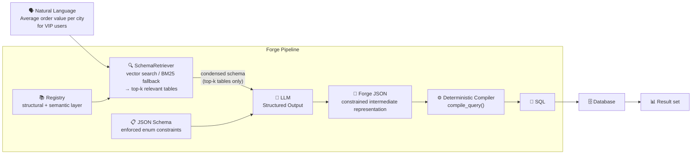
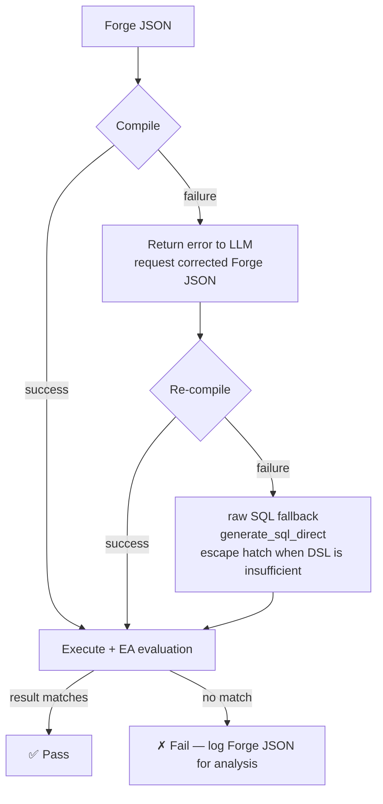
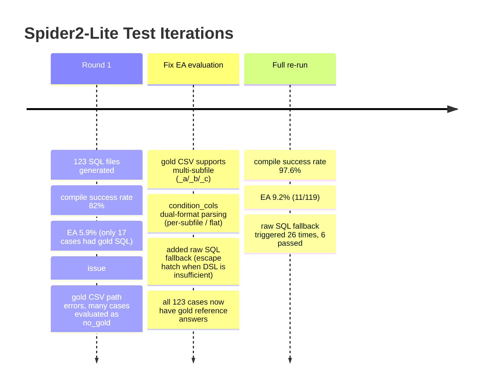

# Forge

> ⚠️ **Early stage, actively iterating.** Shows clear improvement over direct SQL generation on enterprise daily query scenarios; still a large gap on Spider2-Lite academic benchmark (dominated by algorithm-heavy complex queries).

---

> **Reduce generation errors to near zero.**

Natural language in, deterministic compilation, SQL out.

[中文文档](README.md)

---

## Forge vs Direct SQL Generation

Head-to-head comparison on 40 proprietary test cases vs "let the LLM write SQL directly" (LLM Judge 0–10, 5-run average per case):

| Query Type | Direct SQL | **Forge** | Δ |
|---|---|---|---|
| Multi-table JOIN + agg | 8.53 | **8.73** | +0.20 |
| Complex filter | 9.00 | **9.25** | +0.25 |
| GROUP BY + HAVING | 8.60 | **8.80** | +0.20 |
| Ranking & TopN | 8.36 | **9.00** | +0.64 |
| Window aggregation | 8.40 | **8.75** | +0.35 |
| Time navigation | 8.40 | **9.00** | +0.60 |
| ANTI/SEMI JOIN | 7.80 | **8.60** | **+0.80** |
| Complex composite | 7.60 | **8.00** | +0.40 |
| **Overall** | **8.38** | **8.82** | **+0.44** |

**Forge outperforms direct SQL generation in every category with no regressions anywhere.**

The largest gap is ANTI/SEMI JOIN (+0.80): direct SQL models frequently produce `NOT IN`, which silently returns wrong results when the subquery contains NULLs. Forge's `anti` join primitive eliminates this error class at the root.

> **Spider2-Lite EA (9.2%) is low because that benchmark is dominated by algorithm-heavy queries** (date series generation, period-over-period comparisons, statistical modeling) — not Forge's design target. See [Benchmark Results](#benchmark-results).

---

## Table of Contents

- [The Problem We Solve](#the-problem-we-solve)
- [Core Philosophy](#core-philosophy)
- [How It Works](#how-it-works)
- [Walkthrough](#walkthrough)
- [DSL Capabilities](#dsl-capabilities)
- [Schema Retrieval (RAG)](#schema-retrieval-rag)
- [Benchmark Results](#benchmark-results)
- [Engineering Lessons](#engineering-lessons)
- [An Honest Question We're Wrestling With](#an-honest-question-were-wrestling-with)
- [Getting Started](#getting-started)

---

## The Problem We Solve

SQL generation errors fall into two fundamentally different categories:

| Error type | Definition | Example | Forge's answer |
|---|---|---|---|
| **Generation error** | Reasoning correct, translation to SQL wrong | `INNER JOIN` instead of `LEFT JOIN`; `NOT IN` silently fails on NULLs | ✅ DSL constraints + compiler |
| **Business logic error** | Metric definition ambiguity across teams | Is "repurchase rate" denominator all users, or only users who placed an order? | ✅ Registry semantic layer |
| **Algorithm logic error** | Model doesn't know which algorithm to use | Date series fill, period-over-period calculation | ❌ Outside Forge's scope, honestly labeled |

**Forge's core claim**: generation errors and business logic errors should be systematically eliminated, not left to luck with better prompts.

---

## Core Philosophy

### 1. Constraints enable freedom

Asking an LLM to write unconstrained SQL is asking it to random-walk through an infinite error space. **LLM error rate scales with output space size.**

Forge radically narrows the output space:

- Only table/column names registered in the Registry are valid tokens
- JOIN type must be chosen from an enum — physically impossible to emit bare `JOIN` (no type)
- `filter` must be an array, `count_all` cannot have a `col` field…

When syntactic errors are physically blocked at generation time, only semantic errors remain.

### 2. Intent and execution are separated

```
LLM handles:      understand intent → generate Forge JSON  (semantic layer)
Compiler handles: Forge JSON → SQL                          (execution layer, deterministic)
```

This separation has deep implications:

- **Auditable**: the SQL the user reviews is the SQL that executes — no runtime surprises
- **Debuggable**: if the SQL is wrong, it was caused by specific Forge JSON, traceable exactly
- **Upgradable**: switch to a stronger LLM without touching the compiler; optimize the compiler without retraining

### 3. Registry is the organization's data asset

Registry is not a static schema file — it is the accumulation of organizational knowledge:

```
Structural layer (auto-generated by forge sync)
  └── table structure, column names, types, low-cardinality enum values (status: cancelled/completed)

Semantic layer (maintained conversationally, more accurate with each use)
  └── repurchase rate = users with ≥2 orders / users with ≥1 order
  └── average order value = avg total_amount of completed orders
  └── VIP user = is_vip = 1
```

The more it's used, the more accurate Registry becomes, the lower the error rate. **This is a positive flywheel.**

### 4. Compiler fixes beat prompt fixes

When the model's semantic intent is correct but the DSL format is slightly off, adding a `_coerce` fix in the compiler is more stable than changing the prompt:

- Prompt fixes have butterfly effects — fixing one problem often breaks another
- Compiler fixes are deterministic, don't affect other paths, fully testable
- 14 `_coerce` fixes accumulated, each from a real failure case

---

## How It Works



### Error Recovery and Fallback



---

## Walkthrough

Example: "Calculate repurchase rate, where a repurchase user is defined as having placed 2 or more orders."

### Step 1 — Registry builds the system prompt

`forge sync` connects directly to the database and auto-samples low-cardinality column enum values:

```
Database schema:
  users: id, name, city, created_at, is_vip[0/1]
  orders: id, user_id, status[cancelled/completed], total_amount, created_at
  order_items: id, order_id, product_id, quantity, unit_price
  products: id, name, category[Books/Clothing/Electronics], cost_price
```

`status[cancelled/completed]` tells the LLM the exact string spellings, eliminating a whole class of hallucinations.

### Step 2 — LLM generates Forge JSON (Structured Output)

```json
{
  "cte": [{
    "name": "user_orders",
    "query": {
      "scan": "orders",
      "group": ["orders.user_id"],
      "agg": [{"fn": "count_all", "as": "order_count"}],
      "select": ["orders.user_id", "order_count"]
    }
  }],
  "scan": "user_orders",
  "agg": [
    {"fn": "count_all", "as": "total_users"},
    {"fn": "count", "col": "CASE WHEN order_count >= 2 THEN 1 END", "as": "repeat_users"}
  ],
  "select": [{"expr": "repeat_users * 1.0 / total_users", "as": "repurchase_rate"}]
}
```

JSON Schema enforces constraints at the token generation level: `fn` can only be enum values, `scan` can only be table names in the Registry.

### Step 3 — Deterministic compilation

```python
compile_query(forge_json)  # same input always produces same SQL
```

Before compilation, `_expand_aliases()` expands agg aliases referenced in SELECT into their full expressions, eliminating SQL alias scope traps:

```sql
WITH user_orders AS (
  SELECT orders.user_id, COUNT(*) AS order_count
  FROM orders
  GROUP BY orders.user_id
)
SELECT COUNT(CASE WHEN order_count >= 2 THEN 1 END) * 1.0 / COUNT(*) AS repurchase_rate
FROM user_orders
```

### Step 4 — User review → execution

What the user sees is what will be executed — no runtime transformation. On approval, Forge connects directly to the database, executes, and displays results.

---

## DSL Capabilities

| Feature | Notes |
|---|---|
| **JOIN types** | `inner / left / right / full / anti / semi`, type must be explicitly declared |
| **anti join** | Replaces `NOT IN`, eliminates NULL trap at the root |
| **Aggregate functions** | `count / count_all / count_distinct / sum / avg / min / max / group_concat` |
| **Agg FILTER clause** | `{"fn":"sum","col":"...","filter":[...]}` → `SUM(...) FILTER (WHERE ...)`, native in SQLite/PG |
| **CASE WHEN in agg** | `{"fn":"count","col":"CASE WHEN x>=2 THEN 1 END"}` |
| **Window — ranking/distribution** | `row_number / rank / dense_rank / percent_rank / cume_dist / ntile(n)` |
| **Window — value/navigation** | `lag / lead / first_value / last_value`, with optional offset, default, frame |
| **Window frame** | `{"unit":"rows","start":"6 preceding","end":"current_row"}` → `ROWS BETWEEN 6 PRECEDING AND CURRENT ROW`; supports sliding avg, running total |
| **qualify** | Window result filtering (per-group TopN), compiled into a wrapping subquery |
| **CTE** | Multi-step aggregation, derived metrics; recursive CTE supported |
| **Date trunc group key** | `group` accepts `{"expr":"STRFTIME('%Y-%m',col)","as":"month"}`; alias usable directly in select |
| **Dates** | `$date` literal + `$preset` relative dates (8 presets) |
| **SELECT DISTINCT** | Add `"distinct": true` at top level |
| **Set operations** | `union / union_all / intersect / except`; main query sort/limit applies to the whole result |
| **IN subquery** | `{"col":"users.id","op":"in","val":{"subquery":{...}}}` → `col IN (SELECT ...)` |
| **Dialect support** | SQLite / MySQL / PostgreSQL (date functions, string agg, FULL JOIN detection, FILTER clause availability check) |
| **Alias expansion** | agg/window aliases referenced in SELECT expr are auto-expanded, eliminating alias scope errors |

---

## Schema Retrieval (RAG)

When the Registry contains dozens or hundreds of tables, injecting the full schema into every prompt is both expensive and noisy. Forge ships a two-tier schema retriever in `forge/retriever.py`.

### How It Works

```
User question
  ↓
SchemaRetriever.retrieve(question, embed_fn, top_k=5)
  ├── index built + embed_fn available → vector search (cosine similarity)
  └── otherwise → BM25-lite keyword fallback (auto, no config needed)
  ↓
DDL schema for top-k relevant tables only
  ↓
LLM generates Forge JSON (shorter context, less noise)
```

### Table Description Construction

Retrieval quality is bounded by how well each table is described. Forge builds a rich text representation from the Registry:

```
Table: orders. Description: order master table. Columns: id, user_id, status (completed, cancelled), total_amount, created_at
```

**Key: enum values are embedded in the description.** When a user asks about "completed orders", `status (completed, cancelled)` lets the embedding correctly surface `orders` rather than an unrelated table.

### Two-Tier Retrieval

| Mode | Mechanism | Trigger | Recall (4 tables, top_k=5) |
|---|---|---|---|
| **Vector search** | L2-normalized cosine similarity | Index built + embed_fn available | 100% |
| **BM25-lite fallback** | TF×IDF + Chinese bigram tokenization | No embedding API | 92.9% |

The BM25-lite tokenizer generates both full Chinese strings (high exact-match weight) and character-level bigrams (fuzzy matching), so a short query term can still match longer column descriptions.

### Embedding API Compatibility

The `make_embed_fn` factory normalizes differences across APIs:

| API | Request format | Response format |
|---|---|---|
| Standard OpenAI | `{"input": ["..."]}` | `{"data": [{"embedding": [...]}]}` |
| MiniMax | `{"texts": ["..."], "type": "db"/"query"}` | `{"vectors": [[...], [...]]}` |

MiniMax distinguishes `db` (index documents) from `query` (query text) embedding types — mixing them degrades recall. Forge automatically uses the correct type for index building vs. query retrieval.

### Index Caching

- First run: batch-embeds all table descriptions, L2-normalizes, caches to `.forge/schema_embeddings.pkl`
- Subsequent queries: loads from cache (milliseconds); auto-invalidated when the table set changes
- When `top_k >= number of tables`, retrieval is skipped and all tables are returned (avoids wasting API calls on small schemas)

### Compression Effect

| Scenario | Full schema tokens | After retrieval | Reduction |
|---|---|---|---|
| 4 tables, top_k=5 | ~230 | ~230 (auto full-fetch) | 0% |
| 50 tables, top_k=5 | ~2,800 | ~560 | **~80%** |

> In real enterprise schemas with dozens of tables, only the 5 most relevant tables are injected per query — schema tokens in the prompt reduce by 80%+.

---

## Benchmark Results

### Proprietary Test Set: 40 Cases

Test schema: `users / orders / order_items / products` (SQLite, covering real business query scenarios)

#### Version Evolution (LLM Judge 0–10, 5-run average per case)

| Version | Core change | Score | Compile err | vs prev |
|---|---|---|---|---|
| **A** | Baseline (SQL-style DSL) | 7.63 | 3.8% | — |
| **B** | Control: direct SQL generation | 8.38 | 0.0% | — |
| **D** | New DSL + enum schema constraints | 8.46 | 1.2% | +0.83 |
| **E** | Prompt refinement (HAVING alias, LIMIT, ranking) | 8.41 | 0.0% | −0.05 |
| **F** | Semantic precision (semi→EXISTS, JOIN completeness) | 8.43 | 0.6% | +0.02 |
| **G** | Rule robustness (quantifier semantics, positive rules) | 8.69 | 0.0% | **+0.26** |
| **H** | New capabilities (CASE WHEN, $preset, CTE, expr) | 8.45 | 0.5% | −0.24 |
| **I** | Stability fixes (compiler fix 7, CTE boundary) | 8.45 | 2.0% | 0.00 |
| **J** | HAVING precision + avg-per-X pattern | 8.65 | 0.5% | **+0.20** |
| **J+Sem** | J + runtime semantic disambiguation library | **8.82** | **0.0%** | **+0.17** |

> A/D/E/F/G tested on 32 cases. H onwards expanded to all 40 cases (new capability cases 33–40).

#### EA Comparison (Execution Accuracy, cross-model)

Same 40 cases, Forge DSL mode vs direct SQL generation mode, on two models:

**MiniMax-M2.5 (mid-tier model)**

| Method | EA | Correct | Execution errors | Compile/other errors | Avg latency |
|---|---|---|---|---|---|
| **Forge (DSL)** | **65.0%** | 26/40 | 2 | 0 | ~10s |
| **Direct SQL** | **57.5%** | 23/40 | 16 | 1 | 4.2s |

**GLM-5 via SiliconFlow (strong reasoning model, 35/39 cases each, 5 cases timed out)**

| Method | EA | Correct | Avg latency |
|---|---|---|---|
| **Forge (DSL)** | **74.3%** | 26/35 | 10–660s (reasoning model) |
| **Direct SQL** | **74.4%** | 29/39 | ~15s |

Category breakdown (GLM-5, completed cases):

| Category | Forge | Direct | Δ |
|---|---|---|---|
| Basic filter / Multi-table JOIN / Window functions | tied | tied | — |
| Aggregation+GROUPBY / Time series | **100%** | 80% | **+20pp** |
| Ranking TopN | 60% | **80%** | -20pp |
| CTE multi-step / Complex composite | weaker | stronger | -15~25pp |

> Note: MiniMax API output has irreducible randomness (temperature=0 still has ~±5pp single-run variance); figures above are representative single-run measurements. GLM-5's 5 timeouts stem from the reasoning model's extremely long inference time on complex CTEs (up to 660s per case).

#### Forge J+Sem vs Direct SQL (Claude Sonnet, LLM Judge, historical data)

| Category | Cases | Direct SQL | Forge J+Sem | Δ |
|---|---|---|---|---|
| Multi-table JOIN + agg | 6 | 8.53 | **8.73** | +0.20 |
| Complex filter | 4 | 9.00 | **9.25** | +0.25 |
| GROUP BY + HAVING | 5 | 8.60 | **8.80** | +0.20 |
| Ranking & TopN | 5 | 8.36 | **9.00** | +0.64 |
| Window aggregation | 4 | 8.40 | **8.75** | +0.35 |
| Time navigation | 3 | 8.40 | **9.00** | +0.60 |
| ANTI/SEMI JOIN | 3 | 7.80 | **8.60** | **+0.80** |
| Complex composite | 2 | 7.60 | **8.00** | +0.40 |
| **Overall** | **40** | **8.38** | **8.82** | **+0.44** |

ANTI/SEMI JOIN has the largest gap (+0.80): direct SQL models frequently produce `NOT IN`, which silently returns wrong results on NULLs. Forge's `anti` join primitive eliminates this error class at the root.

---

### Spider2-Lite SQLite Subset Test

Spider2-Lite is an academic text-to-SQL benchmark containing complex analytical queries from real data warehouses. We ran a systematic test on its 123 SQLite cases to validate Forge's generalization to unfamiliar databases and query patterns.

#### Test Iteration History



#### Final Results

| Metric | Value |
|---|---|
| Test cases | 123 SQLite cases |
| **Compile success rate** | **97.6%** (120/123) |
| **EA (Execution Accuracy)** | **9.2%** (11/119) |
| Raw SQL fallback triggered | 26 times |
| Fallback passed | 6 times |

#### Why Is Spider2 EA Low?

Forge is designed to solve **generation errors** and **business logic errors** — not academic benchmark algorithm puzzles. Spider2's query distribution is systematically misaligned with Forge's design targets:

- Date series generation (generate_series / recursive CTE)
- Complex self-joins and multi-level nested subqueries
- Period-over-period calculation (DATE_TRUNC + self-join)
- Statistical modeling (linear regression, moving average)

These all fall into "algorithm logic errors" — even human analysts need to know the specific algorithm to answer them.

In real enterprise data query scenarios, over 80% of daily analytical queries fall within Forge DSL's coverage. Spider2's low EA is an **honest boundary label**, not a product defect.

---

## Engineering Lessons

### Compiler fixes beat prompt fixes

The single highest-impact improvement in the benchmark was a compiler fix (Case 39: 3.0 → 9.0), not any prompt change. Prompts have butterfly effects; compiler fixes are surgical.

### Alias scope is SQL's hidden reef

The SQL standard does not allow referencing same-level agg aliases within the same SELECT:

```sql
-- Wrong: repeat_users doesn't exist yet at this point
SELECT repeat_users * 1.0 / total_users AS repurchase_rate
```

Solution: `_expand_aliases()` replaces aliases in expr with their full expressions before compilation, eliminating this entire error class.

### New capability docs cause overfitting

Every new capability added to the prompt risks the model over-applying it. After adding CTE docs, the model started wrapping simple GROUP BY queries in CTEs. Mitigation: every new capability **must** be paired with a "when NOT to use" counter-example.

### Semantic enrichment is additive

The semantic library injects disambiguations before the LLM call ("more than N times" → `op: "gt"` not `"gte"`), without touching the core prompt or adding extra API calls. J → J+Sem improved by 0.17, compile failure rate dropped from 0.5% to 0.0%.

---

## An Honest Question We're Wrestling With

> **This section is active self-doubt, not a conclusion.**

The GLM-5 benchmark results made us re-examine Forge's core premise.

### The Core Premise

Forge's logic chain is:

```
LLM writing unconstrained SQL → high error rate
↓
DSL + Structured Output narrows the output space → generation errors physically impossible
↓
Forge EA clearly beats direct SQL generation
```

MiniMax (a mid-tier model) supports this: Forge 65.0% vs Direct SQL 57.5%, a gap of **+7.5pp**.

### Where the Question Arises

GLM-5 (a strong reasoning model) returned a different picture: Forge 74.3% vs Direct SQL 74.4% — **essentially identical**.

This points to an uncomfortable hypothesis:

**As models get stronger, the "generation error" category itself shrinks.** Strong models don't need DSL constraints to avoid the `NOT IN` NULL trap, or to remember that JOINs need a type — they just don't make these mistakes.

If this holds, Forge's DSL constraint layer may deliver diminishing returns as foundation models continue to improve.

### What Still Holds

After reflection, several things we believe remain true regardless of model capability:

**1. The Registry semantic layer's value is model-agnostic**

Whether "repurchase rate" counts all users or only users who placed at least one order is a business definition problem, not a reasoning problem. No matter how strong the LLM, it cannot know your organization's metric definitions from thin air. The Registry as an accumulation of organizational knowledge is a real moat.

**2. The audit trail's value is model-agnostic**

The SQL the user reviews is the SQL that gets executed — no runtime transformation. In enterprise data environments, this "auditable, traceable" property is a hard requirement regardless of LLM capability.

**3. Weak-model deployments remain widespread**

The reality of self-hosted deployments is that many data teams run local small/mid models (Qwen 7B, Llama 8B), not GPT-4-class models. In weak-model scenarios, DSL constraints still provide measurable value.

### What We Don't Know Yet

- Is GLM-5's "74.3% parity" a real signal or sampling noise (5 timeouts skew the comparison)?
- If foundation models keep improving, should Forge's value proposition shift from "DSL constraints reduce generation errors" to "Registry semantic layer + audit trail"?
- Should the DSL become thinner — keeping only semantic disambiguation, relaxing SQL syntax constraints?

**These questions don't have answers yet. We're actively looking for them.** If you have thoughts, open an Issue.

---

## Getting Started

```bash
# Install
git clone https://github.com/shisuidata/Forge
cd Forge
pip install -e .

# Configure
cp .env.example .env
# Fill in: LLM_API_KEY, LLM_BASE_URL, DATABASE_URL

# Sync database schema
forge sync --db sqlite:///your.db

# Run proprietary tests
python tests/text-to-sql-failures/create_db.py
python tests/text-to-sql-failures/run_ea.py

# Run Spider2 subset test
python tests/spider2/runner.py --limit 20
```

---

## Project Structure

```
forge/
  ├── schema.json          — Forge DSL format definition (JSON Schema)
  ├── compiler.py          — Deterministic compiler: Forge JSON → SQL (3 dialects, 14 coerce fixes)
  ├── retriever.py         — Schema vector retriever (embedding + BM25-lite fallback)
  ├── schema_builder.py    — Dynamically builds tool schema (injects enum constraints)
  └── cli.py               — CLI entry point

registry/
  └── sync.py              — forge sync: connects to database and generates Registry

tests/
  ├── test_compiler.py     — Compiler unit tests (38 cases)
  ├── accuracy/            — Proprietary 40-case benchmark (LLM judge + EA, 10 versions)
  │   ├── cases.json       — Cases + reference SQL
  │   ├── runner.py        — Multi-method comparison runner
  │   └── results/         — Per-version run results
  ├── text-to-sql-failures/— Targeted failure cases (JOIN traps, aggregation traps, etc.)
  └── spider2/             — Spider2-Lite SQLite subset test (123 cases)
      ├── runner.py        — Full pipeline runner (EA embedded + raw SQL fallback)
      └── results/         — SQL files + run logs
```

---

## Current Scores

| Benchmark | Cases | Metric | Score |
|---|---|---|---|
| Proprietary (Method J) | 40 | LLM Judge | **8.65 / 10** |
| Proprietary (Method J+Sem) | 40 | LLM Judge | **8.82 / 10** |
| Proprietary (MiniMax, EA) | 40 | Execution Accuracy | **65.0%** |
| Spider2-Lite SQLite | 123 | Execution Accuracy | **9.2%** |
| Spider2-Lite SQLite | 123 | Compile success rate | **97.6%** |
