# 核心技术优势：Forge 为什么可信

## 1. 受约束中间表示：先写“结构化提纲”，再排版 SQL

**类比**：译者先填写固定栏目表单，而不是直接交付最终印刷稿。

**机制**：LLM 生成 Forge JSON。`scan`、`joins`、`filter`、`group`、`agg`、`window` 等字段表达查询语义；`schema_builder.py` 将当前 Registry 的表列注入 Tool Schema。

**收益**：JOIN 类型、聚合函数、排序方向等进入有限集合；非法结构能在执行前暴露。

**证据**：[`forge/schema.json`](https://github.com/shisuidata/Forge/blob/main/forge/schema.json)、[`forge/schema_builder.py`](https://github.com/shisuidata/Forge/blob/main/forge/schema_builder.py) 与 compiler 测试。

**边界**：只有 Provider 真正执行严格 tool/schema 约束时，才能称“生成阶段被阻止”。表达式字段仍有透传能力；兼容 Provider 可能降级；业务意图和算法选择仍可能错误。

## 2. 确定性编译器：把随机生成与执行语法分开

**类比**：LLM 决定菜谱，编译器按固定工艺出菜。

**机制**：`compile_query(forge_json, dialect)` 依次 coerce、JSON Schema 校验、alias 展开和方言编译。

**收益**：在相同 Forge JSON、编译器版本和方言下，SQL 可复现；错误可定位到结构字段；编译规则可用单测固定。

**边界**：编译确定性不代表 Forge JSON 的业务语义正确，也不代表不同编译器版本输出文本完全相同。

## 3. Registry：把组织知识放到模型外

**类比**：通用翻译器之外，还需要公司的术语表、财务口径和字段字典。

**机制**：结构层由 `forge sync` 生成；语义层包含 metrics、disambiguations、field conventions 和 business context；候选规则经过 staging/人工确认。

**收益**：同一个词在不同公司可有不同定义；规则可版本控制、审核和复用。

**边界**：Registry 不完整时，系统仍可能误解；错误规则会稳定地产生错误，因此治理和回归测试同样重要。

## 4. Schema RAG：只把相关地图交给模型

**类比**：问“北京地铁”时，不把全国所有道路地图铺在桌上。

**机制**：为表构建含名称、描述、列和枚举的文本；优先向量余弦召回，无 Embedding 时用中文 bigram 的 BM25-lite；索引缓存，ACL 在上下文构建时过滤。

**收益**：减少 token 和无关表干扰；Embedding 不可用时仍可退化运行。

**边界**：top-k 是召回与噪声的取舍。历史小样本结果不能外推为任意客户 Schema 的保证。

## 5. Lint 与失败反馈：把事故写成护栏

**类比**：航空检查单来自真实事故，而不是“请飞行员更认真”。

**机制**：`lint_conventions()` 检查字段、过滤、粒度、TopN、结果列等契约；失败信息返回 LLM，最多重试；稳定规则进入测试、Registry 或租户规则。

**收益**：确定性规则比不断加 prompt 更可测、更可回归。

**边界**：当前部分 large benchmark 规则仍有数据集特征，不能包装成通用能力；目标是逐步租户化，而非无限堆全局 lint。

## 6. Human-in-the-loop 与审计链：把“看过”变成系统步骤

**类比**：付款前必须显示最终金额并由人确认，而不是让推荐系统直接扣款。

**机制**：生成 SQL 后进入 pending/review；用户 approve/cancel；Executor 校验只读、超时和结果上限；Audit 保存问题、Forge JSON、SQL、状态、耗时和错误；Feedback 进入后续复盘。

**收益**：审核者看到的 SQL就是执行对象；外部 `/api/prepare-query` 只返回待审核 SQL，不能借内部 pending 流直接执行。

**边界**：人工审核不等于人工一定看懂；应用层只读校验不替代数据库只读权限。

## 7. 模型与数据库解耦：替换能力，不替换信任链

**类比**：更换翻译人员，不必重建出版社和印刷厂。

**机制**：LLM Provider、Forge JSON、Compiler 方言和 Executor 分层；数据库能力按 compile/sync/execute/smoke/production 分级。

**收益**：可接 Anthropic 或 OpenAI-compatible Provider；可在私有环境中替换模型；SQLite/PG/MySQL 共享核心查询语义。

**边界**：接口“兼容 OpenAI”不代表 tool calling、strict schema、超时行为完全一致；能编译 BigQuery/Snowflake SQL 也不等于已经能安全 sync 和执行。



**文字替代说明**：LLM 输出先经过动态 Schema、Lint 和 Compiler；失败被结构化反馈给 LLM 重试，成功 SQL 进入人工审核；线上反馈再回到 Registry、Lint 和测试集。

## 8. 一句话总结

Forge 的优势不是某一个模型技巧，而是把概率系统包在一组可治理的确定性边界中：

```text
组织语义 + 受约束意图 + 确定性编译 + 人工决策 + 只读执行 + 可回放证据
```
