# 一次查询的完整生命周期



**文字替代说明**：问题先经过澄清与 Schema 检索，再由 LLM 生成 Forge JSON；Lint/Compiler 可反馈重试；SQL 只有在用户确认后才交给只读 Executor，结果和状态写入审计与记忆。

## 1. 输入：用户说了什么

```text
统计复购率。复购用户是下过至少 2 单的用户，
分母是至少下过 1 单的用户。
```

Agent 先写入 EMS，并检查是否命中需要澄清的歧义规则。如果 Registry 已确认该口径，可继续；如果规则要求确认，先返回 clarification，而不是抢跑生成 SQL。

## 2. 上下文：系统给模型看什么

WMB 组合最近对话和相关 SMP 知识；SchemaRetriever 召回 `orders` 等相关表；Registry 注入指标、枚举和字段约定。团队 ACL 会先限制可见表。

简化后的上下文可能是：

```text
orders(id, user_id, status[completed,cancelled], created_at)
口径：复购率 = 订单数 >= 2 的下单用户 / 订单数 >= 1 的下单用户
约定：消费行为默认只统计 completed 订单
```

## 3. Structured Output：模型表达意图

```json
{
  "cte": [{
    "name": "user_orders",
    "query": {
      "scan": "orders",
      "filter": [{"col": "orders.status", "op": "eq", "val": "completed"}],
      "group": ["orders.user_id"],
      "agg": [{"fn": "count_all", "as": "order_count"}],
      "select": ["orders.user_id", "order_count"]
    }
  }],
  "scan": "user_orders",
  "agg": [
    {"fn": "count_all", "as": "buyers"},
    {"fn": "count", "col": "CASE WHEN order_count >= 2 THEN 1 END", "as": "repeat_buyers"}
  ],
  "select": [{"expr": "repeat_buyers * 1.0 / buyers", "as": "repurchase_rate"}]
}
```

这是教学示例；真实动态 Schema 会根据 Registry 和 Provider 能力决定约束强度。

## 4. Lint 与编译

Agent 先运行 `lint_conventions()`。如果遗漏订单状态、粒度或结果契约，错误会连同上一版 JSON 返回模型重试。编译器随后 coerce、验证并生成目标方言 SQL：

```sql
WITH user_orders AS (
  SELECT orders.user_id, COUNT(*) AS order_count
  FROM orders
  WHERE orders.status = 'completed'
  GROUP BY orders.user_id
)
SELECT
  COUNT(CASE WHEN order_count >= 2 THEN 1 END) * 1.0 / COUNT(*) AS repurchase_rate
FROM user_orders
```

## 5. 审核与执行

SQL 保存为用户的 pending state，并以 `sql_review` 返回。只有 `/api/approve` 或对应 UI/飞书动作才进入执行。Executor 再做：

1. 拒绝多语句和写操作；
2. 应用查询超时；
3. 限制读取与展示行数；
4. 执行并返回结果；
5. 更新 audit 状态、行数和耗时。

数据库必须使用只读账号。应用层检查是第二道护栏，不是最终权限系统。

## 6. 关键异常分支

| 分支 | 系统行为 |
|---|---|
| 口径不清 | 返回 clarification，保存 pending intent，用户补充后合并原问题。 |
| Lint/编译失败 | 把结构化错误反馈给模型，最多重试 `MAX_RETRIES=2`。 |
| 无权限表 | ACL 从检索和 Tool Schema 中排除；返回可理解的权限提示。 |
| 用户取消 | 清除 pending SQL，audit 标记 cancelled。 |
| 超时 | Executor 中断或 best-effort 取消，记录错误。 |
| 空结果 | 返回空结果而不是编造结论；建议调整时间/过滤条件。 |
| 执行关闭 | 仍可准备 SQL，但不允许执行。 |
| Feedback 不准确 | 写入反馈队列，供 failure triage、Registry/lint/test 沉淀。 |

## 7. 内部审核流与外部准备流

### `/api/chat`

面向 Forge 自有交互。可创建内部 pending SQL，之后由 `/api/approve` 消费。

### `/api/prepare-query`

面向外部 Agent。返回：

- `forge_json` 与 `sql`；
- `review_required: true`；
- `can_execute: false`；
- 审计状态 `needs_external_review`。

它不会创建内部可执行 pending state，防止外部 Agent 绕过审核链。

## 8. 状态转换

```text
message
  ├─→ clarification ─→ supplemented message
  ├─→ error
  └─→ sql_review
          ├─→ cancelled
          └─→ approved ─→ executed / execution_error
                              └─→ feedback verified / rejected
```

## 9. 源码入口

- [`agent/agent.py`](https://github.com/shisuidata/Forge/blob/main/agent/agent.py)：`process()`、`prepare_query()`、`approve()`、`cancel()`
- [`web/router.py`](https://github.com/shisuidata/Forge/blob/main/web/router.py)：Chat/prepare/approve/cancel API
- [`forge/executor.py`](https://github.com/shisuidata/Forge/blob/main/forge/executor.py)：只读校验与执行
- [`agent/audit.py`](https://github.com/shisuidata/Forge/blob/main/agent/audit.py)：审计记录
