# Registry：组织的数据知识系统



**文字替代说明**：数据库 schema 经 sync 形成结构层；指标、歧义、字段约定和业务上下文经人工治理形成语义层；Retriever、ACL、SMP/WMB 把相关知识组合成当前查询上下文。

## 1. 为什么需要 Registry

模型可以知道 SQL 语法，却不知道：

- “支付订单”是否包含部分退款；
- “复购率”分母是注册用户还是下单用户；
- 商品维度金额该用订单总额还是明细数量 × 单价；
- 财务团队和市场团队是否采用相同阈值。

Registry 是组织的数据契约，不是 prompt 附件。

## 2. 五类知识

| 类别 | 典型文件/存储 | 来源 | 作用 |
|---|---|---|---|
| 结构层 | `schema.registry.json` | `forge sync` | 表、列、类型、描述、低基数枚举 |
| 指标 | `metrics.registry.yaml` | 人工/对话定义 | 原子指标、衍生指标、时间列和维度 |
| 歧义 | `disambiguations.registry.yaml` | 业务确认 | 触发词、上下文、是否先澄清 |
| 字段约定 | `field_conventions.registry.yaml` | 数据团队 | 字段含义、过滤、粒度和输出契约 |
| 业务上下文 | `business_context.yaml`/知识候选 | 人工、文档、对话、RSS/URL | 阈值、日历、组织结构、行业基准 |

## 3. 结构层：机器同步，少手改

```bash
forge sync --db postgresql://readonly@host/db
```

同步器 introspect 表列并采样低基数枚举。`status=[completed,cancelled]` 同时帮助检索和生成，减少模型编造 `finished`。

数据库结构变化后应重跑 sync，并通过版本控制审阅 diff。非标准标识符能被 introspect，不等于所有目标方言都能无差异执行。

## 4. 语义层：人机协作，必须确认

指标示例：

```yaml
paid_gmv:
  metric_class: atomic
  label: 支付 GMV
  measure: orders.total_amount
  aggregation: sum
  qualifiers:
    - "orders.status = 'completed'"
  period_col: orders.created_at
```

歧义规则示例：

```yaml
repurchase_definition:
  triggers: [复购, 复购率]
  context: "复购率 = 下单次数 >= 2 的用户 / 下单次数 >= 1 的用户"
  requires_clarification: true
```

字段约定示例：

```yaml
amount_grain:
  applies_to: [orders.total_amount, order_items.unit_price]
  convention: "订单维度用 total_amount；商品维度用 quantity * unit_price"
```

## 5. Staging 与知识飞轮

```text
线上澄清/反馈
  → candidate 或 .forge/staging
  → 管理员审核
  → sync-staging / Admin promote
  → Registry
  → 回归测试
  → 后续查询上下文
```

关键不是“自动写知识”，而是“自动提候选，人确认后进入组织事实”。错误知识如果自动提升，反而会形成稳定错误。

## 6. 作用域：当前与目标

当前代码已经有 user/team 映射、team 表 ACL，以及 SMP 的 scope 设计；但 Registry 各类规则尚未全部完成 org/team/user 的统一租户化和变更治理。

目标覆盖顺序：

```text
org 默认 → team 覆盖 → user 偏好覆盖
```

业务口径一般应在 org/team 层治理；个人层适合时间偏好、展示习惯和个人表达映射，不应悄悄改写公司财务定义。

## 7. 从 0 到 10 个核心指标

1. 先同步结构层并补齐表/列描述；
2. 收集团队最常问的 30—100 个问题；
3. 找出其中 5—10 个核心指标；
4. 每个指标写清粒度、度量、过滤、时间列、维度和反例；
5. 将歧义词设为先澄清，而不是急于默认；
6. 为每个核心指标建立 reference SQL 和执行结果；
7. 任何规则变更都跑客户 accuracy suite。

## 8. 常见反例

- 把复杂 SQL 整段塞进 `description`，却没有结构化依赖；
- 指标名明确、分母却未定义；
- 将 benchmark 专属输出列写成所有租户的全局 lint；
- 让任意用户确认一次就自动提升为组织真相；
- Registry 不做版本控制，也没有 reference query。

## 9. 深入阅读

- [Registry 使用指南](https://github.com/shisuidata/Forge/blob/main/docs/registry.md)
- [`registry/validator.py`](https://github.com/shisuidata/Forge/blob/main/registry/validator.py)
- [`registry/staging_sync.py`](https://github.com/shisuidata/Forge/blob/main/registry/staging_sync.py)
