# Agent、记忆与 Pipeline

## 1. Agent 是调度者，不是万能黑盒

查询模式中，Agent 负责：记录输入、检查澄清、构建上下文、调用 LLM、lint/编译重试、保存 pending state 和返回 UI 动作。它不直接决定数据库权限，也不承担方言编译细节。

定义模式中，Agent 将自然语言指标提炼为候选结构，校验后等待确认入库。

## 2. 三层记忆



**文字替代说明**：EMS 在底层追加保存完整事件；SMP 从事件中提炼组织/团队/个人知识；WMB 在每次调用前按场景裁剪最近对话与相关知识，不单独持久化。

| 层 | 类比 | 内容 | 特性 |
|---|---|---|---|
| EMS | 经历过的事 | user/assistant/tool、SQL、状态变更、action | 追加、可回放、session 化 |
| SMP | 已学会的知识 | confirmed fact、correction、profile、summary | 结构化、有 scope 和置信度 |
| WMB | 现在脑中信息 | 最近消息、相关知识、业务上下文 | 实时构建、按场景预算裁剪 |

这种设计类似数仓：原始轨迹保真，语义层提炼价值，应用层按需服务。

## 3. 状态也是事件

`pending_sql`、`pending_intent` 和 `pipeline_run` 通过 EMS state event 管理。这样可以回答：状态何时设置、何时清除、为何中断，并支持断点恢复。

Session 默认在超时或显式 reset 后切换。跨 session 的长期关联应由 SMP 承担，而不是无限塞入历史消息。

## 4. 为什么用 Pipeline 而不是 Graph

Forge 当前的扩展路径天然线性：

```text
Query → Analyze → Visualize → Report
```

线性 Pipeline 的优势：

- Stage 职责清楚；
- 前一步输出通过 Artifact 传递；
- 可在 SQL 审核点暂停；
- 可记录阶段耗时、错误和断点；
- 不需要 Agent 之间自由循环对话。

当未来出现动态分支、并行合并和受控循环时，才有理由升级为 Graph。不是为了“更 Agentic”提前引入复杂框架。

## 5. Artifact 是 Agent 间协议



**文字替代说明**：Orchestrator 按 Stage 调用 Query、Analysis、Visualization 和 Report Agent；Agent 不互相聊天，只返回带类型和版本的 Artifact；SQL Stage 在人工审核处暂停。

主要 Artifact：

- `QueryResult`：SQL、列、行、row_count、Forge JSON；
- `AnalysisReport`：summary、insights、metrics、anomalies、recommendations；
- `ChartSpec`：chart type、title、config、annotations；
- 报告文本：汇总前面 Artifact。

`_version` 与 schema-on-read 让新代码能给旧 Artifact 缺失字段提供默认值，避免每次结构变化都迁移历史 EMS 数据。

## 6. 信任梯度

| 级别 | 行为 | 示例 |
|---|---|---|
| L0 禁止 | 系统不提供 | DDL/DML、删除生产数据 |
| L1 审核 | AI 提议，人确认 | SQL 执行、组织指标入库 |
| L2 展示 | 自动生成并展示，可反馈 | 分析结论、图表建议 |
| L3 静默 | 确定性或后台动作 | 编译、审计写入、上下文裁剪 |

## 7. 当前成熟度

- Query/Define：核心主链 **已实现**，有 API/编译/执行测试。
- EMS/SMP/WMB：代码 **已实现**，但跨租户知识治理仍需持续验收。
- Pipeline/Artifact：代码路径 **已实现**，有查询、分析、可视化、报告编排。
- Analysis/Visualization/Report：可用于受控演示与 PoC；自由文本 JSON 解析、数据截断、客户域准确性和可观测性仍需增强，不能等同 production_verified。

## 8. 不允许的反向失控

下游 Agent 发现数据不足时应返回 `incomplete + suggested_query`，而不是与 Query Agent 无限互聊。是否补查、最多补查几次、是否跳过审核必须由 Orchestrator 的显式策略和用户控制。

## 9. 源码入口

- [`agent/memory/`](https://github.com/shisuidata/Forge/tree/main/agent/memory)
- [`agent/pipeline.py`](https://github.com/shisuidata/Forge/blob/main/agent/pipeline.py)
- [记忆设计记录](https://github.com/shisuidata/Forge/blob/main/docs/memory-architecture.md)
- [Pipeline 设计记录](https://github.com/shisuidata/Forge/blob/main/docs/pipeline-architecture.md)
