# 安全、权限与可信执行

## 1. 威胁模型

Forge 至少要考虑：

- 用户或模型生成写 SQL、多语句或危险函数；
- LLM 被提示注入诱导访问无权限表；
- 慢查询、超大结果集消耗数据库资源；
- 用户从 Schema、错误信息或导出结果获得敏感数据；
- 外部 Agent 绕过审核调用执行；
- API Key、数据库 URL、审计记录泄漏；
- 错误业务口径被提升为组织规则。

## 2. 分层防御

**文字替代说明**：组织包含团队和用户；团队表 ACL 先过滤 Schema/Tool 上下文；审核后的 SQL 还要通过应用层只读校验，最终由数据库只读账号和数据库权限强制执行。

| 层 | 机制 | 作用 |
|---|---|---|
| 入口 | Cookie session、API Key、Admin 页面保护 | 确认调用身份 |
| 上下文 | team table ACL | 不让无权限表进入检索与生成 |
| 生成 | Tool Schema、Lint、Compiler | 拒绝非法结构和已知错误模式 |
| 决策 | SQL review、approve/cancel | 高风险动作由人确认 |
| 应用执行 | 只读 SQL 校验、单语句、timeout、row cap | 降低误执行和资源风险 |
| 数据库 | 只读账号、只读副本、表/列/行权限、资源组 | 最终强制边界 |
| 证据 | Audit、EMS、Feedback | 追溯与复盘 |
| 部署 | Secure Cookie、HTTPS、secret env、readiness | 防止配置层失守 |

## 3. 只读不是一个正则表达式

`validate_readonly_sql()` 会去除字符串/注释后检查起始语句、多语句和危险关键字，这是必要但不充分的 best-effort 防线。数据库语法复杂，供应商函数和未来特性都可能绕开简单分类。

生产要求：

1. 独立数据库只读账号；
2. 最好连接只读副本；
3. 敏感表在数据库层不授权；
4. 配置 statement timeout/资源组；
5. `DATABASE_READONLY_CONFIRMED=true` 只在真实验证后设置。

## 4. 多租户当前边界

`agent/tenant.py` 提供 user→team 映射、admin/member 字段和 team table ACL。它解决了第一层数据可见性，但仍不等于完整企业权限：

- org 级隔离和跨组织认证尚需完善；
- Registry 规则并未全部租户化；
- 缺少完整行级/列级策略和脱敏；
- API Key scope、auditor 角色和审计隔离仍是演进项。

## 5. 外部 Agent 边界

`POST /api/prepare-query` 是只准备接口：生成 Forge JSON 与 SQL，要求外部审核，`can_execute=false`。它与内部 `/api/chat → /api/approve` 的 pending state 分离。

对外集成的首要原则是：**开放生成能力，不默认开放数据库执行权。**

## 6. 审计状态

至少区分：

- pending / approved / cancelled；
- executed / execution_error；
- needs_external_review；
- feedback verified / rejected。

审计记录应包含 question、Forge JSON、SQL、用户/团队、时间、row_count、duration、error，并按保留策略保护敏感值。审计库本身也属于敏感数据。

## 7. Readiness 不是安全认证

`/health/readiness?profile=prod` 和 `forge doctor --profile prod` 检查常见配置缺口，例如认证、默认密码、LLM、只读确认、raw SQL、timeout、Secure Cookie、Registry 和审计目录。

它们是部署门禁，不是渗透测试、合规认证或客户验收的替代品。

## 8. 生产检查清单

- [ ] Forge 使用数据库只读账号/副本；
- [ ] `AUTH_ENABLED=true`，强密码，Secure Cookie + HTTPS；
- [ ] `RAW_SQL_ENABLED=false` 或仅可信管理员可用；
- [ ] 设置超时和结果上限；
- [ ] 客户 Registry 不指向 `tests/datasets/*`；
- [ ] team ACL 和数据库权限做双重验证；
- [ ] secrets 仅在环境变量/secret manager；
- [ ] 审计备份、访问控制和保留策略已定义；
- [ ] production smoke 与客户 golden questions 通过。
