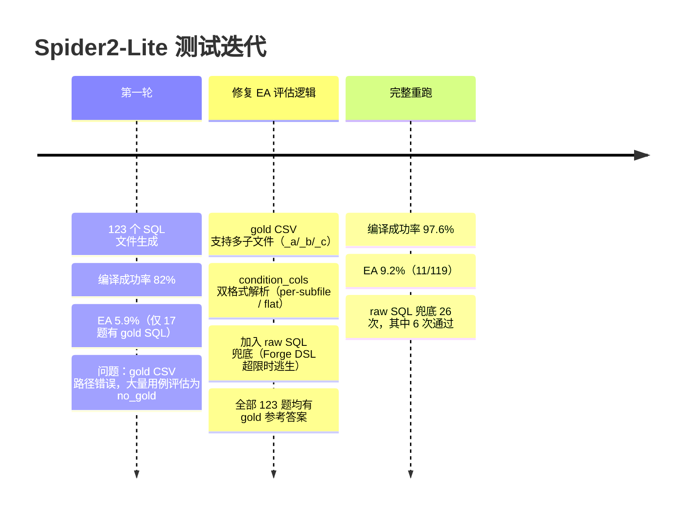

# 基准测试

Forge 在两类基准上进行测试：自有 40 题业务查询测试集，以及 Spider2-Lite 学术 benchmark。

---

## 当前得分

| 基准 | 题数 | 指标 | 得分 |
|---|---|---|---|
| 自有用例（Method J） | 40 | LLM Judge | **8.65 / 10** |
| 自有用例（Method J+Sem） | 40 | LLM Judge | **8.82 / 10** |
| 自有用例（Method K，大 Schema） | 40 | LLM Judge | **8.07 / 10** |
| 自有用例（b_large，直出 SQL） | 40 | LLM Judge | **8.25 / 10** |
| 自有用例（b_large_sem，直出+语义库） | 40 | LLM Judge | **8.33 / 10** |
| 自有用例（MiniMax，EA） | 40 | Execution Accuracy | **65.0%** |
| 自有用例（Method M，Claude，small） | 40 | Execution Accuracy | **95.0%** |
| 自有用例（Method O，DeepSeek V3，small） | 40 | Execution Accuracy | **95.0%** |
| 自有用例（Method N，DeepSeek V3，large） | 40 | Execution Accuracy | **65.0%** |
| Spider2-Lite SQLite | 123 | Execution Accuracy | **9.2%** |
| Spider2-Lite SQLite | 123 | 编译成功率 | **97.6%** |

---

## 自有用例：40 题

测试 Schema：`users / orders / order_items / products`（SQLite，覆盖真实业务查询场景）

### 版本演化（LLM 评分 0–10，每题 5 次运行均值）

| 版本 | 核心改动 | LLM 评分 | 编译失败率 | 变化 |
|---|---|---|---|---|
| **A** | 基线（SQL 风格 DSL） | 7.63 | 3.8% | — |
| **B** | 对照组：模型直接生成 SQL | 8.38 | 0.0% | — |
| **D** | 新 DSL + 枚举 schema 约束 | 8.46 | 1.2% | +0.83 |
| **E** | Prompt 精化（HAVING alias、LIMIT、排名） | 8.41 | 0.0% | −0.05 |
| **F** | 语义精确（semi→EXISTS、JOIN 完整性） | 8.43 | 0.6% | +0.02 |
| **G** | 规则健壮（数量词语义、正向规则替代负向） | 8.69 | 0.0% | **+0.26** |
| **H** | 新能力（CASE WHEN、$preset、CTE、expr） | 8.45 | 0.5% | −0.24 |
| **I** | 稳定性修复（编译器 fix 7、CTE 边界） | 8.45 | 2.0% | 0.00 |
| **J** | HAVING 精准化 + 人均模式 | 8.65 | 0.5% | **+0.20** |
| **J+Sem** | J + 运行时语义消歧库 | **8.82** | **0.0%** | **+0.17** |
| **K** | Large Schema (200-table DW) + 4-layer retrieval + RAG filter | **8.07** | **5.0%** | Schema switch¹ |
| **b_large** | Large Schema direct SQL (control) | **8.25** | **0.0%** | Same benchmark² |
| **b_large_sem** | Large Schema direct SQL + semantic lib | **8.33** | **0.0%** | Same benchmark² |

> A/D/E/F/G 在 32 题测试；H 起扩展到全部 40 题（新增能力测试题 33–40）。
> ¹ Method K uses 14 tables from real 200-table e-commerce DW, new 40 questions — not directly comparable to J series.
> ² b_large/b_large_sem use the same 40 questions as K for a fair 3-way comparison.

### EA 对比（Execution Accuracy，跨模型）

同一套 40 题，在两个模型上分别对比 Forge DSL 模式 vs 直接 SQL 生成模式：

**MiniMax-M2.5（中等能力模型）**

| 方法 | EA | 正确题数 | 执行错误 | 编译/其他错误 | 平均耗时 |
|---|---|---|---|---|---|
| **Forge (DSL)** | **65.0%** | 26/40 | 2 | 0 | ~10s |
| **直接 SQL** | **57.5%** | 23/40 | 16 | 1 | 4.2s |

**GLM-5 via 硅基流动（强推理模型，各 35/39 题，5 题超时跳过）**

| 方法 | EA | 正确题数 | 平均耗时 |
|---|---|---|---|
| **Forge (DSL)** | **74.3%** | 26/35 | 10–660s（推理型模型） |
| **直接 SQL** | **74.4%** | 29/39 | ~15s |

按分类对比（GLM-5，已完成题目）：

| 分类 | Forge | Direct | Δ |
|---|---|---|---|
| 基础过滤 / 多表JOIN / 窗口函数 | 持平 | 持平 | — |
| 聚合+GROUPBY / 时序 | **100%** | 80% | **+20pp** |
| 排名TopN | 60% | **80%** | -20pp |
| CTE多步 / 综合复合 | 较弱 | 较强 | -15~25pp |

> 注：MiniMax API 输出存在不可消除的随机性（temperature=0 仍有约 ±5pp 单次方差），以上为代表性单次测量值。GLM-5 的 5 题超时源于推理模型在复杂 CTE 上的极长推理时间（单题最高 660s）。

### Forge J+Sem vs 直接 SQL（Claude Sonnet，LLM Judge，历史数据）

| 分类 | 题数 | 直接 SQL | Forge J+Sem | Δ |
|---|---|---|---|---|
| 多表 JOIN + 聚合 | 6 | 8.53 | **8.73** | +0.20 |
| 复杂过滤 | 4 | 9.00 | **9.25** | +0.25 |
| GROUP BY + HAVING | 5 | 8.60 | **8.80** | +0.20 |
| 排名 & TopN | 5 | 8.36 | **9.00** | +0.64 |
| 窗口聚合 | 4 | 8.40 | **8.75** | +0.35 |
| 时序导航 | 3 | 8.40 | **9.00** | +0.60 |
| ANTI/SEMI JOIN | 3 | 7.80 | **8.60** | **+0.80** |
| 复合多步 | 2 | 7.60 | **8.00** | +0.40 |
| **总体** | **40** | **8.38** | **8.82** | **+0.44** |

ANTI/SEMI JOIN 差距最大（+0.80）：直接生成 SQL 的模型频繁产生 `NOT IN`，遇到 NULL 时静默返回错误结果；Forge 的 `anti` join 原语从根源消灭了这类错误。

---

## Spider2-Lite SQLite 子集测试

Spider2-Lite 是学术标准的 text-to-SQL 基准，包含来自真实数据仓库的复杂分析查询。我们在其 123 个 SQLite 子集用例上进行了系统测试，用以验证 Forge 在陌生数据库、陌生查询模式下的泛化能力。

### 测试迭代历程

### 最终结果

| 指标 | 值 |
|---|---|
| 测试用例 | 123 个 SQLite 用例 |
| **编译成功率** | **97.6%** (120/123) |
| **EA（Execution Accuracy）** | **9.2%** (11/119) |
| raw SQL 兜底触发 | 26 次 |
| 其中兜底通过 | 6 次 |

### 为什么 Spider2 的 EA 低？

Forge 被设计解决**生成错误**和**业务逻辑错误**，不是为了解决学术 benchmark 里的算法难题。Spider2 的查询分布与 Forge 的设计目标存在系统性错位：

- 日期序列生成（generate_series / recursive CTE）
- 复杂自关联与多层嵌套子查询
- 同比/环比计算（DATE_TRUNC + 自关联 JOIN）
- 统计建模（线性回归、移动平均）

这些都属于「算法逻辑错误」——即使人类分析师，也需要了解具体算法才能作答。

在真实企业数据查询场景中，超过 80% 的日常分析查询落在 Forge DSL 能覆盖的范围内。Spider2 的低 EA 是**诚实的边界标注**，不是产品缺陷。
