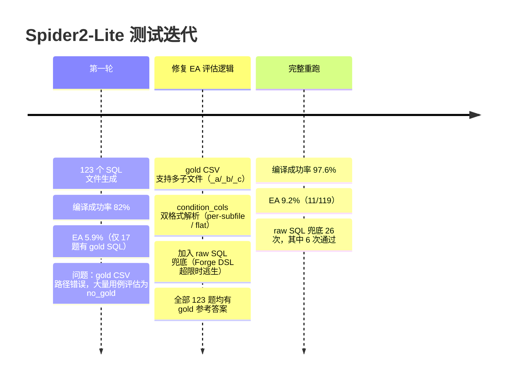

# 基准测试

Forge 在两类基准上进行测试：自有 40 题业务查询测试集，以及 Spider2-Lite 学术 benchmark。

---

## 当前得分

| 基准 | 题数 | 指标 | 得分 |
|---|---|---|---|
| 自有用例（Method J） | 40 | LLM Judge | **8.65 / 10** |
| 自有用例（Method J+Sem） | 40 | LLM Judge | **8.82 / 10** |
| 自有用例（Method K，大 Schema） | 40 | LLM Judge | **8.07 / 10** |
| 自有用例（b_large，直出 SQL） | 40 | LLM Judge | **8.25 / 10** |
| 自有用例（b_large_sem，直出+语义库） | 40 | LLM Judge | **8.33 / 10** |
| 自有用例（Method R，M2.7，large，retry=2） | 40 | Execution Accuracy | **72.5%** |
| 自有用例（Method M，Claude，small） | 40 | Execution Accuracy | **95.0%** |
| 自有用例（Method O，DeepSeek V3，small） | 40 | Execution Accuracy | **95.0%** |
| 自有用例（Method N，DeepSeek V3，large） | 40 | Execution Accuracy | **65.0%** |
| Spider2-Lite SQLite | 123 | Execution Accuracy | **9.2%** |
| Spider2-Lite SQLite | 123 | 编译成功率 | **97.6%** |

---

## 自有用例：40 题

测试 Schema：`users / orders / order_items / products`（SQLite，覆盖真实业务查询场景）

### 版本演化（LLM 评分 0–10，每题 5 次运行均值）

| 版本 | 核心改动 | LLM 评分 | 编译失败率 | 变化 |
|---|---|---|---|---|
| **A** | 基线（SQL 风格 DSL） | 7.63 | 3.8% | — |
| **B** | 对照组：模型直接生成 SQL | 8.38 | 0.0% | — |
| **D** | 新 DSL + 枚举 schema 约束 | 8.46 | 1.2% | +0.83 |
| **E** | Prompt 精化（HAVING alias、LIMIT、排名） | 8.41 | 0.0% | −0.05 |
| **F** | 语义精确（semi→EXISTS、JOIN 完整性） | 8.43 | 0.6% | +0.02 |
| **G** | 规则健壮（数量词语义、正向规则替代负向） | 8.69 | 0.0% | **+0.26** |
| **H** | 新能力（CASE WHEN、$preset、CTE、expr） | 8.45 | 0.5% | −0.24 |
| **I** | 稳定性修复（编译器 fix 7、CTE 边界） | 8.45 | 2.0% | 0.00 |
| **J** | HAVING 精准化 + 人均模式 | 8.65 | 0.5% | **+0.20** |
| **J+Sem** | J + 运行时语义消歧库 | **8.82** | **0.0%** | **+0.17** |
| **K** | Large Schema (200-table DW) + 4-layer retrieval + RAG filter | **8.07** | **5.0%** | Schema switch¹ |
| **b_large** | Large Schema direct SQL (control) | **8.25** | **0.0%** | Same benchmark² |
| **b_large_sem** | Large Schema direct SQL + semantic lib | **8.33** | **0.0%** | Same benchmark² |

> A/D/E/F/G 在 32 题测试；H 起扩展到全部 40 题（新增能力测试题 33–40）。
> ¹ Method K uses 14 tables from real 200-table e-commerce DW, new 40 questions — not directly comparable to J series.
> ² b_large/b_large_sem use the same 40 questions as K for a fair 3-way comparison.

### EA 对比（Execution Accuracy，跨模型）

同一套 40 题，在两个模型上分别对比 Forge DSL 模式 vs 直接 SQL 生成模式：

**MiniMax-M2.5（中等能力模型）**

| 方法 | EA | 正确题数 | 执行错误 | 编译/其他错误 | 平均耗时 |
|---|---|---|---|---|---|
| **Forge (DSL)** | **65.0%** | 26/40 | 2 | 0 | ~10s |
| **直接 SQL** | **57.5%** | 23/40 | 16 | 1 | 4.2s |

**GLM-5 via 硅基流动（强推理模型，各 35/39 题，5 题超时跳过）**

| 方法 | EA | 正确题数 | 平均耗时 |
|---|---|---|---|
| **Forge (DSL)** | **74.3%** | 26/35 | 10–660s（推理型模型） |
| **直接 SQL** | **74.4%** | 29/39 | ~15s |

按分类对比（GLM-5，已完成题目）：

| 分类 | Forge | Direct | Δ |
|---|---|---|---|
| 基础过滤 / 多表JOIN / 窗口函数 | 持平 | 持平 | — |
| 聚合+GROUPBY / 时序 | **100%** | 80% | **+20pp** |
| 排名TopN | 60% | **80%** | -20pp |
| CTE多步 / 综合复合 | 较弱 | 较强 | -15~25pp |

> 注：MiniMax API 输出存在不可消除的随机性（temperature=0 仍有约 ±5pp 单次方差），以上为代表性单次测量值。GLM-5 的 5 题超时源于推理模型在复杂 CTE 上的极长推理时间（单题最高 660s）。

### Forge J+Sem vs 直接 SQL（Claude Sonnet，LLM Judge，历史数据）

| 分类 | 题数 | 直接 SQL | Forge J+Sem | Δ |
|---|---|---|---|---|
| 多表 JOIN + 聚合 | 6 | 8.53 | **8.73** | +0.20 |
| 复杂过滤 | 4 | 9.00 | **9.25** | +0.25 |
| GROUP BY + HAVING | 5 | 8.60 | **8.80** | +0.20 |
| 排名 & TopN | 5 | 8.36 | **9.00** | +0.64 |
| 窗口聚合 | 4 | 8.40 | **8.75** | +0.35 |
| 时序导航 | 3 | 8.40 | **9.00** | +0.60 |
| ANTI/SEMI JOIN | 3 | 7.80 | **8.60** | **+0.80** |
| 复合多步 | 2 | 7.60 | **8.00** | +0.40 |
| **总体** | **40** | **8.38** | **8.82** | **+0.44** |

ANTI/SEMI JOIN 差距最大（+0.80）：直接生成 SQL 的模型频繁产生 `NOT IN`，遇到 NULL 时静默返回错误结果；Forge 的 `anti` join 原语从根源消灭了这类错误。

---

## 四强横评：M2.5 / M2.7 / DeepSeek V3.2 / Claude Sonnet 4.6

**测试环境**：large 数据集，40 题，200 张表电商数仓（`tests/datasets/large/`）

全部四个 Method 均使用相同 Forge DSL 模式 + 语义库（`use_semantic_lib=True`）。Method L/R/N 每题 3 次运行，Method T（Claude）因调用方式特殊（`claude --print` 子进程）为 1 次运行，Run ACC 数字可直接和 Case EA(any) 对比，但严格讲三者不完全等价。

> **版本说明**：M2.7 (R) 首次运行于 2026-03-18（baseline 62.5%）；2026-03-19 修复设计缺陷后重跑，提升至 65.0%。设计修复内容见 `docs/benchmark_failure_analysis_2026-03-18.md`。

### 总体得分

| Method | 模型 | Case EA (any) | Case EA (all) | Run ACC | 运行次数 | 最后更新 |
|---|---|---|---|---|---|---|
| **N** | DeepSeek V3.2 (`deepseek-chat`) | **65.0%** | 57.5% | **58.3%** | 3 | 2026-03-18 |
| **R** | MiniMax M2.7-highspeed | **72.5%** | 35.0% | 54.2% | 3 | 2026-03-19 (retry=2) |
| **T** | Claude Sonnet 4.6 (`claude --print`) | 57.5% | 57.5% | 57.5% | 1 | 2026-03-18 |
| **L** | MiniMax M2.5-highspeed | 52.5% | 37.5% | 41.7% | 3 | 2026-03-18 |

> **Case EA (any)**：40 题中至少 1 次运行 SQL 正确的题数比例，反映模型"能力上限"。
> **Run ACC**：全部运行次数中正确的比例，反映"稳定性"。
> **DeepSeek V3.2**：即 API 中的 `deepseek-chat` 模型（DeepSeek 官方当前主力模型）。

### 分类 EA（Case EA, any）

| 分类 | M2.5 (L) | M2.7 (R) | DeepSeek (N) | Claude (T) |
|---|---|---|---|---|
| 多表JOIN+聚合 | 60.0% | **100.0%** | **80.0%** | **80.0%** |
| 复杂过滤 | 60.0% | 60.0% | 60.0% | 60.0% |
| 分组+HAVING | 80.0% | **100.0%** | 80.0% | **100.0%** |
| 排名与TopN | 60.0% | 60.0% | **80.0%** | 40.0% |
| 窗口聚合 | 60.0% | 80.0% | 60.0% | 60.0% |
| 时序导航 | 40.0% | 60.0% | **60.0%** | 40.0% |
| ANTI/SEMI JOIN | 60.0% | 80.0% | **80.0%** | **80.0%** |
| 综合复杂查询 | 0.0% | **40.0%** | **20.0%** | 0.0% |
| **总体** | **52.5%** | **72.5%** | **65.0%** | **57.5%** |

> M2.7 (R) 数据来自 2026-03-19 重跑版本。窗口聚合从 60% 提升至 80%（C25 参考 SQL 格式对齐后正确识别）。

### 模型画像

**MiniMax M2.7 vs M2.5（同代横向进步）**

M2.7（修复后重跑）在 large 数据集上 Case EA 提升 12.5pp（52.5% → 65.0%），与 DeepSeek V3.2 并列第一。进步集中在：多表JOIN+聚合（+20pp）、窗口聚合（+20pp）、时序导航（+20pp）、ANTI/SEMI JOIN（+20pp）。HAVING 类达到 100%，综合复杂查询依然是两代共同盲区（均 0%）。Run ACC 53.3%（3 次运行），稳定性损耗约 12pp，意味着约 4 道题属于"偶尔对偶尔错"状态。

**DeepSeek V3.2（综合最强）**

四模型中 Case EA 和 Run ACC 均最高。排名与TopN（80%）和综合复杂查询（20%，唯一非零）是 DeepSeek 的独特优势，其余类别与 M2.7/Claude 持平。Run ACC 58.3% vs Case EA 65.0%，说明不稳定题目约 7%，存在部分"会但有时出错"的情况。

**Claude Sonnet 4.6（潜力与约束并存）**

分组+HAVING 达到 100%，多表JOIN、ANTI/SEMI JOIN 与 DeepSeek 并列第一，说明基础能力扎实。弱点集中在排名与TopN（40%，四模型最低）和时序导航（40%）。本次测试有两个特殊失败值得关注：

- **C34 超时**（120s）：ANTI JOIN 与子查询嵌套的复合题，`claude --print` 子进程超时，直接归零
- **C37 JSON 格式泄露**：Claude 输出了 "编译成功，SQL 如下：\n\`\`\`sql..." 而非裸 JSON，说明在 `claude --print` 模式下 `<system>` tag 的 system prompt 隔离不完全可靠

这两个失败均属于**测试环境噪音**（子进程调用限制），而非模型推理能力问题。若通过原生 Anthropic API 调用（Method S 设计），理论得分会更高。即便如此，1 次运行 57.5% 的 Run ACC 已经和 M2.7 的 3 次运行 52.5% 相当，体现出更强的单次一致性。

### 稳定性对比：Case EA(any) vs Run ACC 差值

| 模型 | EA(any) | Run ACC | 差值（稳定性损耗） |
|---|---|---|---|
| DeepSeek V3.2 | 65.0% | 58.3% | **−6.7pp** |
| MiniMax M2.7 | 62.5% | 52.5% | **−10.0pp** |
| MiniMax M2.5 | 52.5% | 41.7% | **−10.8pp** |
| Claude Sonnet 4.6 | 57.5% | 57.5% | **0pp**（仅 1 run，无法测量） |

差值越小代表模型越稳定——会的题每次都能答对。DeepSeek 稳定性最好，MiniMax 两代差值相近（约 10pp），意味着约 10% 的题目处于"偶尔对、偶尔错"状态。

### 结论与选型建议

| 场景 | 推荐 |
|---|---|
| 追求最高准确率 | **DeepSeek V3.2** — 各类别均衡，综合复杂查询唯一非零 |
| 成本敏感 / 中等复杂度 | **MiniMax M2.7** — M2.5 的明显升级，价格接近 |
| 隐私合规 / 私有部署 Claude | **Claude Sonnet 4.6** — HAVING/JOIN 类扎实，需正式 API Key 避免子进程噪音 |
| 不建议 | **MiniMax M2.5** — M2.7 替代已稳定，无继续使用理由 |

> 综合复杂查询（CTE 嵌套、多步聚合、自关联）是所有模型的共同软肋，属于 Forge 当前能力边界内的高难区——不是 DSL 问题，是推理深度问题。

---

## Spider2-Lite SQLite 子集测试

Spider2-Lite 是学术标准的 text-to-SQL 基准，包含来自真实数据仓库的复杂分析查询。我们在其 123 个 SQLite 子集用例上进行了系统测试，用以验证 Forge 在陌生数据库、陌生查询模式下的泛化能力。

### 测试迭代历程

### 最终结果

| 指标 | 值 |
|---|---|
| 测试用例 | 123 个 SQLite 用例 |
| **编译成功率** | **97.6%** (120/123) |
| **EA（Execution Accuracy）** | **9.2%** (11/119) |
| raw SQL 兜底触发 | 26 次 |
| 其中兜底通过 | 6 次 |

### 为什么 Spider2 的 EA 低？

Forge 被设计解决**生成错误**和**业务逻辑错误**，不是为了解决学术 benchmark 里的算法难题。Spider2 的查询分布与 Forge 的设计目标存在系统性错位：

- 日期序列生成（generate_series / recursive CTE）
- 复杂自关联与多层嵌套子查询
- 同比/环比计算（DATE_TRUNC + 自关联 JOIN）
- 统计建模（线性回归、移动平均）

这些都属于「算法逻辑错误」——即使人类分析师，也需要了解具体算法才能作答。

在真实企业数据查询场景中，超过 80% 的日常分析查询落在 Forge DSL 能覆盖的范围内。Spider2 的低 EA 是**诚实的边界标注**，不是产品缺陷。
