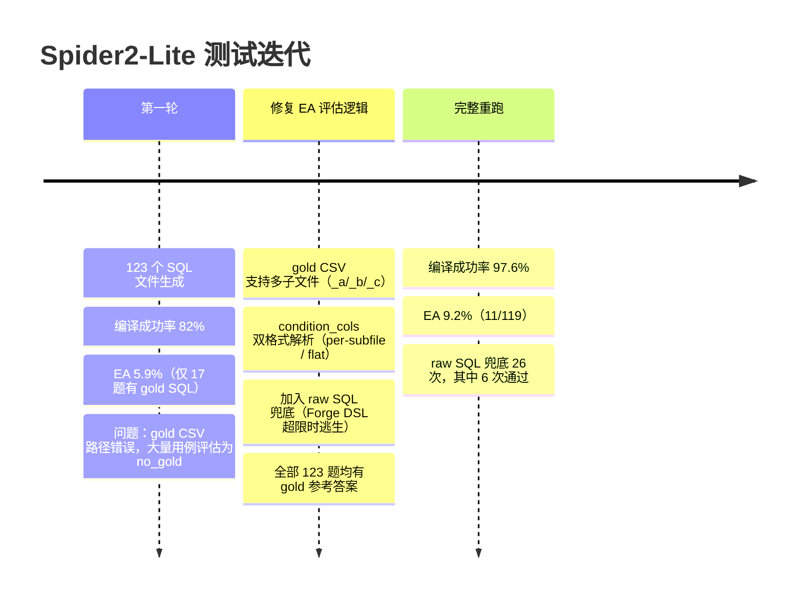

# 基准测试

Forge 保留BIRD Mini-Dev 500题、自有40题回归集与Spider2-Lite等公共证据。已用于本项目调参的500题现为R回归集，不能因其公共来源就宣称独立泛化；H留出集必须另行冻结、核对重叠并完成标签审核。

## REQ-045：基准与业务质量标准（2026-09-05）

目标是同时提高正确完成与回答覆盖率、降低静默错误及用户负担，不以更多拒绝或反复澄清换取漂亮的条件准确率。每个初始请求占一个分母；澄清后成功仍是一项 `answered`，另记澄清轮次，不复制任务。失败、超时、权限拒绝和待澄清均保留在全请求分母，失败不补抽、不换题、不只发布可执行子集。


### 数据分层与评价口径

| 分层 | 用途与门禁 |
|---|---|
| D | 预先冻结的日常诊断/开发集；记录精确case IDs、选择规则、曝光与实验子集。当前已有D50证据，不能按修复后得分挑题。 |
| R | 固定BIRD Mini-Dev开发500题、11库，阶段全量回归；已参与调参，不称独立泛化。500个case IDs保留官方重复实例，不以498个question IDs去重。 |
| H | 独立未暴露留出集，先审核标签及题意/模板/数据库依赖重叠，再冻结和隔离访问；曝光用于调参后不能继续称H。当前H仍not_ready，不能拿R或历史Spider2结果顶替。 |
| S | 隔离、可离线复现的逻辑、安全、数据偶合反例；不合并进BIRD EX百分比。 |

BIRD Official EX（历史亦称Official EA）使用官方核心规则：`set(gold_result_tuples) == set(predicted_result_tuples)`，忽略行顺序和重复次数，保留列位置与值比较规则。只证明固定数据库快照上的执行结果相同，不能证明SQL逻辑等价、题意正确或业务低静默错误。Contract按声明的列、行序、多重集、NULL和舍入规则另报；不为提高EX而放宽Contract，不把评价器修复计成模型增益。Contract也不能排除快照偶合。

md-454漏Top-5仍在原公开数据上EX通过；隔离构造同县6校即可暴露返回6行的错误。`tests/test_bird_semantic_boundaries.py`保留此性质：即使EX与Contract都在五校快照上通过，加入第六校仍可证伪逻辑等价。既有`test_bird_execution_accuracy_uses_exact_result_sets`固守官方核心；S不覆盖Gold或改写历史成绩。Gold SQL、结果与答案可以用于隔离评分、离线归因和开发/回归集上的规律总结，但不进入本次被测候选生成的Prompt、context或模型工具；清单可含Gold SQL哈希，不携带Gold内容。

分析Gold找错、执行明确标记的人为反事实、据此改进通用Prompt/检索/Contract/Compiler属于正常开发，不是作弊。应先对照参考解的实体、JOIN、筛选、粒度、聚合、投影，再核对题意与元数据；不能拒绝分析Gold，也不能无依据地照抄其每个关联。禁止答案泄漏后冒充独立生成、人工改候选/Gold后冒充原始成绩、看Gold调参后仍称独立H或将按题号硬编码包装成通用能力。当前500题属于开发/回归，改进需如实披露曝光与调参；独立验证另用未参与调参的数据。冻结中的`gold_use=scoring_only`约束被测生成链路，不否定隔离离线诊断。见[输出契约与Gold使用复核](benchmark-luna-output-contract-review-2026-09-06.md)。

### 冻结、公平性、预算与原始证据

实验先声明基线、唯一处理变量、成功/回退阈值、case IDs及顺序、分层用途、曝光历史、总调用预算，再冻结内容寻址清单。公平比较固定dataset全部官方文件、DB、metadata及其哈希，并固定model/provider、Prompt、Schema、sampling、timeout、retry、toolchain/evaluator源码版本和每题context。仅预声明变量可变；不能同时改Prompt、元数据、Compiler后声称单因素收益。未声明漂移导致不可比较，不能续跑混分。仅更换evaluator的固定候选重放单独报告，不当新生成收益。

固定公开资产目录见[`bird_mini_dev_standard.json`](../tests/datasets/bird_mini_dev_standard.json)：2个官方JSON、11个SQLite数据库与75份CSV，共88项内容校验。重新freeze也必须匹配仓库目录，不能改Gold后重新包装成官方数据。SQLite SHM与空WAL/journal是运行时边文件，不当作数据；非空WAL/journal失败关闭，不能忽略未合并数据，也不自动删除用户文件。

预检入口`POST /api/internal/benchmark-v2/protocol`输入`{provider,model,case_ids,confirm_model_calls,protocol_manifest?}`，输出不可变manifest、protocol_revision、case IDs、metric/Prompt/Schema revisions、预检context及generation约束。清单是不可变输入工件，不是另一份任务主状态；Pi在现有Run保存清单并只消费预检context，后续Context/Evaluate携带protocol revision校验case及数据漂移。

总模型预算包含双臂、失败请求、参数canary和已授权续跑，在dispatch处计数，每臂最多一轮Agent、Provider重试0、默认采样、单次timeout 120秒；未实际发送输出上限记null。无调用确认不得生成，恢复不能重置预算，不补跑丢失响应或隐性重试。冻结、验证、固定候选重放、对比、context审计不调用模型，不新增调度器。

原始证据保留请求参数/上下文哈希、原始响应/工具参数、规范化候选、SQL、逐题评价版本/结果、用量、时延、错误及dispatch计数，再复算聚合。payload hook仅证明准备发送的payload，不等于真实HTTP请求或HTTP200；没有传输层证据就记未知，不能把工具成功事件冒充HTTP成功。缺失token、调用次数、时延不得当0；声明temperature/max_output_tokens不等于实际参数或硬费用上限。

Pi新记录通过usage_observed区分已报告用量与未观测值；已dispatch但无usage时聚合total_tokens=null，并保留observed_total_tokens和未知arm数量，页面显示“未知”。Token口径是SDK/Provider已报告的完整或部分用量，不是账单结算；不能据此虚构真正扣费或HTTP计数。

### 全请求业务质量契约

`forge.benchmark_quality.summarize_quality(records, *, label_basis)`每请求接收一个记录：case_id；终态status为answered/needs_clarification/refused/failed；可空布尔correct/answerable；可空refusal_reason为permission/unsupported/missing_data/capability/unknown；可空非负整数clarification_turns/user_interactions/model_calls；可空有限非负数total_tokens/elapsed_ms。省略观测按null处理，不补0。NaN/Infinity、负数、布尔冒充数值、重复ID、非法状态或矛盾标签失败关闭：correct=true只能属于answered且不能与answerable=false并存，拒绝原因仅属于refused。

澄清轮次按已请求轮次计，含等待用户回答的轮次；user_interactions指初始请求之外的额外用户动作。澄清后回答只记answered+turns，不重复算任务。一次请求可先澄清再回答/拒绝/失败，所以澄清率与终态率可能重叠，不能相加作总任务数。

| 输出指标 | 分子 / 分母与边界 |
|---|---|
| correct_completion | 正确回答 / 全请求；非回答不是正确完成，answered缺标签仍留分母。 |
| answer_coverage | answered / 全请求，不看正确性。 |
| conditional_accuracy | 正确回答 / answered，必须同时披露覆盖率，不能替代全请求完成率。 |
| silent_error | 独立语义标签判错的已回答 / 全请求，仅label_basis=independent_semantic可计算。 |
| EX_wrong_answer_proxy | EX判错的已回答 / 全请求，仅official_ex可计算；此时silent_error=null，不能称业务语义错误率。 |
| clarification、refusal、failure | 曾请求澄清、终态拒绝、失败分别 / 全请求。 |
| permission_refusal | 权限拒绝 / 全请求，独立披露，不算能力误拒。 |
| avoidable_refusal | answerable=true且已知非权限原因的拒绝 / 全请求；answerable缺失不能判误拒，原因未知不能排除权限；必要标签全缺失为unknown。 |
| autonomous_completion | 正确回答且clarification_turns=0、user_interactions=0 / 全请求；缺观测不推定自主，EX标签下仍是代理完成。 |
| costs | calls/tokens/time/user interactions各自总量及每正确完成成本；分子包含失败、拒绝、澄清成本，不能只算成功请求。 |

label_basis=unknown不把correct字段当已确立真值，语义/EX错误指标均null。每项聚合带denominator/known_count/missing_count/state；缺标签的count/rate为null，仅observed_count报告已知阳性，不用已知子集比例冒充整体率。成本缺项则total/per_correct_completion为null，observed_total仅为已观测小计；正确完成数不完整或为0时单位成本为null。空集合没有可测率或总成本；只有显式观测到0才是0。observations另列原始字段覆盖率，防止可推导的非回答计数掩盖缺失真值。

报告必须并列覆盖、正确完成、条件准确率、语义静默错误（或明确EX代理）、权限/可避免拒绝、澄清、自主完成及成本，先声明各指标晋级边界；不压成可用拒绝换分的总分。业务静默错误结论需独立语义标签与H证据，不能由BIRD EX或S通过率替代。

### 日期context审计边界

`forge benchmark bird audit-context`只读每字段前100个非NULL存储样本（可显式限制max-rows），不输出行值，不修改元数据或Prompt。字段状态为conflict/missing_layout/compatible_sample/unknown_sample/empty/query_failed，并记录truncated与observed_layouts计数。缺失官方日期布局与YYMMDD声明对ISO存储值冲突分别报告；compatible_sample只说明被观察样本相容，不保证整列，更不是自动改metadata或追加Prompt的依据。

当前布局识别限于ISO日期/时间、YYYYMMDD及YYMMDD；missing_layout表示没有识别到这些明确布局，不把未支持格式断言为源数据错误。

REQ-047新增显式实验开关：freeze默认`--date-context off`；`--date-context observed --date-max-rows 100`只把当前数据库、ContextSnapshot可见字段的日期观察附加给双臂，后缀完全相同。原CSV声明与样本观察并列；带来源hash、非随机抽样计数、截断和未识别状态，不携带Gold或行值，不转换日期、不改Compiler或基本指令。`date_evidence`及两臂指令分别hash-bound，Context API返回冻结输入；共享源码或样本上限漂移仍拒绝。

两条件都声明`--variable date_context`，固定题目及其顺序，仅切换off/observed；下例为处理组，基线使用相同参数改为off并另存文件。单条件预算为2N，两条件总预算为4N（显式Gold跳过时同步缩减），必须另行授权。当前新冻结采用`bird-protocol-v4`；旧协议不续跑为新版本，保留原始工件及历史判分。

### 粒度声明与单变量消融

REQ-048从正常Python/Pi ResultContract删除未经业务确认的expected_grain，不再用each/per把单位或措辞推断包装成业务粒度。问题与Evidence保留，不固定替换为scalar，不改比较器。

默认`--grain-context off`。仅同时声明`--variable grain_context`时，才允许`--grain-context question_heuristic`对照：旧关键词规则从问题生成建议，附question hash与business_confirmed=false，以相同后缀提供给两臂，不进入业务ResultContract或评分ContextSnapshot。处理组off；两条件源码、Schema、日期及评分上下文相同。这个带来源的新对照不是历史seed46提示词的逐字复现，不能用它包装历史分数为配对基线。

参数型date_context/grain_context/value_context都不允许共享源码漂移或任意提示事实替换；每次重建验证全部hash，只在比较时排除已声明模式及其后缀hash。正常滚动实验仍须提供上一轮与全部同模型历史，两条件复用相同选择参数；总预算按两条件合并确认，未评分题留分母。

REQ-048后续维护已修复未派发重放语义：output=null且显式scored=false的记录保留未评分及原执行/失败状态；不把它计为生成失败。未标明scored=false的旧空候选账本仍按既有生成失败语义处理，有实际候选则重新评价。新Pi raw_output.assistant保存content、stopReason和errorMessage，失败日志保留Provider错误详情；历史丢失信息不回填，未知用量不补零。80臂零调用重放及两侧回归证据见`benchmark-luna-grain-maintenance-2026-09-06.json`。源码指纹变化后的旧冻结不得续跑；diagnostic或未评分记录仍不能晋级正式比较。

### SQLite 标量极值 CTE 性能修复（REQ-049）

SQLite 编译目标对参与 INNER/CROSS JOIN 的简单非递归标量 MIN/MAX CTE 使用 `AS MATERIALIZED`，避免规划器在外层循环中反复计算极值。只识别直接列聚合以及与聚合匹配的单列投影；分组、筛选、集合操作、递归、复杂表达式、原始子查询或其他CTE来源均不采用此策略，不把全部CTE强制物化。

该优化 SQL 要求目标 SQLite ≥3.35.0；当前实际验证版本3.53.4。物化会阻断部分优化并使用临时存储，因此不依据本机版本切换输出、不推广到任意CTE。其他方言与Forge输入Contract不变。SQLite语义与版本依据：[Materialization Hints](https://sqlite.org/lang_with.html#materialization_hints)。

零模型调用、同候选离线验证：

- md-199 Forge JSON不变，仅增加物化提示；从原30秒execution_timeout恢复为Assurance、执行、Official EX及Contract均通过，独立本机只读烟测79.26ms。此耗时不是replay根节点保留的历史elapsed_ms，也不是新生成时延基准。
- 原两条件80臂全部重放，原output/raw_output不变；仅off/md-199/Forge恢复，其他79臂核心状态、评分和SQL不变。off Forge确认正确数EX4→5、Contract1→2，各仍有1题未知；Direct及对照组不变，不以成功子集替换20题分母。
- 24个旧Forge候选共120项五方言编译结果中，只有这一项SQLite SQL改变；13种排除边界与修复前源码输出一致。
- 固定VM预算的MIN/MAX两个反例修复前失败，修复后保留并列极值；另覆盖NULL、空输入、引用别名与未投影聚合不阻断下推。Python818 passed/26 skipped、Pi150 passed/typecheck通过。

完整简报：[benchmark-luna-scalar-cte-fix-2026-09-06.json](benchmark-luna-scalar-cte-fix-2026-09-06.json)。原付费Run与旧证据不改写；新的diagnostic冻结有效，旧源码冻结拒绝，diagnostic/未评分仍不晋级。本结果只证明固定候选的Compiler修复，不是模型能力提升、完整配对结论或H/R0.6验收。

### 滚动seed48与跨语言冻结维护（REQ-046）

新冻结不再携带冗余的`selection.remaining_new_fraction`；选题继续由整数计数与case IDs证明70%/30%最近整数分配。该派生浮点在余1位时由Python序列化为1.0、JavaScript往返为1，会使同一值产生不同协议hash。删除未使用字段，不放宽hash算法或源码漂移校验；旧冻结与失败回执保留，新Run须重新冻结。

seed48首次提交在创建Run前被拒绝、零调用；修复后真实HTTP协议往返成功。Python819 passed/26 skipped、Pi150 passed/typecheck通过。获批38次的Run实际32派发/30候选后停止：Forge md-234生成120秒超时，md-447被取消；3题6臂未派发，Gold md-340仍零调用保留。完整20题下两臂EX均4/12/4、Contract均1/15/4，观察107160 tokens及2臂未知usage；只有新md-313双臂全过。

32份留存响应hash、40臂核心评分重放、28个可执行候选的独立官方EX一致；原失败元数据和Gold编译投影差异不抹平。未评分记录仍拒绝正式比较，未补跑或延长超时。原候选/Gold/数据不改写，服务已停止。逐题结果、跨轮限制与完整证据见[seed48简报](benchmark-luna-mixed-d20-seed48-2026-09-06.md)及[JSON](benchmark-luna-mixed-d20-seed48-2026-09-06.json)。

### 取消完成后封存失败证据（REQ-050）

Pi Benchmark对同一会话复用abort Promise；超时/取消或其他失败时，等待AgentSession最终化后读取raw_output、响应hash与已知usage，再退订事件并dispose。120秒生成上限不变，原清理路径本就等待abort；这次只调整证据封存顺序。迟到或部分响应仍不视为有效候选，不调用评分、不追加派发或重试，未知usage不补零。

修复前的确定性deadline反例保留assistant=[]；修复后Run重开可见终止消息和最终用量，日志hash可复算。真实Pi SDK的合成流烟测确认提交顺序，未访问网络或真实模型。Pi151 passed/typecheck、Python819 passed/26 skipped；seed48原40臂诊断重放与历史工件hash均不变。旧缺失消息和usage不能回填，不宣称查询准确率收益。Pi runtime指纹变化仍禁止旧Run跨版本resume；Python协议校验与不完整比较门禁不变。

简报和完整证据：[benchmark-luna-cancellation-evidence-fix-2026-09-06.json](benchmark-luna-cancellation-evidence-fix-2026-09-06.json)。

### 生成流阶段定向诊断（REQ-051）

授权4次、实际4次；md-234/md-447各一个单题双臂Run，按题串行。维持Luna、同一Prompt/Schema、120秒、零重试及日期/粒度off。实验观察器聚合SDK可见事件，不改变流或Pi真相源；可见thinking摘要和首次可见前的等待不等于内部推理耗时。

四次生成/执行均成功，EX/Contract均0/4，19831 tokens且未知用量0。Forge耗时11.18/23.60秒，工具参数可见区间3.27/7.46秒；未复现超时，不能据此宣称可靠性或准确率提升。md-234存在次数请求与Gold列集合差异；md-447为DOCType标签与DOC编码差异，离线反事实换列可匹配Gold，但不修改原候选/评分，不做按题规则。

4份Prompt与seed48对应臂hash一致，4份响应hash、4臂原候选重放及独立只读EX核验通过；完整57条日志和Pi快照已封存、服务已停。不追加调用、不改变生成策略；这是定向诊断而非seed49，滚动父Run不变。见[简报](benchmark-luna-generation-stages-2026-09-06.md)与[机器证据](benchmark-luna-generation-stages-2026-09-06.json)。

### CTE绑定与公共SQL字段保障（REQ-052）

Compiler不再剥离显式CTE限定名，也不把裸列/窗口别名强绑到主CTE；保留显式select，不机械补投影。五个合法查询的真实SQLite反例恢复结果。公共Forge JSON末尾复用现有`assure_compiled_sql`的只读、解析、Registry/字段作用域门禁，使用同一已限定Registry并保留先前证据；Assurance修订为`query-assurance-v8`，Policy仍为v9，不授予执行权。两个CTE未投影字段漏拒反例已拒绝，歧义拒绝边界保持。

零模型调用；40个固定Forge候选的200项五方言编译结果与5份历史Run hash不变。md-032/md-199四臂在新v8 diagnostic冻结下评分/SQL不变，缺列仍拒绝。实际CLI/HTTP及返回SQL隔离执行通过；Python825 passed/26 skipped、Pi151 passed/typecheck。不是准确率提升或完整R500复评，旧冻结不跨版本复用，滚动父Run不变。公共既有关系/裸列前置限制未放宽；见[修复简报](benchmark-luna-cte-binding-fix-2026-09-06.md)与[机器证据](benchmark-luna-cte-binding-fix-2026-09-06.json)。

### 当前栈R500回归与取值证据审计（REQ-053）

零被测模型调用，1000份Structured Sol原候选完整进入当前Compiler/Assurance v8诊断。EX Forge311/187/2、Direct312/186/2；Contract282/216/2、292/206/2（正确/失败/未知）。md-340/md-393两臂Gold在30秒下超时，保留500分母及未知；无旧正确候选误拒、无已评分正确/错误转换。14变化臂已审查，候选/SQL/Gold hash及源码/数据完整性核对；Replay写完1000项但complete=false/exit1，不晋级正式成绩。历史120秒/缓存、Assurance未重跑及多次源码/上下文漂移使其不是v8单因素或模型比较；只覆盖Benchmark共享SQL门禁。

取值审计确认当前两臂gasstations.Segment元数据缺少精确存储值；公开只读5716行5值及三个字面量反事实证明机制，原成绩仍1/4。带来源的限定列值证据仅作为下一处理候选，未进入Prompt；不自动lower/LIKE，不把历史离线重建视为原始Prompt。4题16次配对生成仅提案、另批预算。见[简报](benchmark-r500-v8-binding-audit-2026-09-06.md)及[完整机器证据](benchmark-r500-v8-binding-audit-2026-09-06.json)。

### 限定列观察取值上下文（REQ-054）

已实现默认关闭的离线实验开关，不是默认Prompt优化。仅公共BIRD SQLite、一次一个三段限定字段；observed必须同时声明value_context变量。两条件指定相同字段与max_values，只切换off/observed。

仅当数据库及精确table.column位于已有ContextSnapshot.fields时读取该列；同名字段不能互相授权。查询使用只读连接、5秒上限及BINARY DISTINCT；默认最多16值（可配1–100）、每值最多256 UTF-8字节。超限、非文本、查询失败或来源漂移不泄露部分值；WAL格式数据库（含已checkpoint）拒绝连接，避免只读连接创建sidecar。UTF-16数据库同样失败关闭。结果只是该快照非NULL存储值，不是业务权威枚举、未来值保证或原列比较规则。

两臂获得完全相同的限定字段/原样取值/查询/参数/来源hash与覆盖声明后缀，按不可信数据处理；不使用Gold、答案，不自动lower/LIKE、纠正SQL或改变ResultContract/评分。value_evidence及完整指令hash进入v4冻结；已声明变量只允许模式变化，不允许字段、采集上限、数据、共享源码或其他上下文漂移。旧v1/v2/v3冻结不得升级续跑。

四题真实冻结/HTTP验证：md-009、md-026和同表控制md-018每臂新增1642字节；同名异表控制md-002无证据、指令不变。off四题八份指令与修改前逐字一致。实际Pi消费八份合成输出完成，冻结后指令篡改在新派发前拒绝；不是SDK真实生成或准确率证据。原Sol八候选在两条件各重放，SQL与EX/Contract均不变。Python873 passed/26 skipped、Pi151 passed/typecheck通过；服务与临时脚本已清理。

授权前实现与零调用准备见[准备简报](benchmark-luna-value-context-ready-2026-09-06.md)。随后用户单独批准16次Luna配对：16派发/16候选，Forge EX/Contract2/4→3/4、Direct3/4→4/4；目标四臂1/4→3/4，未达预声明4/4，控制无回退。总35572 tokens、未知用量0，处理组+17.85%；保持默认off，不补跑/扩样。md-009 Forge已用Discount，却漏接CTE FROM/JOIN；共享Assurance v8通过该样本，SQLite报unknown_column，不自动补JOIN。16原响应hash/回放/独立SQLite评分一致，216日志及Pi快照封存、服务已停。完整结果见[配对简报](benchmark-luna-value-context-2026-09-06.md)与[机器证据](benchmark-luna-value-context-2026-09-06.json)。父Run仍为seed48，不作为seed49或H/R0.6晋级。

### FROM作用域绑定保障（REQ-055）

REQ-055当时将共享Assurance修订升为`query-assurance-v9`，Policy仍为v9。字段qualify后，区分可用CTE定义与实际FROM/JOIN绑定；限定列只接受本层有效来源或合法相关环境。子查询继承可见环境，UNION分支及FROM派生源按各自使用位置继承祖先环境；不把本层相邻FROM别名交给非LATERAL派生表，不全局展开所有CTE。相同CTE按不同使用环境分别校验，递归按Scope与环境去重。未绑定关系沿用`registry_acl / unknown_schema_reference`失败关闭，不改写SQL或补JOIN。

零模型调用；1016份固定历史SQL仅新增拒绝REQ-054处理组md-009 Forge，R500原997通过/3拒绝不变，旧正确新增误拒0。原16候选在当前诊断上下文下输出、SQL、EX/Contract保持一致，只把该臂的执行错误前移到Assurance拒绝。65个SQLite夹具中原qualify接受且可执行的查询无新增误拒；18项五方言/LATERAL/SEMI/ANTI检查仅证明静态解析和作用域，不代表外部数据库运行时已验证。

真实CLI→鉴权HTTP验证原Forge JSON/Direct SQL均拒绝，合法CTE通过但不授权执行，其返回SQL另行只读执行一致。旧v4冻结因源码漂移HTTP409；即使显式diagnostic，旧版本化候选也不能越过预声明变量。保留原Run/协议及文件hash，将未修改输出提取到独立诊断账本后重评；compare仍拒绝晋级。Python887 passed/26 skipped、Pi151 passed/typecheck通过，服务关闭。不改原成绩或value_context默认off结论，滚动父Run仍seed48。见[修复简报](benchmark-luna-from-scope-fix-2026-09-07.md)与[机器证据](benchmark-luna-from-scope-fix-2026-09-07.json)。

### 发布前物理来源授权修复（2026-09-07）

现行共享Assurance为`query-assurance-v10`，Policy仍v9。发布审阅发现既有全局CTE名称集合可遮蔽未授权实体表；现改按SQLGlot各Scope的真实source校验物理表，CTE/派生Scope不冒充物理关系，并沿用MappingSchema的方言标识符归一化。扁平Registry没有schema/catalog授权语义，带此类限定的物理来源失败关闭，不借同名表获得授权。

合成越权复现先红后绿，合法CTE结果与双输入门禁保留；旧v9 QueryRun审批必须因assurance_revision_drift拒绝，重新prepare/审核，不自动迁移。此修复零模型调用；旧实验成绩和原始hash不重写，旧冻结协议遇新源码会拒绝。见[版本验证](release-verification-2026-09-07.json)。

### 已实现的离线CLI

以下命令不调用模型；PROVIDER/MODEL替换为真实配置名，输出使用新路径，不覆盖历史。D可用--case-ids显式列题，或seed/size按数据库×难度round-robin确定性抽样；R固定完整500题，不接受子集。变量只允许model/prompt/compiler/schema/date_context/grain_context/value_context之一。日期、粒度与取值提示变量只切换各自的窄参数；任意ContextSnapshot、Schema、采样上限或共享源码修改仍被拒绝，不能借此绕过评价器门禁。

`--forge-prompt-revision`默认`forge-structured-benchmark-v1`，保持原指令；`forge-structured-benchmark-denominator-v1`只追加一条合成分母范围范例，必须同时声明`--variable prompt`。只接受注册的内置revision，不加载任意Prompt文件，不包含真实题目/Gold。冻结、HTTP上下文、Pi生成合同与重开均绑定同一revision；compare允许控制/处理各自绑定的Prompt revision不同，但不能顺带改变Direct、共享上下文、runtime或SDK。该范例已完成16次Luna开发对照：Forge EX/Contract2/4→3/4、Direct2/4不变，但正确对照md-079发生别名/投影错误回退，未过预声明门槛，不启用默认或补跑。见[完整机器证据](benchmark-luna-denominator-scope-2026-09-07.json)。

`forge-structured-benchmark-cte-interface-v1`是另一个独立、默认不启用的候选：只追加一条合成CTE声明/导出/引用范例，不叠加分母范例，不强制简单查询使用CTE，不自动补列或增加返修。也必须显式`--variable prompt`。REQ-058已完成独立授权的16次Luna配对调用：Forge EX/Contract3/4→3/4（md-199新增正确、md-079回退），Direct3/4→2/4；目标全对与零回退门槛失败。总67367 tokens，处理总量+8.57%，但Forge每正确答案tokens+13.11%、生成P95+41.53%，后两项护栏亦失败。不启用默认、不补跑或扩样；四题单次开发结果不代表500题或生产表现。见[生成证据](benchmark-luna-cte-interface-2026-09-07.json)；原[零调用准备证据](benchmark-cte-interface-ready-2026-09-07.json)保留，不能混作生成结果。

```bash
forge benchmark bird freeze --cohort D --provider "$PROVIDER" --model "$MODEL" --seed 42 --size 20 --variable prompt --out frozen-d.json
forge benchmark bird freeze --cohort R --provider "$PROVIDER" --model "$MODEL" --out frozen-r.json
forge benchmark bird freeze --cohort D --provider "$PROVIDER" --model "$MODEL" --case-ids md-483 md-077 md-085 md-231 md-289 --variable date_context --date-context observed --date-max-rows 100 --out frozen-date-observed.json
forge benchmark bird freeze --cohort D --provider "$PROVIDER" --model "$MODEL" --case-ids md-009 md-026 md-002 md-018 --variable value_context --value-context observed --value-field debit_card_specializing gasstations Segment --value-max-values 16 --out frozen-value-observed.json
forge benchmark bird validate frozen-d.json
forge benchmark bird replay candidates.json --protocol frozen-d.json --out replay.json
forge benchmark bird compare baseline-replay.json candidate-replay.json
forge benchmark bird audit-context --max-rows 100
forge benchmark quality quality-records.json
```

分母范例处理组的零调用冻结示例（控制组使用同一清单和默认revision；真实生成仍需另批预算）：

```bash
forge benchmark bird freeze --cohort D --provider "$PROVIDER" --model "$MODEL" --case-ids md-259 md-079 md-000 md-312 --variable prompt --forge-prompt-revision forge-structured-benchmark-denominator-v1 --out frozen-denominator.json
forge benchmark bird preflight frozen-denominator.json
```

CTE接口范例处理组的零调用冻结示例（控制组使用同一清单和默认revision；不是生成授权）：

```bash
forge benchmark bird freeze --cohort D --provider "$PROVIDER" --model "$MODEL" --case-ids md-079 md-199 md-312 md-386 --variable prompt --forge-prompt-revision forge-structured-benchmark-cte-interface-v1 --out frozen-cte-interface.json
forge benchmark bird preflight frozen-cte-interface.json
```

候选账本为`{schema_version:"bird-candidates-v1",protocol_revision:"sha256:…",candidates:[{case_id,arm:"forge"|"direct",output}]}`；每个冻结case/arm恰好一项，生成失败保留output:null。也接受Pi导出的cases双臂output。历史无版本候选只能显式replay --diagnostic，不能参与可比较晋级；同一协议schema内跨源码版本重评需显式新--protocol并保留candidate_protocol_revision。已不支持的v1/v2/v3协议不得伪造升级；仅可保留原始Run/协议/文件hash，将原候选无修改提取到显式诊断账本，再用当前上下文重评，不能充当新生成或可比基线。quality-records.json形状为`{label_basis,records}`，遵守上面的质量契约；输入也可用`-`从stdin读取。日期审计可用--dataset-root指定官方数据根目录。

需要实际生成时，沿用Pi现有鉴权调用`POST /v1/benchmarks`，提交`{provider,model,case_ids,confirm_model_calls:frozen.generation.max_model_calls,protocol_manifest:frozen.manifest}`；这是会消耗模型额度的步骤，必须另行明确授权。默认require_all为2N预算；显式Gold跳过则减去2×阻塞题数，题目分母不变。case_ids保留冻结顺序，R阶段使用显式R清单，不因题目数碰巧为500就把D自动升级为R。Web默认启动按钮仍确认2N预算；未传清单的启动由协议API冻结为D。随后导出现有Pi Run供replay，不另建生成器。

已真实评分的生成失败、编译失败和SQL失败计EX=0，保留分母且仍可比较；未评分、版本/数据漂移或旧记录诊断不能发布为可比较结果。compare逐臂列出newly_passed/regressed case IDs，Contract的unknown转移独立披露、不挤成正确或错误。Compiler/Schema单变量及无变量重放要求固定原始候选哈希；model与generation_contract完整保留，除声明允许的因素外全部固定。

### 当前候选与历史保护

REQ-044投影完整性候选Forge仍4/5、零新增通过，不采纳、不扩样追分；Direct未改指令却4/5→5/5属于生成波动。保留现行Prompt、[原始配对证据](benchmark-luna-projection-instructions-2026-09-05.json)及下文历史，不把日期审计、评价器纠错或标准落地写成新的模型收益。本标准落地不授权新增付费模型调用。

REQ-047日期观察实验已完成20次Luna配对生成：Forge EX/Contract2/5→3/5，Direct3/5→3/5；新增通过仅为未获日期补充、输入相同的md-289，不计日期收益。目标md-483双臂和md-077 Forge的日期绑定改善，但EX/Contract仍失败，预声明门槛未满足，默认off、不推广、不补样。总73565 tokens，处理组双臂+12.49%；20臂重放/hash与19个可执行候选独立官方EX核心复算一致，1个Assurance拒绝保留。见[简报](benchmark-luna-date-context-2026-09-05.md)与[逐题证据](benchmark-luna-date-context-2026-09-05.json)。

### 工程门禁与验收证据

Python既有CI运行全套pytest；新增pi-contracts CI job运行Node22、npm ci、TypeScript typecheck及Pi行为测试，不使用模型凭证。永久回归覆盖官方EX/Contract差异、Top-5数据偶合、冻结数据/预算/上下文漂移、已评分失败分母、原候选哈希、未知标签/成本及日期冲突。

[`benchmark-standards-engineering-2026-09-05.json`](benchmark-standards-engineering-2026-09-05.json)记录实际CLI冻结/重放/对比、质量与日期审计、HTTP协议门禁、浏览器预算/未知成本和双侧验证。R500本次仅冻结与校验，不是新的500题模型运行；旧10候选诊断重放仍双臂4/5，不宣称新收益。


### REQ-046：失败延续、七三抽样与每轮简报

每轮先带入上轮任一臂EX/Contract未通过或未评分的全部题目；剩余位置随机无放回抽取70%同模型未测、30%已测且不在延续集合的题。新题数量按最近整数四舍五入，其余分配旧题；固定seed。历史输入须是同provider/model的Pi Run或bird-candidates-v1原候选账本；由真实候选或派发证据认定曝光，单纯选中但未派发不算已测。供应全部已留存历史，不把其他模型已测题冒充独立holdout。


示例命令中的路径由每轮真实证据替换：


```bash
forge benchmark bird freeze --cohort D --provider openai-codex --model gpt-5.6-luna \
  --previous-run previous-run.json --history older-run.json historical-candidates.json \
  --seed 43 --size 20 --gold-policy skip_unscorable --out frozen.json
forge benchmark bird preflight frozen.json
# 经Pi原生POST /v1/benchmarks生成；confirm_model_calls必须等于frozen.generation.max_model_calls
forge benchmark bird replay run.json --protocol frozen.json --out replay.json
```

失败题超出规模或任一池不足时失败关闭，不丢失败题、换比例或扩大预算。混合选择、历史来源hash、失败延续/新题/复测组均绑定在冻结清单内。

Gold默认require_all：在付费生成前完整只读预检，任一失败拒绝整轮。用户另行明确授权后可用skip_unscorable：冻结时检查Gold并记录阻塞题，缩减为2×可生成题数的预算；预检必须与冻结阻塞报告一致。阻塞题留在分母中，scored=false，EX/Contract=null，已知零派发/零模型tokens；不能作为模型答错，也不能从报告消失。此类运行仍failed/incomplete，不参与完整准确率晋级。Gold只用于评分，不修改原SQL/数据或30秒执行限制。

每次测试结束必须交付简要报告（失败/阻塞也报告）：模型与Run ID、题目组成和seed；授权/实际调用及跳过数；两臂EX/Contract正确、失败、未评分数量；已报告tokens及未知成本；延续题的恢复/持续失败和复测回退；本轮结论与下一步；原始证据路径。表格保留完整分母，混合样本和生成波动不当作同比优化收益。


## 版本化 Evaluate 运行清单

公共 `evaluation-suite-v1` 将问题、Direct SQL/Forge JSON 候选、expected/actual result、预期失败和 dataset/producer/prompt/retrieval/retry/timeout revision 固定为不可变输入。`POST /api/v1/evaluation-runs` 运行集合并持久化 `evaluation-run-manifest-v1`；`GET /api/v1/evaluation-runs/{run_id}` 导出完整 suite、原始 outcomes、Policy/Assurance/Evidence lineage 和聚合。公开本地样例位于 [`examples/evaluation-suite-v1.json`](../examples/evaluation-suite-v1.json)。

聚合只从原始 outcomes 计算，可用 `forge.evaluation_runs.recompute_aggregate` 复算。跨版本 release gate 默认不允许新增失败或 pass rate 下降。以下不变量必须一致，否则结果标记 `not_comparable` 且 gate 失败：dataset、case selection、evaluation basis、retry/timeout policy、evaluator、metric、candidate contract、Assurance、Policy、Registry 与 dialect。producer/model/prompt/retrieval revision 单独完整记录并允许变化，用于比较这些被测变量。

```bash
forge evaluate examples/evaluation-suite-v1.json --suite
forge evaluate --suite-revision "sha256:<suite-revision>" --baseline-run "evr_<baseline>"
forge evaluate --run-id "evr_<run-id>"
```

## ACC-1A：比较器版本与固定候选重评（2026-09-05）

`REQ-2026-09-05-036` 已验证。`semantic-result-compare-v2` 修复重复同值列的假阴性、int/float精确等价的指纹不一致、真实值错误被误标为映射歧义，以及宽结果唯一列置换和显式set重复策略。仍按声明的行序、多重集、NULL及舍入规则比较；不增加通用浮点容差、不把大整数转成float。可靠唯一列名优先对齐；只有值等价而身份不唯一时 `column_mapping=null`。边际值相同但不能确定完整行映射时 `correct=null` / `inconclusive`，不当作正确答案。

公开Evaluate的 `result_comparison.metric_revision` 参与evaluation ID；历史缺失该新字段只投影null，不回填。已有EvaluationRun的configuration.metric_revision保留原值，跨版本release gate继续 `not_comparable`。Pi Benchmark新Run从suite冻结metric_revision；context与evaluate逐次核对，evaluate请求缺版本返回422、旧版本返回409。中途漂移使Run失败，不能以completed发布混合版本分数；历史未记录版本的Benchmark Run只显示未知、不得按新版本恢复生成。未知比较仍留在分母，不产生winner。

### 同候选、同Gold、不同评价版本

证据：[benchmark-sol-metric-replay-2026-09-05.json](benchmark-sol-metric-replay-2026-09-05.json)。保留原Sol Run与归因JSON；校验1000个候选/SQL、500个Gold及996个可执行结果的原始哈希，并逐项复现旧比较器判定。只读公开SQLite重执行上限120秒，Gold采用已核对内容和SQL哈希的仓库缓存；未重跑Assurance，不是时延或新生成基准。

| 指标 | Forge | Direct SQL |
|---|---:|---:|
| Official EA，保持不变 | 313/500（62.6%） | 314/500（62.8%） |
| Contract v1 | 280/500（56.0%） | 291/500（58.2%） |
| Contract v2 | 284/500（56.8%） | 294/500（58.8%） |
| 评价纠正后的新增通过 / 回退 | 4 / 0 | 3 / 0 |
| 新版inconclusive | 0 | 0 |
| Execution，保持不变 | 496/500 | 500/500 |

新增通过：两臂均为 `md-172/419/427`，Forge另有 `md-259`。其余87个Forge、94个Direct诊断从“列映射不确定”改为“值不匹配”，仍判错。**这些变化仅证明评价器纠错，不证明模型或业务准确率提升。**下文2026-09-04/REQ-034的旧Contract数值保留历史语境，不原地改写为v2。

### 冻结清单与剩余门禁

[accuracy-evaluation-cohorts-2026-09-05.json](accuracy-evaluation-cohorts-2026-09-05.json) 冻结R=500题，D=16道value_grounding诊断题+34道旧基线两指标通过对照，覆盖11库与33个数据库/难度分层；对照从258道eligible中按固定SHA排序和配额产生，未按修复后得分挑选。S的20个比较器输入期望全部通过，7个既有安全测试引用共14个参数化用例通过。D/R不是独立业务正确性标签。

H只冻结选择/独立审核协议，状态 `not_ready`：旧hard子集与R重叠；Spider2未找到能同时证明未参与调参、完成题意/模板隔离和独立标签审核的现成切片。P未授权。R保持500个case_id，公开question_id实际498个；重复官方实例保留，不以question_id去重。**ACC-1A维护完成，但ACC-1整体及ACC-6独立验证门禁未通过。**下一步补齐独立H来源与审核，冻结ACC-2A单变量实验卡和总调用预算后，才进入新候选实验。

验证：6个修复前失败反例已消除；Python全套722 passed / 26 skipped，Pi全套124 passed，TypeScript typecheck通过。全程零新模型调用、未改Prompt/Compiler/Gold、未修改生产配置或部署。

---

## ACC-2前置实证：恢复已有元数据，不宣称新得分（2026-09-05）

`REQ-2026-09-05-037` 的[元数据审计](accuracy-metadata-treatment-audit-2026-09-05.json)发现：format+PK对D16/25错误arm没有新增有效取值证据，因此停止该追加Prompt实验。

[CSV绑定修复证据](accuracy-metadata-binding-fix-2026-09-05.json)记录了实际缺陷：`student_club`描述CSV的大小写与schema不同，48列已有元数据被丢弃，其中17列有非空values。现按SQLite ASCII标识符规则匹配表/列，保留schema原名，大小写碰撞失败关闭，不对Unicode标识符做额外合并。D50真实context复算仅5题输入改变，md-065的`approved`取值说明恢复；Prompt/Compiler/Gold不变。这只证明输入修复，不是准确率改善。

[H来源审计](accuracy-holdout-source-audit-2026-09-05.json)机械冻结1011候选/964依赖组件，最终H仍未抽样。已曝光SQL解析失败、独立题意/Gold/依赖审核、数据快照和访问隔离仍未完成；公开新版Gold不替代独立审核，也不改写Mini-Dev旧分数。

[实验卡](accuracy-csv-binding-experiment-card-2026-09-05.json)准备阶段选取全部5道输入受影响的D题，原提案20次配对生成。后续授权与实际Luna结果见下一节。准备时发现Run的temperature/max_output_tokens仅为声明值，Codex适配器不写8192输出上限且session默认自动重试；实际实验另行约束重试并捕获请求参数，不把8192当token或费用硬上限。

验证：修复前失败反例已消除；Python725 passed/26 skipped，TypeScript typecheck通过；50题context输入与双臂指令哈希复算通过。新模型调用0，当前Official EA保持下表不变。

## Luna五题修复前后实测（2026-09-05）

[完整差异与复算证据](benchmark-luna-binding-2026-09-05.json)。通过现有Pi OAuth与 `PiBenchmarkRuntime` 完成5题×2条件×2臂。首次2个请求因显式temperature参数被拒；用户批准总上限22后，默认采样完成20个有效候选，无自动重试。以下计分不含那2个无答案的参数canary，也不将其隐藏为免费重试。

| 指标 | 修复前 | 修复后 |
|---|---:|---:|
| Forge Official EA / Contract v2 | 3/5 | 2/5 |
| Direct Official EA / Contract v2 | 3/5 | 3/5 |
| Forge成功执行 | 5/5 | 4/5 |
| Direct成功执行 | 5/5 | 5/5 |
| 双臂总tokens，每条件10个候选 | 28,611 | 38,709 |

md-065两臂由`approved=Yes`改为`true`，从空结果变为非空分类汇总，但费用类型与Gold的event.type有解释冲突，未擅自改判。md-077 Forge日期正确且人员/金额与Gold相同，仍因姓名合并列而未过原输出契约；Direct日期仍错。md-052处理组Forge使用`scan="event e"`、`table="budget b"`，编译器报未声明表别名，形成1个回退。单次生成不能证明该回退稳定由元数据导致。

结论：零新增评价通过，tokens增加35.29%，超过20%晋级阈值；不扩大调用或宣称整体准确率改善。保留元数据完整性修复，下一短闭环聚焦已复现的Forge别名表示错误。20个候选结果与5个Gold已只读复算。此处仅为5道选定开发题，不能当作Luna总体准确率，也不改写下列历史500题得分。实际请求不传temperature/max_output_tokens；Pi原始Run的0/8192字段是旧声明，不是有效参数。

## 严格Structured Outputs实测（2026-09-05）

`REQ-2026-09-05-038` 将Forge Benchmark从prefer改为Provider原生strict:true函数工具，不是文本response_format。完整传输Schema从现有Forge Schema派生：保留递归/CTE/子查询/集合运算，可选字段以required+nullable表达，回到Compiler前去除传输占位null，保留SQL NULL。调用使用现有Pi onPayload钩子；不支持的API或显式能力拒绝失败关闭，不静默降级。历史prefer及Schema/Prompt版本漂移运行不能续跑混分。

用户批准1题双臂、最多2次Luna请求。实际2次、零自动重试，两臂HTTP200。Forge真实HTTP请求中strict=true、tool_choice指定emit_forge_query、parallel_tool_calls=false；未经过SDK强制转换的原始参数独立通过严格Schema校验，规范化后通过编译和执行。该题双臂EA/Contract通过，仅证明协议链路可用，不外推总体准确率；Forge 4185 tokens，Direct 2182 tokens。

[完整请求证据与原始/规范化候选](benchmark-luna-strict-output-2026-09-05.json)。TypeScript typecheck与129项Pi测试通过。仅Luna/Codex完成服务端验证；其他OpenAI兼容接口不能据此宣称支持。严格结构不保证字符串别名、取值绑定、范围或业务语义正确，md-052别名问题仍单独处理。历史成绩保留原生成契约，不追溯标记为strict。

## 隐式关系别名修复：固定候选离线复算（2026-09-05）

`REQ-2026-09-05-039` 修复Compiler关系解析不一致：SQL渲染接受event e，但引用绑定只识别event AS e。共用解析器现在支持省略AS的表/限定表/括号子查询别名；完整引用标识符不拆分，SQL尾部子句不误作别名，原表名遮蔽与重复绑定继续拒绝。无需修改模型输出或放宽Assurance。

对上述同一批20个Luna候选和冻结HTTP上下文离线复算，只有处理组md-052 Forge的SQL改变；返回September Speaker，编译、Assurance、执行、Official EA与Contract均通过。处理组Forge从2/5恢复3/5，控制组Forge及双条件Direct保持3/5；零回退、零新增模型调用。原始Run/证据不覆盖，新结果单独保存于[别名修复复算证据](benchmark-luna-alias-fix-2026-09-05.json)。

Compiler/Benchmark聚焦141项通过，5方言解析通过；原始回归在修复前有3项失败。该结果纠正Compiler缺陷归因，不证明元数据处理带来准确率提升，未重评历史500题。

## Luna严格输出完整配对复测（2026-09-05）

用户选择同5题×两元数据条件×双臂，批准20次新请求；两条件使用同一严格Schema与已修复的Compiler。实际20次HTTP200，零Provider自动重试、零替换调用。10份上下文/20份用户指令与原冻结输入一致。

| 条件 | Forge EA / Contract | Direct EA / Contract | 双臂tokens |
|---|---:|---:|---:|
| 旧元数据 | 2/5 | 3/5 | 24,021 |
| 修复后元数据 | 3/5 | 3/5 | 33,883 |

处理组tokens增加41.06%，总消耗57,904。处理组Forge仍与前轮固定候选Compiler纠错后的3/5相同；控制组新增md-046 CTE漏投影total。md-052四个候选均通过；md-065取值Yes→true改善但费用分组/Gold语义争议未消除；md-077处理组得到正确人员和金额，却把姓名合为一列，仍违反现有列数契约。小样本和生成波动不足以证明稳定收益或严格输出单因素因果。

**中途故障必须计入审计**：第10次请求后，Pi递归子Schema强制转换栈溢出；第二轮Agent尝试在HTTP前被阻止，未额外调用。原Run错误标为completed且丢失3819 tokens。现已把严格校验/归一化移至prepareArguments，再由Pi校验canonical Schema；缺失候选失败关闭并保留token。用户确认只继续剩余10次，原响应不补跑、不改写。最终20个原始候选统一离线复算；恢复的md-046候选仍被Assurance拒绝，不判对。

[原始请求、费用、故障和统一复算证据](benchmark-luna-strict-paired-2026-09-05.json)。10个Forge原始参数及真实Pi校验通过，20个原始候选评分已复核；132项Pi测试/typecheck通过。历史运行不覆盖，历史500题不重评；暂不扩大量测，优先明确费用分组和姓名输出契约。

## Luna当前配置跨库十题扩展回归（2026-09-05）

用户批准10题/20次请求。排除最近5道开发题，按预声明SHA-256规则从R500选10库各1题（simple3、moderate3、challenging4），不按历史答案或对错挑题。冻结当前配置、上下文与评分；无旧配置对照，属于已曝光扩展回归而非H或优化增益实验。

| 当前配置 | Official EA | Contract | Compile | Execution | tokens |
|---|---:|---:|---:|---:|---:|
| Forge | 6/10 | 5/10 | 10/10 | 10/10 | 51,077 |
| Direct SQL | 7/10 | 7/10 | N/A | 10/10 | 29,953 |

20次均HTTP200、零Provider重试/替换，20份原始候选独立复算与原评分/token一致；10份Forge参数独立通过strict Schema及真实Pi校验，源码与10库hash未变。总81,030 tokens，Forge多70.52%；无货币结算金额。没有复现上轮递归参数故障，但不代表语义正确或整体优化有效。

- md-436/259：Forge声明聚合却未投影目标表达式，分别输出分子ID/标签、741个英雄ID。
- md-259：Direct的INNER JOIN把百分比分母从总体750变成744，Marvel数量118一致但比例不同。
- md-483：两臂用YYMMDD字面量比较实际ISO日期；Forge为0而参考65，Direct还存在逐账户分组差异。loan.date未提供格式，其他日期字段有YYMMDD注释；不能据此认定已证明模型错误的因果来源。
- md-241：两臂找到同一个Felipe Massa，但把Evidence定义的forename/surname合为一列；仍按原列数契约判错。
- **md-454反例**：Forge漏Top-5条件，当前公开数据结果集仍与Gold相同，EA通过；隔离构造同县6校后返回6行而不是5行，证明逻辑并不等价。该题Contract失败源于行序，不表示它识别了漏过滤。官方6/10不改写，也不把它当语义正确率。

[完整请求、候选、只读结果核对与六校反例](benchmark-luna-expanded-regression-2026-09-05.json)。本轮未改代码、Gold、Prompt或评分；样本作为通用问题证据，不成为业务规则来源，不扩样凑收益，历史500题得分不变。

## 投影完整性生成指令配对验证（2026-09-05）

REQ-044已确认以BIRD建立查询准确性基础。先离线重现3个原始候选，确认遗漏已存在于生成select；6种合成行为通过，自动补齐所有agg列破坏4个合法结果契约。因此仅试验两条逐层输出/CTE导出说明，不改Compiler或增加拒绝。

用户另批20次Luna请求：固定2道原失败探针（md-436/259）与3道正确对照（md-085/312/386），原/候选指令两条件、Forge/Direct双臂各一次。元数据、Evidence、ContextSnapshot、Direct指令及strict Schema一致，仅Forge指令及配套revision不同；隔离覆盖不关闭版本门禁，也不修改生效源码。

| 条件 | Forge EX / Contract | Direct EX / Contract | 双臂tokens |
|---|---:|---:|---:|
| 原指令 | 4/5 | 4/5 | 36,284 |
| 候选投影说明 | 4/5 | 5/5 | 36,262 |

20次均HTTP200、零Provider重试/替换；全部候选经Forge链路与固定版本BIRD官方EX核心函数分别复算，判分零差异，10份strict/真实Pi参数校验通过。两条件各臂执行5/5、Forge编译5/5。总72,546 tokens，Forge自身23,660→23,719（+0.25%）。

**不采用候选Prompt**：Forge零新增通过、零正确回退，3个正确对照均保持通过。md-436两条件现在都生成相同正确SQL，不能将相对上轮的恢复记作候选收益；md-259原指令分母范围错，候选输出三个中间计数，仍漏百分比并违反列数契约。Direct指令未变却4/5→5/5，是生成波动，不是处理收益。

[原始候选、单变量校验、官方EX复算与不采纳决定](benchmark-luna-projection-instructions-2026-09-05.json)。此为5道已曝光开发题的诊断，不代表整体80%准确率，不替代历史500题成绩；保留现行Prompt，不补跑、不继续堆叠提醒或扩样追分。

## 当前得分

| 基准 | 题数 | 指标 | 得分 |
|---|---|---|---|
| BIRD Mini-Dev 完整集（Structured Forge，fresh GPT-5.6 候选 + 最终 Compiler 重评） | 500 | Official EA | **62.60% (313/500)** |
| BIRD Mini-Dev 完整集（Direct SQL，同次 fresh GPT-5.6 运行） | 500 | Official EA | **62.80% (314/500)** |
| BIRD Mini-Dev 完整集（历史文本 Forge，同模型一次生成） | 500 | Official EA | **53.20% (266/500)** |
| BIRD Mini-Dev 完整集（历史 Direct SQL，同模型同 Evidence） | 500 | Official EA | **62.20% (311/500)** |
| BIRD Mini-Dev 完整集（Forge，`openai/deepseek-v4-flash`，一次生成） | 500 | Official EA | **45.40% (227/500)** |
| BIRD Mini-Dev 完整集（Direct SQL，同模型同 Evidence，一次生成） | 500 | Official EA | **56.40% (282/500)** |
| BIRD Mini-Dev challenging 诊断子集（Forge，NAS 三轮完成运行） | 12/102 | Official EA aggregate | **6.48% (7/108)** |
| BIRD Mini-Dev challenging 诊断子集（Direct SQL，同模型同 Evidence，NAS 三轮完成运行） | 12/102 | Official EA aggregate | **25.93% (28/108)** |
| 自有用例（Method AI，Ark Coding Plan，large，3 runs） | 40 | Case EA(any，旧近似比较器) | **100.0%** |
| 自有用例（Method AI，Ark Coding Plan，large，3 runs） | 40 | Case EA(all) | **100.0%** |
| 自有用例（Method AI，Ark Coding Plan，large，3 runs） | 120 runs | Run ACC | **100.0%** |
| 自有用例（Method AI，Ark Coding Plan，large，3 runs） | 120 runs | 编译失败率 | **0.0%** |
| 自有用例（Method AF，DeepSeek V4 Pro，large，3 runs） | 40 | Case EA(any) | **100.0%** |
| 自有用例（Method AF，DeepSeek V4 Pro，large，3 runs） | 40 | Case EA(all) | **92.5%** |
| 自有用例（Method AF，DeepSeek V4 Pro，large，3 runs） | 120 runs | Run ACC | **97.5%** |
| 自有用例（Method AF，DeepSeek V4 Pro，large，3 runs） | 120 runs | 编译失败率 | **0.0%** |
| 自有用例（Method J） | 40 | LLM Judge | **8.65 / 10** |
| 自有用例（Method J+Sem） | 40 | LLM Judge | **8.82 / 10** |
| 自有用例（Method K，大 Schema） | 40 | LLM Judge | **8.07 / 10** |
| 自有用例（b_large，直出 SQL） | 40 | LLM Judge | **8.25 / 10** |
| 自有用例（b_large_sem，直出+语义库） | 40 | LLM Judge | **8.33 / 10** |
| 自有用例（Method R，M2.7，large，retry=2） | 40 | Execution Accuracy | **72.5%** |
| 自有用例（Method M，Claude，small） | 40 | Execution Accuracy | **95.0%** |
| 自有用例（Method O，DeepSeek V3，small） | 40 | Execution Accuracy | **95.0%** |
| 自有用例（Method N，DeepSeek V3，large） | 40 | Execution Accuracy | **65.0%** |
| Spider2-Lite SQLite | 123 | Execution Accuracy | **9.2%** |
| Spider2-Lite SQLite | 123 | 编译成功率 | **97.6%** |

---
## DeepSeek Structured 500 题复验失败关闭（2026-09-04）

本轮没有形成新的 DeepSeek 完整基准成绩。测试保持 BIRD Mini-Dev 500 题、每题 Structured Forge / Direct SQL 各一次生成、temperature 0、max output 8192、同一 Oracle Evidence 与 ContextSnapshot；但三个可用入口均未满足 1000 次候选生成完整性，因此当前得分表不更新。

| Provider / 阶段 | Run | 实际结果 |
|---|---|---|
| `deepseek/deepseek-v4-flash` | `pbr_e553889ad3c9461286286d2378422ecb` | 48/500 题后停止；96 个 arm 均为零 stream event、零 token、无候选 |
| `volc-ark-coding/deepseek-v4-flash-ga-260731` canary | `pbr_3027e7668ed44c09a1dc0bc8c2ecf89f` | 两臂无候选；独立 CLI 探针返回 `429 AccountQuotaExceeded`，月额度于 `2026-09-12 23:59:59 +0800` 重置 |
| `deepseek-official/deepseek-v4-flash` canary | `pbr_2d8dc382f81d4147af4678a53951b92a` | 1/1 题两臂均生成、执行并 Official EA 命中 |
| 官方入口并发 4 | `pbr_d4520dabc41d450fb724bc8192a06e80` | 10/500 题后失败关闭；27 次 Provider 自动重试，且已有候选缺失，并发没有改善吞吐 |
| 官方入口并发 1 pilot | `pbr_743b905dc5d644499b7976996bc752d2` | 10/10 题、20/20 arm 完成；4 次 Provider 自动重试 |

随后以并发 1 启动 nominal full Run `pbr_9d5e4263afdb46cd8636d4b6599f0708`。模型绑定为 `deepseek-official/deepseek-v4-flash` revision `sha256:718d89d6e4d38a4ba4620b8bfb0b0a78d8b57a59238b3f4c357b9f4c54b91914`；Forge generation contract 为 `pi_tool_schema`、Prompt revision `forge-structured-benchmark-v1`、Schema revision `sha256:e9b56c6f98d08c8b866bd4f49ab0076ff55510711429025d397a5acd9188e723`、`strict: prefer`，Direct 为 `text_sql`。Store 写入 500 个唯一 case、1000 个 arm 并把 Run 标记为 `completed`，但只有 78 个 Forge object 和 78 条 Direct SQL；每臂 422 次候选生成失败。`md-080`–`md-499` 的 420 题两臂全部缺失，另有各 2 个早期单臂缺失。运行后独立官方 CLI 探针返回 `402 Insufficient Balance`。因此 `completed` 只是调度终态，不满足候选完整性门禁。

以下仅用于失败审计，不是可比较成绩。32 次自动重试包括 28 次连接错误、3 次超时和 1 次 terminated；已生成候选消耗的 token 与时延为：

| 生成成功的 arm（非代表性前缀） | 候选 | EA 命中 | Contract | Execution | Compile | Total tokens | Mean generation | P95 generation |
|---|---:|---:|---:|---:|---:|---:|---:|---:|
| Structured Forge | 78 | 48 | 44 | 69 | 75 | 2,419,491 | 66,414.25 ms | 214,191.9 ms |
| Direct SQL | 78 | 54 | 49 | 77 | N/A | 693,458 | 44,903.37 ms | 195,143.6 ms |

对保存候选独立离线重放后，Forge 仍为 Compile 75、Execution 69、EA 48，Direct 独立重执行仍为 Execution 77、EA 54，排除了聚合读取或候选存储损坏；它不能补回 844 个缺失候选。按 500 分母显示的 Forge 48/500、Direct 54/500 主要测到余额耗尽，明确禁止作为模型准确率、Forge/Direct 差异或历史趋势使用。当前有效 DeepSeek 证据仍是历史 Run `pbr_1f735d433a284366bfe6526146511792` 的 45.40% vs 56.40%；当前 GPT-5.6 有效证据仍是 `pbr_6778bf9d34ae42fba0b070a5f9c154ba` 的 62.60% vs 62.80%。两者不能用本次失败 Run 补做模型横向结论。

运行准备期间修复了 Benchmark ModelRuntime 的扩展注册时序：首次列举模型前以无工具、内存 Session 引导已配置扩展，`/v1/benchmarks/models` 随后可正确列出六个 `volc-ark-coding` 模型。TypeScript typecheck 与 Pi 全套 118 个测试通过。重新运行的前置条件是火山套餐重置或官方余额恢复，并先通过双臂 canary；此前不报告新 DeepSeek 分数。

---
## Sol 固定候选错题初步归因（2026-09-05）

`REQ-2026-09-05-034` 完成离线 P0 分析。可复核清单见 [benchmark-sol-error-triage-2026-09-05.json](benchmark-sol-error-triage-2026-09-05.json)：保存全部 500 题、1000 个原始候选及当前 SQL、问题/Evidence/Gold SQL、结果摘要与哈希、双评分、373 个失败 arm 的逐项理由和主审修订。未修改 Prompt、Compiler、评分器、Gold 或原始 Run，未生成新候选。

同一 Sol Run 的诊断重放仍为 Forge 313/500 EA、280/500 Contract、496/500 Execution；Direct 314/500、291/500、500/500。重放使用只读公开 SQLite、当前 Compiler 和两个比较器，不重新运行 Assurance；慢查询诊断时限延长至 120 秒，两条慢 Gold 查询使用已校验 SQL SHA-256 的仓库缓存。因此这是固定候选诊断，不是新的正式运行或时延成绩。

### 归因覆盖及边界

覆盖 164 道共同错题、23 道 Direct 独对题、22 道 Forge 独对题，共 209 题、373 个 EA 失败 arm。六个互斥分片做 Agent 辅助审查，主审复核候选错误、统一显式日期/展示歧义口径，并用完整结果验证列置换；不是独立人工裁决。

| 初步主因判断 | Forge 失败 arm | Direct 失败 arm | 合计 |
|---|---:|---:|---:|
| 有可确认候选错误 | 46 | 40 | 86 |
| 存在参考/Evidence/题意冲突 | 74 | 76 | 150 |
| 意图或输出契约仍有歧义 | 66 | 67 | 133 |
| 当前证据不足 | 1 | 3 | 4 |

这些标签为计数互斥；参考冲突不表示候选其他部分正确，独立错误仍保留在 rationale。样本按本轮失败选择，不能据此估计整个 BIRD 的标注错误率，不能扣除争议分母或计算“纠正后准确率”。Official EA 始终保留 62.6% vs 62.8%。

86 个被初判存在候选错误的 arm 中：值/实体绑定 25（16题）、关系与筛选范围 15（10题）、输出契约 13（9题）、粒度聚合 11（9题）、排序/Top-N 11（6题）、算术精度/尺度 7（4题）、SQL作用域 4（4题）。不同方向的题数可能重叠，覆盖数不是可兑现的涨分预测；其中 76 个 arm 为高置信、10 个为中置信。

### 已复核的具体证据

- 值绑定：`md-026` 的 `premium` 对真实 `Premium`；金融库多题将 ISO 日期误写为 YYMMDD。优先验证字段格式、权威枚举及本地化实体绑定，而非继续扩大全表已可见的 Schema 召回。
- 参考冲突：`md-007` Evidence 分母为2013消费额而 Gold 用2012；`md-114` Gold 的 `COUNT(CASE ... ELSE 0 END)` 将0也计入分母；`md-115` Gold 的 OR 缺括号改变性别/指标条件范围。它们不是把模型改得更服从错误 Gold 的理由。
- 保留歧义：`md-013` 的“最高月消费”未明确单客户月值还是全体月总量；前一轮口头分析把它直接认作聚合错误过强，本次降为意图歧义。姓名拼接/分列、月份表示和并列最值同样不以 Gold 展示习惯自动裁定。
- EA/Contract：Forge EA通过但Contract失败的35个arm中，31个是重复次数不同、4个是列值指纹假阴性；Direct对应22个重复次数、1个行序、3个列指纹。`md-109/direct`、`md-319/两臂`、`md-459/两臂` 全量结果经列置换相等，但官方EA因列序失败。不能将这些差异统称为业务语义错误。

### 下一步方向，不是实施或涨分承诺

先明确评价/输出契约并独立裁定争议样本；首个生成实验聚焦值与实体绑定，然后验证分母范围、JOIN/NULL、粒度、所需输出字段及数值排序。保持双臂相同证据、单变量和独立留出集。四个非执行候选全部修对也只覆盖本固定批次0.8pp；两臂理想Oracle选优上限67.2%，不能将其视作真实选择器成绩。不改变 R0.6 外部采用门禁。

---


## BIRD-SQL 官方 Mini-Dev 500 题 Structured GPT-5.6 完整复验（2026-09-04）

Run `pbr_6778bf9d34ae42fba0b070a5f9c154ba` 完成 500/500 cases、1000/1000 新模型调用。两臂使用同一 `openai-codex/gpt-5.6-sol` revision `sha256:64aabcc80506d63ad711bdc89b9f3a29fe8a275d62dab5b97c04d5af222724a0`、temperature 0、max output 8192；500/500 ContextSnapshot hash 与历史 GPT-5.6 Run 一致。每题每臂一次生成，不按结果重试或选优，Gold SQL/Result 对模型隐藏。Forge 使用 `pi_tool_schema` terminating tool、Prompt revision `forge-structured-benchmark-v1`、`strict: prefer`；500/500 返回校验后的对象，无文本 JSON 或空输出。Direct 仍返回单条文本 SQL。

运行封存后，500 个 Forge 对象暴露出可由同一输入稳定复现的 Compiler 缺陷。先保留原始运行结果，再用修复后的最终 Compiler 对**完全相同候选**重新执行 Compiler、Assurance、SQLite 和双评分；没有新增模型调用，Direct 候选与评分不变。最终 Compiler 修复 relation `AS` alias/self-join 绑定、raw SQL 内层 alias 作用域、比较谓词 scalar subquery、排序 raw expression、semi/anti 多条件 SimpleCondition、HAVING 复合 aggregate alias 与空 GROUP BY；不按 case 猜测表、粒度或业务语义。

| 方法 / 评价状态 | Official EA | Contract Accuracy | Execution Success | Compile Success | Total tokens | Mean generation | P95 generation |
|---|---:|---:|---:|---:|---:|---:|---:|
| Structured Forge（运行时封存） | 57.40% (287/500) | 51.40% (257/500) | 87.80% (439/500) | 96.40% (482/500) | 4,905,368 | 9,791.49 ms | 18,269.9 ms |
| 同一 Forge 候选 + 最终 Compiler 重评 | **62.60% (313/500)** | 56.00% (280/500) | **99.20% (496/500)** | **100.00% (500/500)** | 4,905,368 | 9,791.49 ms | 18,269.9 ms |
| Direct SQL（同次运行，未重写） | **62.80% (314/500)** | **58.20% (291/500)** | **100.00% (500/500)** | N/A | **3,074,132** | **6,454.98 ms** | **13,601.8 ms** |
| 最终 Forge Delta | **-0.20pp** | **-2.20pp** | **-0.80pp** | N/A | **+59.57%** | **+51.69%** | **+34.32%** |

确定性重评相对运行时封存净增 26 个 Official EA、23 个 Contract、57 个 Execution、18 个 Compile，零 EA 回退。Official EA 最终配对为 both correct 291、Forge only 22、Direct only 23、both wrong 164；45 个不一致对上的双侧 exact McNemar/binomial p=`1.0`。Contract 配对为 both correct 260、Forge only 20、Direct only 31、both wrong 189，p=`0.1608`。两项差异均不显著：本轮证据支持近似持平，不支持 Forge 更准确，也不再支持本轮 Direct 显著领先。

| 难度 | 题数 | 最终 Forge EA | Direct EA | Forge Delta |
|---|---:|---:|---:|---:|
| simple | 148 | **76.35% (113/148)** | 72.30% (107/148) | **+4.05pp** |
| moderate | 250 | 61.20% (153/250) | **64.00% (160/250)** | -2.80pp |
| challenging | 102 | 46.08% (47/102) | 46.08% (47/102) | 0.00pp |

因果边界：历史文本 Forge 的 500 个候选在同一最终 Compiler 下为 269/500（53.80%），Direct 为 311/500（62.20%）；新 Structured 候选为 313/500，较历史同编译器净增 44（62 gains / 18 losses，p=`8.14e-7`），但该差异合并 Structured Tool、Prompt 精简、移除默认四位舍入和单次生成波动，不能拆成单因素因果。相同 temperature 0 下，新旧 Forge 候选 0/500 完全相同，Direct 仅 237/500 完全相同；Direct 311→314 的 17 gains / 14 losses（p=`0.7201`）提供生成波动对照。

最终仅 4 个 Forge 候选未执行：`md-006/119` 漏投影下游 CTE 字段，`md-339` 在同层 WHERE 引用 window alias，`md-405` 同层嵌套 aggregate；它们是生成语义错误，不应由 Compiler 猜测修复。Forge 准确率在该次完整实验中达到统计持平，但仍多 59.57% tokens、51.69% 平均生成时间。结论只适用于固定 GPT-5.6 revision、Oracle Evidence、当前 Structured Prompt/Schema、最终 Compiler 与一次生成策略；不构成开放世界准确率、成本优势或外部采用证据。

---


## BIRD-SQL 官方 Mini-Dev 500 题 GPT-5.6 双臂对照（2026-09-04）

Run `pbr_76da9a18d96c4e13b2b810ba111bd599` 使用完整 Mini-Dev 500 题、11 个数据库和 1000 次新模型调用。每题由两个独立 Pi AgentSession 并行调用同一 `openai-codex/gpt-5.6-sol` OAuth 模型，固定 revision `sha256:64aabcc80506d63ad711bdc89b9f3a29fe8a275d62dab5b97c04d5af222724a0`、temperature 0、max output 8192；两臂共享 question、Oracle Evidence、召回后的 Schema 与 ContextSnapshot，Gold SQL 和 Gold Result 对模型隐藏。Forge 与 Direct 使用各自输出契约提示，这是被测方法差异，不能表述为提示完全相同。每题每臂只取一次生成，不按结果重试或选优；3 次 Provider 自动重试均恢复，1000 个调用全部完成。

评分使用 BIRD Official Execution Accuracy 的 exact tuple-set comparison。持久结果重聚合与逐一读取 1000 条候选记录、对其中已生成 SQL 独立重执行的结果一致。

| 方法 | Official EA | Contract Accuracy | Execution Success | Total tokens | Mean generation | P95 generation |
|---|---:|---:|---:|---:|---:|---:|
| Forge JSON → SQL | 53.20% (266/500) | 48.00% (240/500) | 94.40% (472/500) | 5,443,601 | 9,269.59 ms | 19,637.05 ms |
| Direct SQL | **62.20% (311/500)** | **56.80% (284/500)** | **99.80% (499/500)** | **3,558,117** | **6,650.82 ms** | **14,129.74 ms** |
| Forge Delta | **-9.00pp** | **-8.80pp** | **-5.40pp** | **+52.99%** | **+39.37%** | **+38.98%** |

配对结果：both correct 244、Forge only 22、Direct only 67、both wrong 167；89 个不一致对上的双侧 exact McNemar/binomial p=`1.899849174722082e-06`。两臂均执行成功的 471 题中，Direct only 50、Forge only 22，说明差距主要不只是 Forge Compiler/Assurance 的 28 个非执行候选。Forge 执行成功但 EA 错误 206 题，Direct 为 188 题。

| 难度 | 题数 | Forge EA | Direct EA | Forge Delta |
|---|---:|---:|---:|---:|
| simple | 148 | 67.57% (100/148) | 74.32% (110/148) | -6.76pp |
| moderate | 250 | 54.40% (136/250) | 60.40% (151/250) | -6.00pp |
| challenging | 102 | 29.41% (30/102) | 49.02% (50/102) | -19.61pp |

Forge 只在 11 个数据库中的 `european_football_2` 与 `toxicology` 各领先 1 题，在其余 9 个数据库落后。Direct 独赢 67 题中，17 题对应 Forge 非执行，50 题对应 Forge 已执行但结果错误；抽样错误包括复杂字段名引用、保留字表名转义、额外输出列、日期边界、比例缩放/舍入和关系语义。Forge 独赢样本表明结构化规则可帮助部分 Top-N、结果列和精度问题，但没有形成总体优势。

因此，本轮完整公共基准**不支持**“同一 LLM 生成 Forge JSON 比直接生成 SQL 更准确”的广义假设。结论限定于该固定模型 revision、当前 Prompt/Compiler/Assurance、BIRD Mini-Dev 和一次生成策略；它不否定 Forge JSON 作为治理载体，也不削弱 Forge 生成后 Evaluate、Enforce、Explain、Evidence 与 Audit 的产品价值。

### GPT-5.6 Structured Tool 历史失分题定向复测（2026-09-04）

Runs `pbr_d14f45bf31df4dfdb536c39f0fa75905`（1-case canary）与 `pbr_00295fcb34f1474a9f5d33253c4a3efa`（19 cases）在完整运行前预先冻结 20 道历史失分题：这些题在 Run `pbr_76da9a18d96c4e13b2b810ba111bd599` 中全部 Forge Official EA 错、Direct SQL 对。样本按默认舍入、非执行、输出契约、实体/粒度语义四类定向选择，因此只回答“旧错题能否被新方法修复”，不是完整 500 题新成绩，也不能估计总体准确率。

该历史实验的Forge分支不再让模型返回文本JSON，而是只启用一个Pi terminating custom tool；工具参数使用去掉说明性annotation后的完整Forge JSON Schema，成功调用后把对象提交给Compiler。当时安装版Pi的strict Schema转换器拒绝递归$ref和对象oneOf，strict: prefer降级为普通tool schema，再由Pi校验参数。这是普通schema-bound工具输出，不是Provider-native strict；不能将Pi转换器限制误认为OpenAI原生协议不支持递归。20/20题取得通过工具校验的对象，没有文本JSON解析失败或空输出。后续真正strict:true的单独验收见本文严格Structured Outputs实测，不改写本次历史成绩。

两次新 Run 与历史 Run 使用相同 `openai-codex/gpt-5.6-sol` revision `sha256:64aabcc80506d63ad711bdc89b9f3a29fe8a275d62dab5b97c04d5af222724a0`、temperature 0、max output 8192；20/20 ContextSnapshot hash 与历史输入一致。每题每臂仍只生成一次，Gold 对模型隐藏。

| 方法 / 同一 20 题 | Official EA | Contract Accuracy | Execution Success | Total tokens | Mean generation |
|---|---:|---:|---:|---:|---:|
| 历史文本 Forge | 0.00% (0/20) | 10.00% (2/20) | 70.00% (14/20) | 224,188 | 10,946.98 ms |
| Structured Tool Forge | **45.00% (9/20)** | **50.00% (10/20)** | **75.00% (15/20)** | **214,051** | **10,184.95 ms** |
| 历史 Direct SQL control | 100.00% (20/20) | 95.00% (19/20) | 100.00% (20/20) | 141,261 | 7,275.15 ms |
| 新 Direct SQL control | 85.00% (17/20) | 80.00% (16/20) | 100.00% (20/20) | 141,775 | 7,348.08 ms |

Structured Forge 修复分布：默认舍入 5/6、非执行 2/6、输出契约 2/4、实体/粒度语义 0/4。20 题中生成候选包含 `ROUND(` 的数量从 8 降为 0，说明移除默认四位舍入直接命中了主要失分源；但语义类没有改善，且仍有 2 个带空格 alias 的 `sql_parse_failed`、2 个 quoted reference 的 `compile_failed`、1 个聚合 alias `unknown_column`。新配对结果为 both correct 9、Direct only 8、both wrong 3、Forge only 0；新 Direct 在相同 revision 与 temperature 0 下仍有 3 题从历史正确变错误，说明单次生成并非完全稳定。

Prompt 本文字符数均值从 18,658.7 降至 10,348.6（-44.54%）；每次另有 6,780 字符的工具 Schema，二者简单相加为 17,128.6（比旧 Prompt 少 8.20%）。Provider 计数的 Forge prompt tokens 反而增加 25.54%，受工具 Schema 序列化与 cache-read 从 69,632 降至 22,656 影响；completion tokens 降 7.27%，total tokens 降 4.52%，平均生成时延降 6.96%。当时的结论是：Structured Tool 明确消除了文本 JSON 形状风险并显著修复默认舍入错题，但没有产生 token 输入优势，也没有解决 DSL/Compiler 表达能力和业务语义差距；该定向样本本身不能宣称总体准确率提升。

### Structured Forge Compiler 确定性修复复算（2026-09-04）

`REQ-2026-09-04-030` 只修复 Structured Tool 暴露的确定性 Compiler 缺陷：quoted qualified identifier 的引用绑定、按 SQLite/PostgreSQL/MySQL/BigQuery/Snowflake 方言渲染关系/字段/输出 alias、HAVING 条件两侧聚合 alias 展开。Raw subquery 与显式聚合 SQL 表达式保留原样；没有按 case 猜测实体、粒度或业务语义。

对上述 Structured Tool Runs 保存的**完全相同 20 个 Forge 对象**使用最终 Compiler 离线重评，Official EA 从 9/20 升至 14/20、Contract Accuracy 从 10/20 升至 15/20、Execution Success 从 15/20 升至 20/20、Compile Success 从 18/20 升至 20/20；`md-083/139/322/448/495` 五题被修复。这组 9 → 14 是候选不变的确定性 Compiler 因果证据，没有模型调用。

随后按同一 20 题、相同 GPT-5.6 revision、temperature 0、max output 8192、Prompt/Schema 与 20/20 ContextSnapshot 重新生成一次：Runs `pbr_cdfe12f9e77745eb8a81dd37b0e56571` / `pbr_e91cc3b0ba4645d2a2447daf9732e2cc` 保存时为 Forge 15/20 EA、16/20 Contract、18/20 Execution、20/20 Compile；最终 source identifier 渲染对这些**相同新候选**再离线修复 `md-448/495`，终值为 17/20 EA、18/20 Contract、20/20 Execution/Compile。剩余三题分别为 Official EA mismatch、结果列数不匹配、结果行数不匹配。同期新 Direct SQL 为 14/20 EA、14/20 Contract、20/20 Execution。

新生成中 Forge 使用 194,561 total tokens、总生成 205,872.3 ms，Direct 使用 121,188 tokens、总生成 124,689.0 ms；Forge 分别多 60.55% 与 65.11%。同一 temperature 0 的 Direct 由前次 17/20 波动到本次 14/20，证明生成仍非确定性。因此 9/20 → 17/20 横跨不同候选，只能作为“Compiler 修复后的一次新定向结果”，不能当成纯 Compiler 增益；该样本又是从历史 Forge 错、Direct 对的题中定向选择，不能估计完整 500 题总体表现。当时的完整 GPT-5.6 基线为 Forge 53.20% vs Direct 62.20%，随后完整 Structured 复验见上节。

---

## BIRD-SQL 官方 Challenging 诊断子集双臂对照（2026-08-26，EA 审计后）

来源：[BIRD 官方站](https://bird-bench.github.io/) · [Mini-Dev GitHub](https://github.com/bird-bench/mini_dev) · [HuggingFace](https://huggingface.co/datasets/birdsql/bird_mini_dev)。题目、Oracle Evidence、Schema、database description、SQLite database 和 Gold SQL 均来自官方公开数据；许可证 CC BY-SA 4.0。当前 12 个 case 的 question / evidence / SQL / difficulty / db_id 已逐字段核对，与官方原始记录完全一致。

评分只看执行结果，不比较 SQL 文本。每条 Gold SQL 与生成 SQL 在同一官方 SQLite 数据库执行；判定严格复刻 BIRD Execution Accuracy：set(gold_result_tuples) == set(predicted_result_tuples)。值和 tuple 列顺序必须精确一致；忽略结果行顺序与重复行 multiplicity；不做数值容差、大小写归一化或 trim。Execution Success 只表示 SQL 可执行，不代表结果正确。

本轮只覆盖 102 道 challenging 题中的 12 道（11.8%），且只覆盖 11 个数据库中的 Formula 1、Financial 两个。它是诊断子集，不是完整 Mini-Dev 成绩，也不能与 leaderboard 横向比较。原抽样说明曾声称只保留 Gold 非空可执行题，但同两库另有 6 道满足该条件却未入选；该说明已撤销，不再把该 12 题称为代表性样本。

| 方法 | Official EA mean | First-run EA | Pass@3 | Consistent@3 | Execution Success | P95 |
|---|---:|---:|---:|---:|---:|---:|
| Forge JSON → SQL | 5.56% (2/36) | 0.00% (0/12) | 16.67% (2/12) | 0.00% (0/12) | 91.67% | 116,851 ms |
| Direct SQL | **27.78%** (10/36) | **33.33%** (4/12) | **50.00%** (6/12) | **8.33%** (1/12) | **100.00%** | **23,518 ms** |

NAS run hbr_9a78d73cc64642709b03d4dc8aef978a 重新按官方 EA 评分后，Direct SQL 领先 22.22pp，且 P95 约为 Forge 的五分之一。旧比较器使用 0.1% 相对误差、0.005 绝对误差、大小写与首尾空格归一化，因此把 11 个不精确结果误判为正确；旧的 Forge 30.56% 与 Direct 33.33% 结论作废。

NAS 上共有三轮完整 72-call 运行。最新页面 run hbr_c99bb3d506f54a25b528d191c3955944：Forge EA 5.56% (2/36)，Direct EA 30.56% (11/36)，Direct +25.00pp；三轮合计 Forge 7/108 (6.48%)、Direct 28/108 (25.93%)。三轮差异说明模型输出与执行成功率存在明显波动，单轮分数不得包装成稳定结论。

2026-09-03 对本地保留的公共诊断 Run `hbr_453ac77d1fc34478b39e0d19dc5b6741` 做历史候选离线回放（没有重新调用模型）：Compiler 将未投影的聚合排序别名展开为原聚合表达式后，case 988 run 3 从 `no such column` 变为 Official EA exact match；case 1011 run 1/3 恢复可执行，但因输出列形状仍与 Gold 不同继续判错。这是单个确定性缺陷的修复证据，不改写上述三轮聚合，也不构成完整 500 题新成绩。

后续公共基准标准保持为完整 500 题 Mini-Dev、11 个数据库、每题一次生成，以 Official EA 为主指标；102 道 challenging 全集作为难题切片。重复 3 次只报告 Mean EA、Pass@3、Consistent@3 等稳定性指标，不再把 Pass@3 命名为 Case EA。上述 12 题历史结果继续保持“诊断子集”标识，不能与完整成绩混写。

Accuracy Lab：http://preview.internal.invalid:18001/admin/benchmark。

---


## 当前推荐交付基线：Method AI

Method AI 使用 large 40 题电商数仓基准、火山方舟 Coding Plan 的
`ark-code-latest`、每题 3 次生成、编译/lint 重试 2 次。它在 Method AH 的基础上增加：

- `qualify` 内部排名列与最终结果列隔离
- 退款记录、进口商品订单明细、品牌评分偏差的稳定结果列契约
- 品类 TopN 占比按可见 `category_name` 计算分母
- OpenAI-compatible 基准输出上限提升到 8192 token

| 类别 | Case EA | Run ACC |
|---|---:|---:|
| 多表JOIN+聚合 | 100.0% | 100.0% |
| 复杂过滤 | 100.0% | 100.0% |
| 分组+HAVING | 100.0% | 100.0% |
| 排名与TopN | 100.0% | 100.0% |
| 窗口聚合 | 100.0% | 100.0% |
| 时序导航 | 100.0% | 100.0% |
| ANTI/SEMI JOIN | 100.0% | 100.0% |
| 综合复杂查询 | 100.0% | 100.0% |

相对同 Provider 的 Method AH 首轮结果：

| 指标 | Method AH | Method AI |
|---|---:|---:|
| Case EA(any) | 97.5% | 100.0% |
| Case EA(all) | 87.5% | 100.0% |
| Run ACC | 94.2% | 100.0% |
| 编译失败率 | 1.7% | 0.0% |

相对上一交付基线 Method AF，Run ACC 从 97.5% 提升到 100.0%。Method AF 使用
DeepSeek V4 Pro，Method AI 使用 Ark Coding Plan，因此这组只表示当前可复现交付结果，
不作为严格的同模型 A/B。详见 [2026-07-13 测试报告](test-report-2026-07-13.md)。

## 上一交付基线：Method AF

Method AF 使用 large 40 题电商数仓基准、DeepSeek V4 Pro、每题 3 次生成、编译重试 2 次。它在 Method AD 的基础上，把高频输出契约、字段约定、排序口径、过滤口径和反连接/窗口稳定性沉淀到 Registry/lint 中。

| 类别 | Case EA | Run ACC |
|---|---:|---:|
| 多表JOIN+聚合 | 100.0% | 100.0% |
| 复杂过滤 | 100.0% | 93.3% |
| 分组+HAVING | 100.0% | 93.3% |
| 排名与TopN | 100.0% | 100.0% |
| 窗口聚合 | 100.0% | 100.0% |
| 时序导航 | 100.0% | 93.3% |
| ANTI/SEMI JOIN | 100.0% | 100.0% |
| 综合复杂查询 | 100.0% | 100.0% |

相对 Method AD：

| 指标 | Method AD | Method AF |
|---|---:|---:|
| Case EA(any) | 100.0% | 100.0% |
| Case EA(all) | 75.0% | 92.5% |
| Run ACC | 89.2% | 97.5% |
| 编译失败率 | 0.0% | 0.0% |

详见 [2026-05-06 测试报告](test-report-2026-05-06.md)。

## 自有用例：40 题

测试 Schema：`users / orders / order_items / products`（SQLite，覆盖真实业务查询场景）

### 版本演化（LLM 评分 0–10，每题 5 次运行均值）

| 版本 | 核心改动 | LLM 评分 | 编译失败率 | 变化 |
|---|---|---|---|---|
| **A** | 基线（SQL 风格 DSL） | 7.63 | 3.8% | — |
| **B** | 对照组：模型直接生成 SQL | 8.38 | 0.0% | — |
| **D** | 新 DSL + 枚举 schema 约束 | 8.46 | 1.2% | +0.83 |
| **E** | Prompt 精化（HAVING alias、LIMIT、排名） | 8.41 | 0.0% | −0.05 |
| **F** | 语义精确（semi→EXISTS、JOIN 完整性） | 8.43 | 0.6% | +0.02 |
| **G** | 规则健壮（数量词语义、正向规则替代负向） | 8.69 | 0.0% | **+0.26** |
| **H** | 新能力（CASE WHEN、$preset、CTE、expr） | 8.45 | 0.5% | −0.24 |
| **I** | 稳定性修复（编译器 fix 7、CTE 边界） | 8.45 | 2.0% | 0.00 |
| **J** | HAVING 精准化 + 人均模式 | 8.65 | 0.5% | **+0.20** |
| **J+Sem** | J + 运行时语义消歧库 | **8.82** | **0.0%** | **+0.17** |
| **K** | Large Schema (200-table DW) + 4-layer retrieval + RAG filter | **8.07** | **5.0%** | Schema switch¹ |
| **b_large** | Large Schema direct SQL (control) | **8.25** | **0.0%** | Same benchmark² |
| **b_large_sem** | Large Schema direct SQL + semantic lib | **8.33** | **0.0%** | Same benchmark² |

> A/D/E/F/G 在 32 题测试；H 起扩展到全部 40 题（新增能力测试题 33–40）。
> ¹ Method K uses 14 tables from real 200-table e-commerce DW, new 40 questions — not directly comparable to J series.
> ² b_large/b_large_sem use the same 40 questions as K for a fair 3-way comparison.

### EA 对比（Execution Accuracy，跨模型）

同一套 40 题，在两个模型上分别对比 Forge DSL 模式 vs 直接 SQL 生成模式：

**MiniMax-M2.5（中等能力模型）**

| 方法 | EA | 正确题数 | 执行错误 | 编译/其他错误 | 平均耗时 |
|---|---|---|---|---|---|
| **Forge (DSL)** | **65.0%** | 26/40 | 2 | 0 | ~10s |
| **直接 SQL** | **57.5%** | 23/40 | 16 | 1 | 4.2s |

**GLM-5 via 硅基流动（强推理模型，各 35/39 题，5 题超时跳过）**

| 方法 | EA | 正确题数 | 平均耗时 |
|---|---|---|---|
| **Forge (DSL)** | **74.3%** | 26/35 | 10–660s（推理型模型） |
| **直接 SQL** | **74.4%** | 29/39 | ~15s |

按分类对比（GLM-5，已完成题目）：

| 分类 | Forge | Direct | Δ |
|---|---|---|---|
| 基础过滤 / 多表JOIN / 窗口函数 | 持平 | 持平 | — |
| 聚合+GROUPBY / 时序 | **100%** | 80% | **+20pp** |
| 排名TopN | 60% | **80%** | -20pp |
| CTE多步 / 综合复合 | 较弱 | 较强 | -15~25pp |

> 注：MiniMax API 输出存在不可消除的随机性（temperature=0 仍有约 ±5pp 单次方差），以上为代表性单次测量值。GLM-5 的 5 题超时源于推理模型在复杂 CTE 上的极长推理时间（单题最高 660s）。

### Forge J+Sem vs 直接 SQL（Claude Sonnet，LLM Judge，历史数据）

| 分类 | 题数 | 直接 SQL | Forge J+Sem | Δ |
|---|---|---|---|---|
| 多表 JOIN + 聚合 | 6 | 8.53 | **8.73** | +0.20 |
| 复杂过滤 | 4 | 9.00 | **9.25** | +0.25 |
| GROUP BY + HAVING | 5 | 8.60 | **8.80** | +0.20 |
| 排名 & TopN | 5 | 8.36 | **9.00** | +0.64 |
| 窗口聚合 | 4 | 8.40 | **8.75** | +0.35 |
| 时序导航 | 3 | 8.40 | **9.00** | +0.60 |
| ANTI/SEMI JOIN | 3 | 7.80 | **8.60** | **+0.80** |
| 复合多步 | 2 | 7.60 | **8.00** | +0.40 |
| **总体** | **40** | **8.38** | **8.82** | **+0.44** |

ANTI/SEMI JOIN 差距最大（+0.80）：直接生成 SQL 的模型频繁产生 `NOT IN`，遇到 NULL 时静默返回错误结果；Forge 的 `anti` join 原语从根源消灭了这类错误。

---

## 四强横评：M2.5 / M2.7 / DeepSeek V3.2 / Claude Sonnet 4.6

**测试环境**：large 数据集，40 题，200 张表电商数仓（`tests/datasets/large/`）

全部四个 Method 均使用相同 Forge DSL 模式 + 语义库（`use_semantic_lib=True`）。Method L/R/N 每题 3 次运行，Method T（Claude）因调用方式特殊（`claude --print` 子进程）为 1 次运行，Run ACC 数字可直接和 Case EA(any) 对比，但严格讲三者不完全等价。

> **版本说明**：M2.7 (R) 首次运行于 2026-03-18（baseline 62.5%）；2026-03-19 修复设计缺陷后重跑，提升至 65.0%。设计修复内容见 `docs/benchmark_failure_analysis_2026-03-18.md`。

### 总体得分

| Method | 模型 | Case EA (any) | Case EA (all) | Run ACC | 运行次数 | 最后更新 |
|---|---|---|---|---|---|---|
| **N** | DeepSeek V3.2 (`deepseek-chat`) | **65.0%** | 57.5% | **58.3%** | 3 | 2026-03-18 |
| **R** | MiniMax M2.7-highspeed | **72.5%** | 35.0% | 54.2% | 3 | 2026-03-19 (retry=2) |
| **T** | Claude Sonnet 4.6 (`claude --print`) | 57.5% | 57.5% | 57.5% | 1 | 2026-03-18 |
| **L** | MiniMax M2.5-highspeed | 52.5% | 37.5% | 41.7% | 3 | 2026-03-18 |

> **Case EA (any)**：40 题中至少 1 次运行 SQL 正确的题数比例，反映模型"能力上限"。
> **Run ACC**：全部运行次数中正确的比例，反映"稳定性"。
> **DeepSeek V3.2**：即 API 中的 `deepseek-chat` 模型（DeepSeek 官方当前主力模型）。

### 分类 EA（Case EA, any）

| 分类 | M2.5 (L) | M2.7 (R) | DeepSeek (N) | Claude (T) |
|---|---|---|---|---|
| 多表JOIN+聚合 | 60.0% | **100.0%** | **80.0%** | **80.0%** |
| 复杂过滤 | 60.0% | 60.0% | 60.0% | 60.0% |
| 分组+HAVING | 80.0% | **100.0%** | 80.0% | **100.0%** |
| 排名与TopN | 60.0% | 60.0% | **80.0%** | 40.0% |
| 窗口聚合 | 60.0% | 80.0% | 60.0% | 60.0% |
| 时序导航 | 40.0% | 60.0% | **60.0%** | 40.0% |
| ANTI/SEMI JOIN | 60.0% | 80.0% | **80.0%** | **80.0%** |
| 综合复杂查询 | 0.0% | **40.0%** | **20.0%** | 0.0% |
| **总体** | **52.5%** | **72.5%** | **65.0%** | **57.5%** |

> M2.7 (R) 数据来自 2026-03-19 重跑版本。窗口聚合从 60% 提升至 80%（C25 参考 SQL 格式对齐后正确识别）。

### 模型画像

**MiniMax M2.7 vs M2.5（同代横向进步）**

M2.7（修复后重跑）在 large 数据集上 Case EA 提升 12.5pp（52.5% → 65.0%），与 DeepSeek V3.2 并列第一。进步集中在：多表JOIN+聚合（+20pp）、窗口聚合（+20pp）、时序导航（+20pp）、ANTI/SEMI JOIN（+20pp）。HAVING 类达到 100%，综合复杂查询依然是两代共同盲区（均 0%）。Run ACC 53.3%（3 次运行），稳定性损耗约 12pp，意味着约 4 道题属于"偶尔对偶尔错"状态。

**DeepSeek V3.2（综合最强）**

四模型中 Case EA 和 Run ACC 均最高。排名与TopN（80%）和综合复杂查询（20%，唯一非零）是 DeepSeek 的独特优势，其余类别与 M2.7/Claude 持平。Run ACC 58.3% vs Case EA 65.0%，说明不稳定题目约 7%，存在部分"会但有时出错"的情况。

**Claude Sonnet 4.6（潜力与约束并存）**

分组+HAVING 达到 100%，多表JOIN、ANTI/SEMI JOIN 与 DeepSeek 并列第一，说明基础能力扎实。弱点集中在排名与TopN（40%，四模型最低）和时序导航（40%）。本次测试有两个特殊失败值得关注：

- **C34 超时**（120s）：ANTI JOIN 与子查询嵌套的复合题，`claude --print` 子进程超时，直接归零
- **C37 JSON 格式泄露**：Claude 输出了 "编译成功，SQL 如下：\n\`\`\`sql..." 而非裸 JSON，说明在 `claude --print` 模式下 `<system>` tag 的 system prompt 隔离不完全可靠

这两个失败均属于**测试环境噪音**（子进程调用限制），而非模型推理能力问题。若通过原生 Anthropic API 调用（Method S 设计），理论得分会更高。即便如此，1 次运行 57.5% 的 Run ACC 已经和 M2.7 的 3 次运行 52.5% 相当，体现出更强的单次一致性。

### 稳定性对比：Case EA(any) vs Run ACC 差值

| 模型 | EA(any) | Run ACC | 差值（稳定性损耗） |
|---|---|---|---|
| DeepSeek V3.2 | 65.0% | 58.3% | **−6.7pp** |
| MiniMax M2.7 | 62.5% | 52.5% | **−10.0pp** |
| MiniMax M2.5 | 52.5% | 41.7% | **−10.8pp** |
| Claude Sonnet 4.6 | 57.5% | 57.5% | **0pp**（仅 1 run，无法测量） |

差值越小代表模型越稳定——会的题每次都能答对。DeepSeek 稳定性最好，MiniMax 两代差值相近（约 10pp），意味着约 10% 的题目处于"偶尔对、偶尔错"状态。

### 结论与选型建议

| 场景 | 推荐 |
|---|---|
| 追求最高准确率 | **DeepSeek V3.2** — 各类别均衡，综合复杂查询唯一非零 |
| 成本敏感 / 中等复杂度 | **MiniMax M2.7** — M2.5 的明显升级，价格接近 |
| 隐私合规 / 私有部署 Claude | **Claude Sonnet 4.6** — HAVING/JOIN 类扎实，需正式 API Key 避免子进程噪音 |
| 不建议 | **MiniMax M2.5** — M2.7 替代已稳定，无继续使用理由 |

> 综合复杂查询（CTE 嵌套、多步聚合、自关联）是所有模型的共同软肋，属于 Forge 当前能力边界内的高难区——不是 DSL 问题，是推理深度问题。

---

## Spider2-Lite SQLite 子集测试

Spider2-Lite 是学术标准的 text-to-SQL 基准，包含来自真实数据仓库的复杂分析查询。我们在其 123 个 SQLite 子集用例上进行了系统测试，用以验证 Forge 在陌生数据库、陌生查询模式下的泛化能力。

### 测试迭代历程


```mermaid
timeline
    title Spider2-Lite 测试迭代
    第一轮 : 123 个 SQL 文件生成
          : 编译成功率 82%
          : EA 5.9%（仅 17 题有 gold SQL）
          : 问题：gold CSV 路径错误，大量用例评估为 no_gold
    修复 EA 评估逻辑 : gold CSV 支持多子文件（_a/_b/_c）
                   : condition_cols 双格式解析（per-subfile / flat）
                   : 加入 raw SQL 兜底（Forge DSL 超限时逃生）
                   : 全部 123 题均有 gold 参考答案
    完整重跑 : 编译成功率 97.6%
            : EA 9.2%（11/119）
            : raw SQL 兜底 26 次，其中 6 次通过
```

### 最终结果

| 指标 | 值 |
|---|---|
| 测试用例 | 123 个 SQLite 用例 |
| **编译成功率** | **97.6%** (120/123) |
| **EA（Execution Accuracy）** | **9.2%** (11/119) |
| raw SQL 兜底触发 | 26 次 |
| 其中兜底通过 | 6 次 |

### 为什么 Spider2 的 EA 低？

Forge 被设计解决**生成错误**和**业务逻辑错误**，不是为了解决学术 benchmark 里的算法难题。Spider2 的查询分布与 Forge 的设计目标存在系统性错位：

- 日期序列生成（generate_series / recursive CTE）
- 复杂自关联与多层嵌套子查询
- 同比/环比计算（DATE_TRUNC + 自关联 JOIN）
- 统计建模（线性回归、移动平均）

这些都属于「算法逻辑错误」——即使人类分析师，也需要了解具体算法才能作答。

Spider2 的低 EA 是重要的**边界证据**：编译成功不代表算法和执行结果正确。Forge 在客户场景中的实际覆盖率必须通过客户自己的 golden questions 测量，不能从自有题集或 Spider2 外推。
