# Forge 架构总览

Forge 是面向数据团队的**可信 AI 问数中间层与 Agent**。当前主链是：

```text
Web / 飞书 / 外部 API
  → Agent（澄清、调度、重试）
  → Registry + Schema RAG + WMB
  → LLM Structured Output
  → Forge JSON
  → Lint + JSON Schema + 确定性 Compiler
  → 待审核 SQL
  → 用户确认
  → 只读 Executor（timeout / row cap）
  → Result + Audit + Feedback + Memory
```



## 核心原则

1. LLM 表达查询意图，Compiler 负责 SQL 语法；
2. 指标、歧义和字段约定进入 Registry，不依赖模型猜测；
3. SQL 执行与组织知识入库默认由人确认；
4. 应用层校验不能替代数据库只读账号；
5. compile、sync、execute、smoke 和 production 支持分层表述；
6. DSL 不能自动修复模型不知道正确算法的问题。

## 当前与目标

- 查询/定义、Compiler、Registry、Retriever、审核执行、Audit/Feedback、Memory、team ACL 和 readiness 已有代码与测试。
- 分析/可视化/报告 Pipeline 已有实现路径，仍需客户域验收和可观测性增强。
- SQLite/PostgreSQL/MySQL 有 smoke 证据；BigQuery/Snowflake 主要是方言编译路径。
- 标准化交付仍需客户 accuracy suite、规则租户化、企业权限和运维 runbook。

## 完整教材

从产品问题、核心技术优势到实验与生产路线，请阅读：

- [架构课程导读](/course/)
- [核心技术优势](/course/03-core-advantages/)
- [查询完整生命周期](/course/04-query-lifecycle/)
- [完整实战课程](/course/12-labs/)
- [目标架构与路线图](/course/13-roadmap/)
